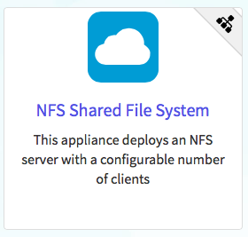
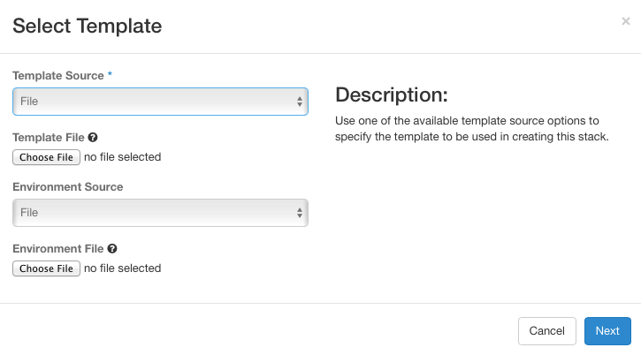
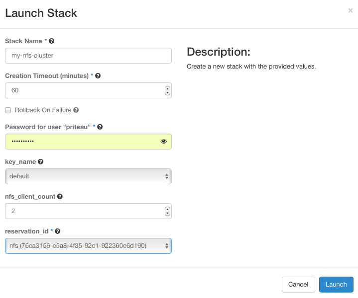
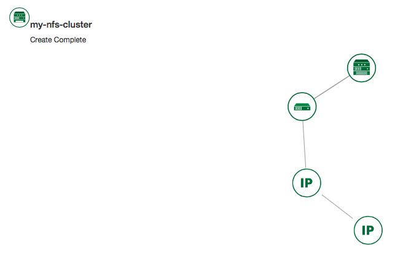
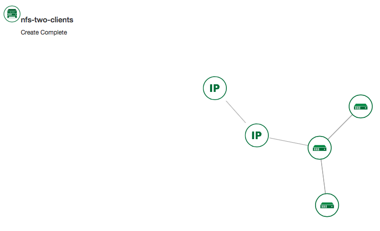
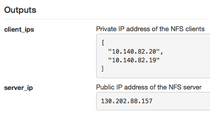

# OpenStack HEAT {#sec:chameleon-heat}

Deploying an MPI cluster, an OpenStack installation, or any other type
of cluster in which nodes can take on multiple roles can be complex: you
have to provision potentially hundreds of nodes, configure them to take
on various roles, and make them share information that is generated or
assigned only at deployment time, such as hostnames, IP addresses, or
security keys. When you want to run a different experiment later you
have to redo all this work. When you want to reproduce the experiment,
or allow somebody else to reproduce it, you have to take very precise
notes and pay great attention to their execution.

To help solve this problem and facilitate reproducibility and sharing,
the Chameleon team configured a tool that allows you to deploy complex
clusters with "one click". This tool requires not just a simple image
(i.e., appliance) but also a document, called a template, that contains
the information needed to orchestrate the deployment and configuration
of such clusters. We call this image + template combination complex
appliance because it consists of more than just the image (i.e.,
appliance).

## Supporting Complex Appliances

In a nutshell, complex appliances allow you to specify not only what
image you want to deploy but also on how many nodes you want to deploy
that image, what roles the deployed instances should boot into (such as
e.g., head node and worker node in a cluster), what information from a
specific instance should be passed to another instance in that complex
appliance, and what scripts should be executed on boot so that this
information is properly used for configuring the "one click" cluster.
For example, a Network File System (NFS) appliance that we will use as
an example in this guide, might specify deployment on three nodes, out
of which one will be configured as head node and others as worker nodes,
the information passed between the images will be hostname of the head
node, and the scripts executed on the worker nodes on boot will put that
hostname in the fstab file. As you can tell from this description,
images used for complex appliances are typically configured such that
they can be booted into any role required on the one-click cluster we
are booting; in this case the image will have both the software for NFS
server node and client node.

Since complex appliances in Chameleon are currently implemented using
the [OpenStack Heat](https://wiki.openstack.org/wiki/Heat) orchestration
service, we will be using OpenStack terminology and features to work
with them. The templates described above are YAML files using the [Heat
Orchestration Template (HOT)
format](http://docs.openstack.org/developer/heat/template_guide/hot_spec.html)
(Heat also supports the AWS CloudFormation template format, but this is
not covered here). A deployed complex appliance is referred to as a
"stack" -- just as a deployed single appliance is typically referred to
as an "instance". This guide will tell you all you need to know in order
to use and configure complex appliances on Chameleon; if you would like
to know more about Heat, please refer to its [official
documentation](http://docs.openstack.org/developer/heat/).

## Chameleon Appliance Catalog

Our [Appliance Catalog](https://www.chameleoncloud.org/appliances/) has
several complex appliances for popular technologies that people want to
deploy such as OpenStack or MPI or even more advanced deployments such
as efficient SR-IOV enabled MPI in KVM virtual machines. We also provide
common building blocks for cluster architectures, such as an NFS share.
Complex appliances are identified by a badge in their top-right corner
representing a group of machines, as shown in @fig:chameleon-nfs.

{#fig:chameleon-nfs}

## Deployment

We will explain how to launch a complex appliance based on our [NFS
share appliance](https://www.chameleoncloud.org/appliances/25/). To
launch a complex appliance, you only need to follow these steps:

1.  Create a lease: use the OpenStack web interface (choose between
    CHI\@UC or CHI\@TACC) to create a lease. To launch our NFS
    appliance, reserve at least three compute nodes (the strict minimum
    is two nodes but we will use three in this example and later ones).

2.  Go to the [Appliance
    Catalog](https://www.chameleoncloud.org/appliances/) and identify
    the appliance you want to launch. In our case you can go straight to
    the [NFS share
    appliance](https://www.chameleoncloud.org/appliances/25/); click on
    it to open its details page. You will see a "Launch" button and a
    "Get Template" button. Follow the "Get Template" link and copy its
    url to the clipboard -- you will need it in the following steps.

3.  Click on the "Launch Complex Appliance at CHI\@TACC" or "Launch
    Complex Appliance at CHI\@UC" button depending on where your
    reservation was created.

This will take you to the Stacks page within the Orchestration menu.
This page will show the current list of stacks, with controls to manage
them and create new ones. Since we have not launched any yet, this list
will be empty for now.

We will now create a new stack, which corresponds to the launch of a
template. Click on Launch Stack on the top right. A window will pop up
like below: @fig:select-template.

{#fig:select-template}

We will deploy the NFS appliance described earlier; it will consist of a
server node and two client nodes. Change the template source field to
URL, and paste the URL of the [NFS share
template](https://www.chameleoncloud.org/appliances/api/appliances/25/template)
(if you do not have it in your clipboard anymore you will need to go back
to the appliance and get it by clicking on "Get template" again).

Do not change the environment source settings, and click "Next".

The next screen allows your to enter input values to your Heat template.
Choose a name for your stack (e.g. my-nfs-cluster). Ignore the "Creation
Timeout" and "Rollback On Failure" settings. You also need to enter your
Chameleon password. Then, you need to select a value for the three
parameters of the template: for key_name, choose your SSH key pair
(this key pair will authorize access on each deployed instances, both
server and client). For nfs_client_count, change the default value of
1 to 2. For reservation_id, choose your reservation created earlier.
Finally, click "Launch". As shown in @fig:launch-nfs-stack.

{#fig:launch-nfs-stack}

Your stack should be in status "Create In Progress" for several minutes
while it first launches the NFS server instance, followed by the NFS
client instances. As below: @fig:create-in-progress.

{#fig:create-in-progress}

It will then move to the status "Create Complete". As the following: @fig:create-complete.

{#fig:create-complete}

You can click on the stack name to get more details, including a
visualization of the deployed resources, as pictured below: @fig:stack-visualization. The single
machine inside a circle represents the NFS server instance. The rack of
machine represents the group of NFS client instances (in this case, a
group composed of two instances). The server's floating IP (the public
IP assigned to a resource) is represented by an IP in a circle; an IP in
a circle is also used to represent the association of the IP with the
NFS server instance (not the greatest idea to use the same symbol for
both the IP and the association -- we agree but cannot do much about it
at the moment). Blow off some steam by dragging the visualization across
the screen, it can be rather fun!

{#fig:stack-visualization}

You can now ssh to the server using the floating IP just as you do with
regular instances (use the cc account). The client does not have a
floating IP attached to it (as per the visualization above) but you can
connect to it via the server node with the client's private IP (connect
to the server with `ssh -A` to enable the SSH agent forwarding after
loading your key to your SSH agent with `ssh-add <path-to-your-key>`).

You can find out the information about the IPs and other things if you
click the "Overview" tab and look in the "Outputs" section. Under the
"Resources" tab you will see the resources described above (the server,
clients, server's public/floating IP, and its the association) and
information about them. In the "Events" tab you will see information
about the history of the deployment so far. In Template you will see the
template that was used to deploy this stack.

## Heat Template

The NFS share appliance deploys:

-   an NFS server instance, that exports the directory /exports/example
    to any instance running on Chameleon bare-metal,

-   one or several NFS client instances, which configure /etc/fstab to
    mount this NFS share to /mnt (and can subsequently read from and
    write to it).

This template is reproduced further below, and includes inline comments
starting with the \# character. There are three main sections:

-   resources,

-   parameters,

-   outputs.

The resources section is the most important part of the template: it
defines which OpenStack resources to create and configure. Inside this
section you can see four resources defined:

-   nfs_server_floating_ip

-   nfs_server

-   nfs_server_ip_association

-   nfs_clients

The first resource, nfs_server_floating_ip, creates a floating IP on
the ext-net public network. It is not attached to any instance yet.

The second resource, nfs_server, creates the NFS server instance (an
instance is defined with the type `OS::Nova::Server` in Heat). It is a
bare-metal instance (`flavor: baremetal`) using the CC-CentOS7 image and
connected to the private network named sharednet1. We set the keypair to
use the value of the parameter defined earlier, using the `get_param`
function. Similarly, the reservation to use is passed to the scheduler.
Finally, a user-data script is given to the instance, which configures
it as an NFS server exporting /exports/example to Chameleon instances.

The nfs_server_ip_association resource associates the floating IP
created earlier with the NFS server instance.

Finally, the nfs_clients resource defines a resource group containing
instance configured to be NFS clients and mount the directory exported
by the NFS server defined earlier. The IP of the NFS server is gathered
using the `get_attr` function, and placed into user-data using the
`str_replace` function.

Parameters all have the same data structure: each one has a name
(`key_name` or `reservation_id` in this case), a data type (number or
string), a comment field called description, optionally a default value,
and a list of constraints (in this case only one per parameter).
Constraints tell Heat to match a parameter to a specific type of
OpenStack resource. Complex appliances on Chameleon require users to
customize at least the key pair name and reservation ID, and will
generally provide additional parameters to customize other properties of
the cluster, such as its size, as in this example.

Outputs are declared similarly to parameters: they each have a name, an
optional description, and a value. They allow to return information from
the stack to the user.

    # This describes what is deployed by this template.
    description: NFS server and clients deployed with Heat on Chameleon

    # This defines the minimum Heat version required by this template.
    heat_template_version: 2015-10-15

    # The resources section defines what OpenStack resources are to be deployed and
    # how they should be configured.
    resources:
      nfs_server_floating_ip:
        type: OS::Nova::FloatingIP
        properties:
          pool: ext-net

      nfs_server:
        type: OS::Nova::Server
        properties:
          flavor: baremetal
          image: CC-CentOS7
          key_name: { get_param: key_name }
          networks:
             - network: sharednet1
          scheduler_hints: { reservation: { get_param: reservation_id } }
          user_data: |
            #!/bin/bash
            yum install -y nfs-utils
            mkdir -p /exports/example
            chown -R cc:cc /exports
            echo '/exports/example 10.140.80.0/22(rw,async) 10.40.0.0/23(rw,async)' >> /etc/exports
            systemctl enable rpcbind && systemctl start rpcbind
            systemctl enable nfs-server && systemctl start nfs-server

      nfs_server_ip_association:
        type: OS::Nova::FloatingIPAssociation
        properties:
          floating_ip: { get_resource: nfs_server_floating_ip }
          server_id: { get_resource: nfs_server }

      nfs_clients:
        type: OS::Heat::ResourceGroup
        properties:
          count: { get_param: nfs_client_count }
          resource_def:
            type: OS::Nova::Server
            properties:
              flavor: baremetal
              image: CC-CentOS7
              key_name: { get_param: key_name }
              networks:
                 - network: sharednet1
              scheduler_hints: { reservation: { get_param: reservation_id } }
              user_data:
                str_replace:
                  template: |
                    #!/bin/bash
                    yum install -y nfs-utils
                    echo "$nfs_server_ip:/exports/example    /mnt/    nfs" > /etc/fstab
                    mount -a
                  params:
                    $nfs_server_ip: { get_attr: [nfs_server, first_address] }

    # The parameters section gathers configuration from the user.
    parameters:
      nfs_client_count:
        type: number
        description: Number of NFS client instances
        default: 1
        constraints:
          - range: { min: 1 }
            description: There must be at least one client.
      key_name:
        type: string
        description: Name of a KeyPair to enable SSH access to the instance
        default: default
        constraints:
        - custom_constraint: nova.keypair
      reservation_id:
        type: string
        description: ID of the Blazar reservation to use for launching instances.
        constraints:
        - custom_constraint: blazar.reservation

    outputs:
      server_ip:
        description: Public IP address of the NFS server
        value: { get_attr: [nfs_server_floating_ip, ip] }
      client_ips:
        description: Private IP addresses of the NFS clients
        value: { get_attr: [nfs_clients, first_address] }

## Customizing an existing template

Customizing an existing template is a good way to start developing your
own. We will use a simpler template than the previous example to start
with: it is the [Hello World complex
appliance](https://www.chameleoncloud.org/appliances/26/).

First, delete the stack you launched, because we will need all three
nodes to be free. To do this, go back to the Project \> Orchestration \>
Stacks page, select your stack, and then click on the red "Delete
Stacks" button. You will be asked to confirm, so click on the blue
"Delete Stacks" button. As the following picture: @fig:delete-stacks.

{#fig:delete-stacks}

The template for the [Hello World complex
appliance](https://www.chameleoncloud.org/appliances/26/) is reproduced
below. It is similar to the NFS share appliance, except that it deploys
only a single client. You can see that it has four resources defined:

-   nfs_server_floating_ip

-   nfs_server

-   nfs_server_ip_association

-   nfs_client

The nfs_client instance mounts the NFS directory shared by the
nfs_server instance, just like in our earlier example.

    # This describes what is deployed by this template.
    description: NFS server and client deployed with Heat on Chameleon

    # This defines the minimum Heat version required by this template.
    heat_template_version: 2015-10-15

    # The resources section defines what OpenStack resources are to be deployed and
    # how they should be configured.
    resources:
      nfs_server_floating_ip:
        type: OS::Nova::FloatingIP
        properties:
          pool: ext-net

      nfs_server:
        type: OS::Nova::Server
        properties:
          flavor: baremetal
          image: CC-CentOS7
          key_name: { get_param: key_name }
          networks:
             - network: sharednet1
          scheduler_hints: { reservation: { get_param: reservation_id } }
          user_data: |
            #!/bin/bash
            yum install -y nfs-utils
            mkdir -p /exports/example
            chown -R cc:cc /exports
            echo '/exports/example 10.140.80.0/22(rw,async) 10.40.0.0/23(rw,async)' >> /etc/exports
            systemctl enable rpcbind && systemctl start rpcbind
            systemctl enable nfs-server && systemctl start nfs-server

      nfs_server_ip_association:
        type: OS::Nova::FloatingIPAssociation
        properties:
          floating_ip: { get_resource: nfs_server_floating_ip }
          server_id: { get_resource: nfs_server }

      nfs_client:
        type: OS::Nova::Server
        properties:
          flavor: baremetal
          image: CC-CentOS7
          key_name: { get_param: key_name }
          networks:
             - network: sharednet1
          scheduler_hints: { reservation: { get_param: reservation_id } }
          user_data:
            str_replace:
              template: |
                #!/bin/bash
                yum install -y nfs-utils
                echo "$nfs_server_ip:/exports/example    /mnt/    nfs" > /etc/fstab
                mount -a
              params:
                $nfs_server_ip: { get_attr: [nfs_server, first_address] }

    # The parameters section gathers configuration from the user.
    parameters:
      key_name:
        type: string
        description: Name of a KeyPair to enable SSH access to the instance
        default: default
        constraints:
        - custom_constraint: nova.keypair
      reservation_id:
        type: string
        description: ID of the Blazar reservation to use for launching instances.
        constraints:
        - custom_constraint: blazar.reservation

Download this template from the [Hello World complex appliance details
page](https://www.chameleoncloud.org/appliances/26/) to your local
machine, and open it in your favorite text editor.

We will customize the template to add a second NFS client by creating a
new resource called another_nfs_client. Add the following text to your
template inside the resources section. Make sure to respect the level of
indentation, which is important in YAML.

      another_nfs_client:
        type: OS::Nova::Server
        properties:
          flavor: baremetal
          image: CC-CentOS7
          key_name: { get_param: key_name }
          networks:
             - network: sharednet1
          scheduler_hints: { reservation: { get_param: reservation_id } }
          user_data:
            str_replace:
              template: |
                #!/bin/bash
                yum install -y nfs-utils
                echo "$nfs_server_ip:/exports/example    /mnt/    nfs" > /etc/fstab
                mount -a
              params:
                $nfs_server_ip: { get_attr: [nfs_server, first_address] }

Now, launch a new stack with this template. Since the customized
template is only on your computer and cannot be addressed by a URL, use
the "Direct Input" method instead and copy/paste the content of the
customized template. The resulting topology view is shown below: @fig:nfs-with-two-clients, as you
can see, the two client instances are shown separately since each one is
defined as a separate resource in the template.

{#fig:nfs-with-two-clients}

You may have realized already that while adding just one additional
client instance was easy, launching more of them would require to copy /
paste blocks of YAML many times while ensuring that the total count is
correct. This would be easy to get wrong, especially when dealing with
tens or hundreds of instances.

So instead, we leverage another construct from Heat: resource groups.
Resource groups allow to define one kind of resource and request it to
be created any number of times.

Remove the nfs_client and another_client resources from your
customized template, and replace them with the following:

      nfs_clients:
        type: OS::Heat::ResourceGroup
        properties:
          count: 2
          resource_def:
            type: OS::Nova::Server
            properties:
              flavor: baremetal
              image: CC-CentOS7
              key_name: { get_param: key_name }
              networks:
                 - network: sharednet1
              scheduler_hints: { reservation: { get_param: reservation_id } }
              user_data:
                str_replace:
                  template: |
                    #!/bin/bash
                    yum install -y nfs-utils
                    echo "$nfs_server_ip:/exports/example    /mnt/    nfs" > /etc/fstab
                    mount -a
                  params:
                    $nfs_server_ip: { get_attr: [nfs_server, first_address] }

A resource group is configured with a properties field, containing the
definition of the resource to launch (`resource_def`) and the number of
resources to launch (`count`). Once launched, you will notice that the
topology view groups all client instances under a single Resource Group
icon. We use the same `resource_def` than when defining separate
instances earlier.

Another way we can customize this template is by adding outputs to the
template. Outputs allow a Heat template to return data to the user. This
can be useful to return values like IP addresses or credentials that the
user must know to use the system.

We will create an output returning the floating IP address used by the
NFS server. We define an outputs section, and one output with the name
`server_ip` and a description. The value of the output is gathered using
the `get_attr` function which obtains the IP address of the server
instance.

    outputs:
      server_ip:
        description: Public IP address of the NFS server
        value: { get_attr: [nfs_server_floating_ip, ip] }

You can get outputs in the "Overview" tab of the Stack Details page. If
you want to use the command line, install `python-heatclient` and use
the `heat output-list` and `heat output-show` commands, or get a full
list in the information returned by `heat stack-show`.

Multiple outputs can be defined in the outputs section. Each of them
needs to have a unique name. For example, we can add another output to
list the private IPs assigned to client instances:

      client_ips:
        description: Private IP addresses of the NFS clients
        value: { get_attr: [nfs_clients, first_address] }

The image below: @fig:outputs, shows the resulting outputs as viewed from the web
interface. Of course IP addresses will be specific to each deployment.

{#fig:outputs}

Finally, we can add a new parameter to replace the hardcoded number of
client instances by a value passed to the template. Add the following
text to the parameters section:

      nfs_client_count:
        type: number
        description: Number of NFS client instances
        default: 1
        constraints:
          - range: { min: 1 }
            description: There must be at least one client.

Inside the resource group definition, change `count: 2` to
`count: { get_param: nfs_client_count }` to retrieve and use the
parameter we just defined. When you launch this template, you will see
that an additional parameter allows you to define the number of client
instances, like in the NFS share appliance.

At this stage, we have fully recreated the NFS share appliance starting
from the Hello World one! The next section will explain how to write a
new template from scratch.

## Writing a new template

You may want to write a whole new template, rather than customizing an
existing one. Each template should follow the same layout and be
composed of the following sections:

-   Heat template version

-   Description

-   Resources

-   Parameters

-   Outputs

### Heat template version

Each Heat template has to include the heat_template_version key with a
valid version of HOT (Heat Orchestration Template). Chameleon bare-metal
supports any HOT version up to 2015-10-15, which corresponds to
OpenStack Liberty. The [Heat
documentation](http://docs.openstack.org/developer/heat/template_guide/hot_spec.html#hot-spec-template-version)
lists all available versions and their features. We recommended that you
always use the latest supported version to have access to all supported
features:

`heat_template_version: 2015-10-15`

### Description

While not mandatory, it is good practice to describe what is deployed
and configured by your template. It can be on a single line:

    description: This describes what this Heat template deploys on Chameleon.

If a longer description is needed, you can provide multi-line text in
YAML, for example:

    description: >
      This describes what this Heat
      template deploys on Chameleon.

### Resources

The resources section is required and must contain at least one resource
definition. A [complete list of resources types known to
Heat](http://docs.openstack.org/developer/heat/template_guide/openstack.html)
is available.

However, only a subset of them are supported by Chameleon, and some are
limited to administrative use. We recommend that you only use:

-   OS::Glance::Image

-   OS::Heat::ResourceGroup

-   OS::Heat::SoftwareConfig

-   OS::Heat::SoftwareDeployment

-   OS::Heat::SoftwareDeploymentGroup

-   OS::Neutron::FloatingIP

-   OS::Neutron::FloatingIPAssociation

-   OS::Neutron::Port (advanced users only)

-   OS::Nova::Keypair

-   OS::Nova::Server

If you know of another resource that you would like to use and think it
should be supported by the OpenStack services on Chameleon bare-metal,
please let us know via our help desk.

### Parameters

Parameters allow users to customize the template with necessary or
optional values. For example, they can customize which Chameleon
appliance they want to deploy, or which key pair to install. Default
values can be provided with the `default` key, as well as constraints to
ensure that only valid OpenStack resources can be selected. For example,
`custom_constraint: glance.image` restricts the image selection to an
available OpenStack image, while providing a pre-filled selection box in
the web interface. [More details about
constraints](http://docs.openstack.org/developer/heat/template_guide/hot_spec.html#parameter-constraints)
are available in the Heat documentation.

### Outputs

Outputs allow template to give information from the deployment to users.
This can include usernames, passwords, IP addresses, hostnames, paths,
etc. The outputs declaration is using the following format:

    outputs:
      first_output_name:
        description: Description of the first output
        value: first_output_value
      second_output_name:
        description: Description of the second output
        value: second_output_value

Generally values will be calls to get_attr, get_param, or some other
function to get information from parameters or resources deployed by the
template and return them in the proper format to the user.

## Sharing new complex appliances

If you have written your own complex appliances or substantially
customized an existing one, we would love if you shared them with our
user community!

The process is very similar to regular appliances: log into the
Chameleon portal, go to the [appliance
catalog](https://www.chameleoncloud.org/appliances/), and click on the
button in the top-right corner: "Add an appliance" (you need to be
logged in to see it as the following: @fig:add-an-appliance).

{#fig:add-an-appliance}

You will be prompted to enter a name, description, and documentation.
Instead of providing appliance IDs, copy your template to the dedicated
field. Finally, share your contact information and assign a version
string to your appliance. Once submitted, your appliance will be
reviewed. We will get in touch if a change is needed, but if it's all
good we will publish it right away!

## Advanced topics

### All-to-all information exchange

The previous examples have all used user-data scripts to provide
instances with contextualization information. While it is easy to use,
this contextualization method has a major drawback: because it is given
to the instance as part of its launch request, it cannot use any context
information that is not yet known at this time.

In practice, this means that in a client-server deployment, only one of
these pattern will be possible:

-   The server has to be deployed first, and once it is deployed, the
    clients can be launched and contextualized with information from the
    server. The server will not know about the clients unless there is a
    mechanism (not managed by Heat) for the client to contact the
    server.

-   The clients have to be deployed first, and once they are deployed,
    the server can be launched and contextualized with information from
    the clients. The clients will not know about the server unless there is
    a mechanism (not managed by Heat) for the server to contact the
    clients.

This limitation was already apparent in our NFS share appliance: this is
why the server instance exports the file system to all bare-metal
instances on Chameleon, because it does not know which specific IP
addresses are allocated to the clients.

This limitation is even more important if the deployment is not
hierarchical, i.e. all instances need to know about all others. For
example, a cluster with IP and hostnames populated in /etc/hosts
required each instance to be known by every other instance.

This section presents a more advanced form of contextualization that can
perform this kind of information exchange. This is implemented by Heat
agents running inside instances and communicating with the Heat service
to send and receive information. This means you will need to use an
image bundling these agents. Currently, our CC-CentOS7 appliance and its
CUDA version are the only ones supporting this mode of
contextualization. If you build your own images using the [CC-CentOS7
appliance builder](https://github.com/ChameleonCloud/CC-CentOS7), you
will automatically have these agents installed.

This contextualization is performed with several Heat resources:

-   `OS::Heat::SoftwareConfig`. This resource describes code to run on
    an instance. It can be configured with inputs and provide outputs.

-   `OS::Heat::SoftwareDeployment`. This resource applies a
    SoftwareConfig to a specific instance.

-   `OS::Heat::SoftwareDeploymentGroup`. This resource applies a
    SoftwareConfig to a specific group of instances.

The template below illustrates how it works. It launches a group of
instances that will automatically populates their /etc/hosts file with
IP and hostnames from other instances in the deployment.

    heat_template_version: 2015-10-15

    description: >
      This template demonstrates how to exchange hostnames and IP addresses to populate /etc/hosts.

    parameters:
      flavor:
        type: string
        default: baremetal
        constraints:
        - custom_constraint: nova.flavor
      image:
        type: string
        default: CC-CentOS7
        constraints:
        - custom_constraint: glance.image
      key_name:
        type: string
        default: default
        constraints:
        - custom_constraint: nova.keypair
      instance_count:
        type: number
        default: 2
      reservation_id:
        type: string
        description: ID of the Blazar reservation to use for launching instances.
        constraints:
        - custom_constraint: blazar.reservation

    resources:
      export_hosts:
        type: OS::Heat::SoftwareConfig
        properties:
          outputs:
            - name: hosts
          group: script
          config: |
            #!/bin/sh
            (echo -n $(facter ipaddress); echo -n ' '; echo $(facter hostname)) > ${heat_outputs_path}.hosts

      export_hosts_sdg:
        type: OS::Heat::SoftwareDeploymentGroup
        properties:
          config: { get_resource: export_hosts }
          servers: { get_attr: [server_group, refs_map] }
          signal_transport: HEAT_SIGNAL

      populate_hosts:
        type: OS::Heat::SoftwareConfig
        properties:
          inputs:
            - name: hosts
          group: script
          config: |
            #!/usr/bin/env python
            import ast
            import os
            import string
            import subprocess
            hosts = os.getenv('hosts')
            if hosts is not None:
                hosts = ast.literal_eval(string.replace(hosts, '\n', '\\n'))
            with open('/etc/hosts', 'a') as hosts_file:
              for ip_host in hosts.values():
                  hosts_file.write(ip_host.rstrip() + '\n')

      populate_hosts_sdg:
        type: OS::Heat::SoftwareDeploymentGroup
        depends_on: export_hosts_sdg
        properties:
          config: { get_resource: populate_hosts }
          servers: { get_attr: [server_group, refs_map] }
          signal_transport: HEAT_SIGNAL
          input_values:
            hosts: { get_attr: [ export_hosts_sdg, hosts ] }

      server_group:
        type: OS::Heat::ResourceGroup
        properties:
          count: { get_param: instance_count }
          resource_def:
            type: OS::Nova::Server
            properties:
              flavor: { get_param: flavor }
              image: { get_param: image }
              key_name: { get_param: key_name }
              networks:
                 - network: sharednet1
              scheduler_hints: { reservation: { get_param: reservation_id } }
              user_data_format: SOFTWARE_CONFIG
              software_config_transport: POLL_SERVER_HEAT

    outputs:
      deployment_results:
        value: { get_attr: [export_hosts_sdg, hosts] }

There are two SoftwareConfig resources.

The first SoftwareConfig, export_hosts, uses the factor tool to extract
IP address and hostname into a single line (in the format expected for
/etc/hosts) and writes it to a special path
(\${heat_outputs_path}.hosts). This prompts Heat to assign the content
of this file to the output with the name hosts.

The second SoftwareConfig, populate_hosts, takes as input a variable
named hosts, and applies a script that reads the variable from the
environment, parses it with ast.literal_eval (as it is formatted as a
Python dict), and writes each value of the dictionary to /etc/hosts.

The SoftwareDeploymentGroup resources export_hosts_sdg and
populate_hosts_sdg apply each SoftwareConfig to the instance
ResourceGroup with the correct configuration.

Finally, the instance ResourceGroup is configured so that each instance
uses the following contextualization method instead of a user-data
script:

              user_data_format: SOFTWARE_CONFIG
              software_config_transport: POLL_SERVER_HEAT

You can follow the same template pattern to configure your own
deployment requiring all-to-all information exchange.
