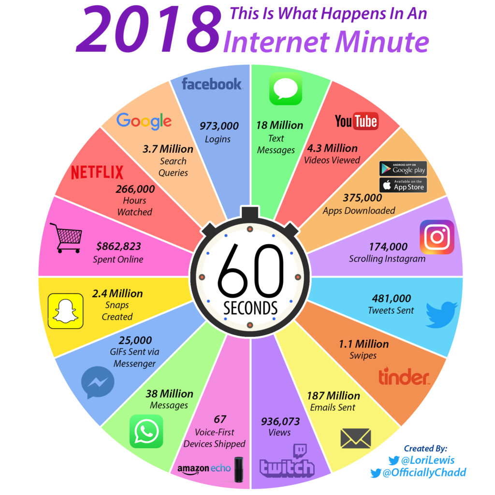
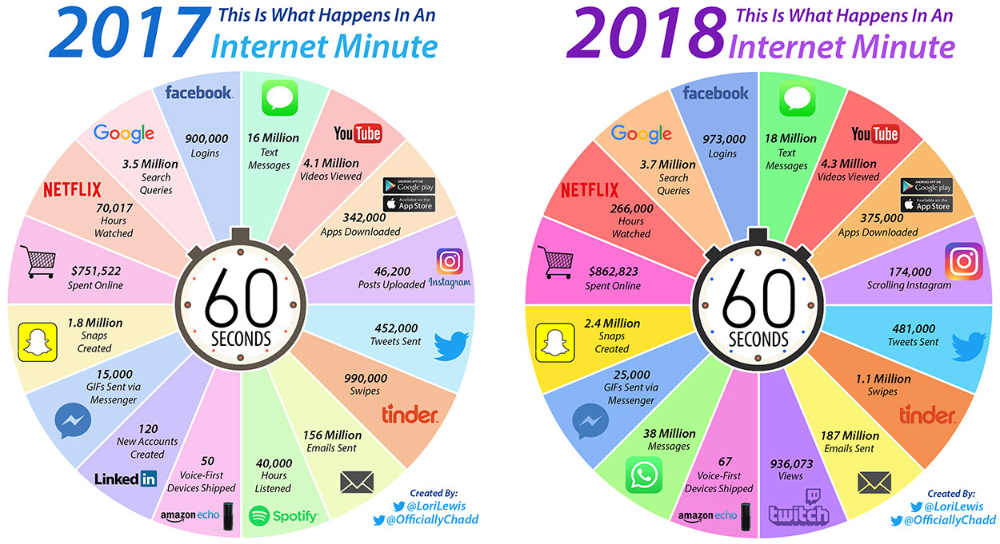
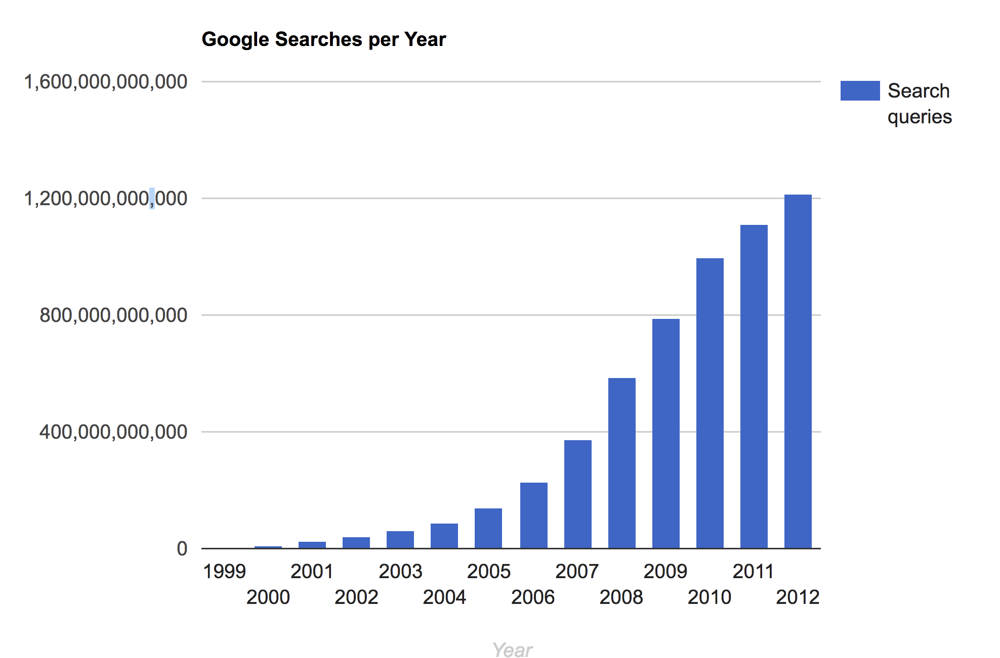
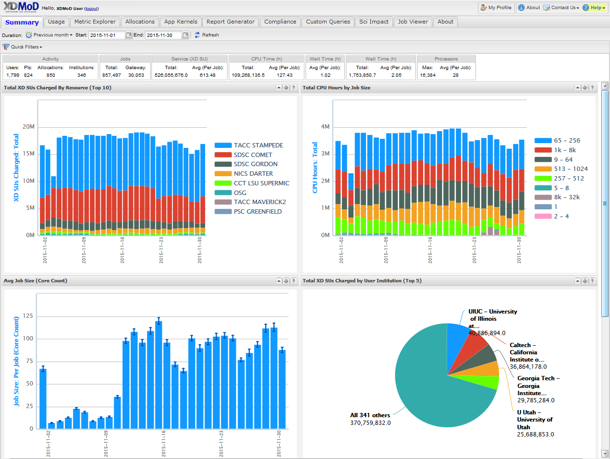
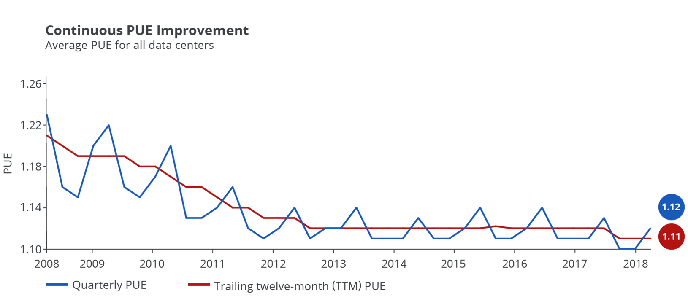

# Data Center

:question: indicates opportunities for comprehension assignments while contributing to this document.

---

**Learning Objectives**

* What is a data center.
* What are import metrics.
* what is the difference between a Cloud data center and a traditional datacenter.
* What are examples of Cloud data centers.

---

## Motivation: Data

### How much data?

One of the issue we have is to actually comprehending how much data is actually created. As humans the total sum created over a year is hard to imagine and put into a perspective that can easily be understood. In order to visualize the data produced we find often Graphics about how much i created in one minute instead. Such depictions include samples of data created as spart of popular cloud services or the internet in general.

One such popular depiction is "Data Never Sleeps". It has been produced a number of timess over the years and is now at version 6.0 released in 2017. If you identify a newer version, please let us know. It is worth while to study this image in detail and identify some of the data that you can relate to of service you use. It is also a possible indication to study other services that are mentioned. A staggering 3.8Mil google searches are executed every minute. Surprisingly the weather channel receives over 18Mil forecast requests which is even higher than the 12Mil text messages send every minute. Youtube certainly serving a significant number of users by 4.3Mil videos watched every minute. Naturally the numbers are averages over time.

Source: <https://www.domo.com/blog/wp-content/uploads/2018/06/18-domo-data-never-sleeps-6.png>

A different source publishes what is happening on the internet in a minute, but we have been able to locate a version from 2018. While some data seems the same, others are slightly different. For example this graph has a lower count for Google searches, while the number of text messages send is significantly higher in contrast to the previous figure.

Source: <https://www.allaccess.com/merge/archive/28030/2018-update-what-happens-in-an-internet-minute>

While reviewing the image from last year from the same author, we find not only increases, but also declines. Looking at facebook showcases a loss of 73000 logins per minute. This loss is substantial. We can see that facebooks services are replaced by other services that are mor popular with the younger generation who tend to pick up new services quickly.

https://www.allaccess.com/assets/img/content/merge/2018/m-04-03-pic1-lg.jpg

It is also interesting to compare such trends over a longer period of time. An example is provided by looking at Google seraches: <http://www.internetlivestats.com/google-search-statistics/>.

**Figure:** Google searchess over time

When looking at the trends, many predict an exponential groth in data. This trend is continuing.

**Figure:** Big data trend. 2012, Source: <https://blogs-images.forbes.com/christopherfrank/files/2012/03/VI_BigData_Graphic_v3_low.png>

<!--

**Figure:** Big Data Landscape
-->

## Cloud Data Centers

## Data Center Metrics

### Data Center Carbon Footprint

Scientists world wide have identified a link between carbon emission and global warming. As the energy consumption of a data center is substantial, it is prudent to estimate the overall carbon emisssion. Schneider Electric (formerly APC) has provided a report on how to estimate the Carbon footprint of a data center. 

* Estimating a Data Center’s
Electrical Carbon Footprint, White Paper 66,  <http://www.apc.com/salestools/DBOY-7EVHLH/DBOY-7EVHLH_R0_EN.pdf>

Although this report is already a bit older, it provides still valuable information. It defines key terms such as

* Carbon dioxide emissions coefficient (“carbon footprint”) 
	* :question:
* Peaker plant
	* :question:
* Avoided emissions
	* :question:
* CO2 (carbon dioxide, or “carbon”) 
	* :question:

The data center will have a total carbon profile, that includes the many different aspects of a data center contributing to carbon emissions. This includes manufacturing, packaging, transportation, storage, operation of the data center, and decommissioning. Thus it is important to notice that we not only need to consider the operation but also the construction and decomisssison phases. 

### Data Center Operational Impact

One of the main operational impacts is the cost and emissions of a data center cause by running, and cooling the servers in the data center. Naturally this is dependent on the type of fuel that is used to produce the energy. The actual carbon impact using electricity certainly depends on the type of powerplant that is used to provide it. These energy costs and distribution of where the energy comes from can often be looked up by geographical regions  on the internet or form the local energy provider. Municipal government organizations may also have such information. Tools such as the Indiana State Profile and Energy Use 

* <https://www.eia.gov/state/?sid=IN>  

may provide valuable information to derive such estimates. Correlating a data center with cheap energy is a key factor. To estimate both costs in terms of price and carbon emission Schneider provides a convenient Carbon estimate calculator based on energy consumption.

* <https://www.schneider-electric.com/en/work/solutions/system/s1/data-center-and-network-systems/trade-off-tools/data-center-carbon-footprint-comparison-calculator/tool.html>
* <http://it-resource.schneider-electric.com/digital-tools/calculator-data-center-carbon>

If we calculate the total cost, we needd naturally add all costs arising from build and teardown phase as well as operational upgrades. 

**Comprehension Assignment**

**Carbon.1:** Carbon footprint of a data center

> Complete the definitions of the terms used in this section

**Carbon.2:** Carbon footprint of data centers

> World wide we have many data centers. Your task will be to find the carbon emisssion of a data center and its cost in $ based on energy use on a yearly basis. Add your findings to the following table. Make sure you avoid redundant reporting and find a new datacenter. A google doc will be provided to coordinate with the class participants

**Table:** Cost of the data center

.

| Data Center | Location | Year | Electricity Cost* | IT Load | Yearly Cost | Yearly CO2 Footprint | Equivalent in Cars |   |
|-------------|----------|------|-------------------|---------|-------------|----------------------|--------------------|---|
| :?:         | :?:      | :?:  | :?:               | :?:     | :?:         | :?:                  | :?:                |   |
|             |          |      |                   |         |             |                      |                    |   |
|             |          |      |                   |         |             |                      |                    |   |

*as adjusted in calculatoro

> If you find other estimates for a data center or an entire data center fleet such as AWS world wide, please provide citations.

**Carbon.3:** Your own Carbon footprint

> It is interesting to compare and measure your own carbon footprint. We will ask you anonymously to report your carbon footprint via a form we will prepare in future. As the time to do this is less than 2 minutes, We ask all students to report their footprint.
 
Please use the calculator at:

* <http://carbonfootprint.c2es.org/>

### Power Usage Effectiveness

One of the frequent measurements in data centers that iss used is the  Power usage effectiveness or PUE in short. It is a measurement to identify how much energy is ued for the computing equipment  versus other energy costs such as air conditioning.

Formally we define it as

> *PUE is the ratio of total amount of energy used by a computer data center facility to the energy delivered to computing equipment.* 
 
PUE was published in 2016 as a global standard under [ISO/IEC 30134-2:2016](https://www.iso.org/standard/63451.html).

The inverse of PUE is the data center infrastructure efficiency (DCIE).

The best value of PUE is 1.0. Any data center musst be higher than this value as offices and other cost surely will arise when we look at the formula

$\mathrm{PUE} = \frac{\mathrm{Total~Facility~Energy}}{\mathrm{IT~Equipment~Energy}}$

$\mathrm{PUE} = 1 + \frac{\mathrm{Non~IT~Facility~Energy}}{\mathrm{IT~Equipment~Energy}}$

According to the PUE calculator at 

* <https://www.42u.com/measurement/pue-dcie.htm>

The following ratings are given

| PUE | DCIS | Level of Efficiency |
| --- | --- | --- |
| 3.0 | 33% | Very Inefficient |
| 2.5 | 40% | Inefficient |
| 2.0 | 50% | Average |
| 1.5 | 67% | Efficient |
| 1.2 | 83% | Very Efficient |

PUE is a very popular metric as it is relatively easy to calculate and provides a metric that can easily compare data centers between each other. 

This metric comes also with some drawbacks:

* It does not integrate for example climate based differences, such as that the energy susse to cool a data center in colder climates siss less than in wormer climats. However, this may actually be a good side-effect as this will likely result in less cooling needs sand therefor energy costs.
* It also forces large data centers with many shared servers in contrast to small data centers where operational cost may become relevant.
* It does not take in consideration recycled energy to for example heat other buildings outside of the data center.

Hence ist is prudent not to justs look at the PUE but also at other metrics that lead to the overall cost and energy usage of the total ecosystem the data center iss located in.

Already in 2006, Google reported its six  data centers efficiency as 1.21 and Microsoft as 1.22 which at that time were considered very efficient. However over time these target has shifted and todays data centers achieve much lower values. The Green IT Cube in Darmstadt, Germany even reported 1.082. According to Wikipedia an unnamed Fortune 500 company achieved with 30000 SuperMicro blades a PUE of 1.06 in 2017.

**Comprehensssion Assignment**

**PUE.1:** Lowest PUE you can find

> What is the lowest PUE you can find. Provide details about the system as well as the date when the PUE was reported.

### Workload Monitoring

#### Workload of HPC in the Cloud

Clouds and especially university data centers do not just provide virtual machines but provide traditional super computer services. This includes the NSF sponsored XSEDE project. As part of this project the "XDMoD auditing tool provides, for the first time, a comprehensive tool to measure both utilization and performance of high-end cyberinfrastructure (CI), with initial focus on XSEDE. Several case studies have shown its utility for providing important metrics regarding resource utilization and performance of TeraGrid/XSEDE that can be used for detailed analysis and planning as well as improving operational efficiency and performance. Measuring the utilization of high-end cyberinfrastructure such as XSEDE helps provide a detailed understanding of how a given CI resource is being utilized and can lead to improved performance of the resource in terms of job throughput or any number of desired job characteristics. 

Detailed historical analysis of XSEDE usage data using XDMoD clearly demonstrates the tremendous growth in the number of users, overall usage, and scale."

Cited from: (https://experts.illinois.edu/en/publications/using-xdmod-to-facilitate-xsede-operations-planning-and-analysis)

Having access to a detailed metrics analysis allows users and center administrators, as well as project managers to better evaluate the use and utilization of such large facilities justifying their existence. 

**Figure:** XDMod: XSEDE Metrics on Demand

Additional information is available at

* <https://open.xdmod.org/7.5/index.html>

#### Scientific Impact Metric

Gregor von Laszewski and Fugang Wang are providing a scientific impact metric to XDMoD and XSEDE. It is  a framework that (a) integrates publication
and citation data retrieval, (b) allows scientific impact
metrics generation at different aggregation levels, and
(c) provides correlation analysis of impact metrics based on
publication and citation data with resource allocation for a
computing facility. This framework is used to
conduct a scientific impact metrics evaluation of XSEDE,
and to carry out extensive statistical analysis correlating
XSEDE allocation size to the impact metrics aggregated by
project and Field of Science. This analysis not only helps to
provide an indication of XSEDE’S scientific impact, but also
provides insight regarding maximizing the return on investment
in terms of allocation by taking into account Field of
Science or project based impact metrics. The findings from
this analysis can be utilized by the XSEDE resource allocation
committee to help assess and identify projects with
higher scientific impact. Through the general applicability of the novel metrics we invented, it can also help provide metrics regarding
the return on investment for XSEDE resources, or
campus based HPC centers.
[PDF](http://cgl.soic.indiana.edu/publications/Metrics2014.pdf)

#### Clouds and Virtual Machine Monitoring

:?: Write about it
Although no longer in operation in its original form FutureGrid <http://archive.futuregrid.org/metrics/html/results/2014-Q3/reports/rst/india-All.html>
has pioneered the extensive monitoring and publication of its virtual machine and project usage. We are not aware of a current system that provides this level of detail as sof yet. However, efforts as part of XSEDE within the XDMoD project are under way at this time but are not integrated.

Futuregrid provided access to all virtual machine information, as well as usage across projects. An archived portal view iss available at:

* <http://archive.futuregrid.org/metrics/html/results/2014-Q3/reports/rst/india-All.html>

**Figure:** FutureGrid Cloud Metric

Futuregrid offered multiple clouds including clouds based on OpenStack, Eucalyptus, and Nimbus. Nimbus and Eucalyptus are ssystems that are no longer used in the community. Only OpenStack is the only viable solution in addition to the cloud offerings by Comet that do not uses OpenStack. 

Futuregrid, could monitor all of them and published its result in its Metrics portal.
Monitoring the VMs is an important activity as they can identify VMs that may no longer be used (the user has forgotten to terminate them) or too much usage of a user or project can be detected in early stages.

We like to emphasize several examples wher such monitoring is helpful:

* Assume a student participates in a class, metrics and logs allow to identify students that do not use the system as asked for by the instructors. For example it is easy to identify if they logged on and used VMs. Furthermore the length of running a VM ba
* Let us assume a user is willfulingly ignoring the practice to not shut down VMs although they are not used because research clouds are offered to us for free. In fact, this situation happened to us recently while using another cloud and such monitoring capacities were not available to us (on jetsstream). The user used up simple handedly the entire allocation that was supposed to be shared with 30 other users in the same project. All accounts of all users were quasi deactivated as the entire project they belonged to were deactivated. Due to allocation review processes it took about 3 weeks to reactivate full access.
sed on the tasks to be completed can be compared against other student members.
* In commercial clouds you will be charged money. Therefore, it is less likely that you forget to shutdown your machine
* In case you use github carelessly and post your cloud passwords or any other passwords in it, you will find that within five minutes your cloud account will be compromised. There are individuals on the network that cleverly mine github for such security lapses and will use your password if you indeed have stored them in it. In fact githubs deletion of a file does not delete the history, so as a non expert deleting the password form github is not sufficient. YOu will have to either delete and rewrite the history, but definitely in this case you will need to reset the password. Monitoring the public cloud usage in the data center is important not only in your region but other regions as the password is valid also there and intruders could hijack and start services in regions that you have never used.

In addition to FutureGrid, we like to point out Comet (see other sections). It contains an exception for VM monitoring   as it uses a regular batch queuing system to manage the jobs. Monitoring of the jobs is conducted through existing HPC tools 

#### Workload of Containers

Monitoring tools for containers such as for kubernetes are listed at:

<https://kubernetes.io/docs/tasks/debug-application-cluster/resource-usage-monitoring/>

Such tools can be deployed alongside kubernetes in the data center, but will likely have restrictions to its access. They are for those who operate ssuch services for example in kubernetes. We will discuss this in future sections in more detail.

## Example Data Centers

In this section we will be giving some data center examples while looking at some of the mayor cloud providers. 

### AWS

AWS focusses on security asspectss of their data centers that include four aspects (<https://aws.amazon.com/compliance/data-center/data-centers/>):

* [Perimiter Layer](https://aws.amazon.com/compliance/data-center/perimeter-layer/)
* [Infrasstructure Layer](https://aws.amazon.com/compliance/data-center/infrastructure-layer/)
*  [Data Layer](https://aws.amazon.com/compliance/data-center/data-layer/)
*  [Environmental Layer](https://aws.amazon.com/compliance/data-center/environmental-layer/)

The global infrastructure is presented (ass of Aug 29th 2018) at <https://aws.amazon.com/about-aws/global-infrastructure/> and includes 55 Availability Zones within 18 geographic Regions and 1 Local Region around the world. Plans existsss to add 12 Availability Zones and four additional Regions in Bahrain, Hong Kong SAR, Sweden, and a second AWS GovCloud Region in the US.

**Figure:** AWS regions

### Azure

* <https://azure.microsoft.com/en-us/global-infrastructure/regions/>

Azure clais to have more global regions than any other cloud provider. They motivate this by their advertisement to bring and applications to the users around the world. The goal iss similar as other commercial hypresscale providers by introducing preserving data residency, and offering comprehensive compliance and resilience.
As of Aug 29, 2018 Azure supports  54 regions worldwide. These regions can currently be accessed by users in 140 countries. NOt every service is offered in every region as the service to region matrix shows:

* <https://azure.microsoft.com/en-us/global-infrastructure/services/>

**Figure:** Azure regions

### Google

From <https://www.google.com/about/datacenters/inside/locations/index.html> we find that on Aug. 29th Google has the following data center locations:

* **North America:** Berkeley County, South Carolina; Council Bluffs, Iowa; Douglas County, Georgia; Jackson County, Alabama; Lenoir, North Carolina; Mayes County, Oklahoma; Montgomery County, Tennessee; The Dalles, Oregon
* **South America:** Quilicura, Chile
* **Asia**: Changhua County, Taiwan; Singapore
* **Europe:* Dublin, Ireland; Eemshaven, Netherlands; Hamina, Finland; St Ghislain, Belgium

Each data center is advertised with a special environmental impact such as a unique cooling system, or wildlife on premise. Google's data centers support its service infrastructure and allow hosting as well as other cloud services sto be offered to it's customers.

Google highlights its efficiency strategy and methods here:

* <https://www.google.com/about/datacenters/efficiency/>

They summarize their offers are based on 

* Measuring the PUE
* Managing airflow
* Adjusting the temperature
* Use free Cooling
* Optimizing the power distribution

**Figure:** [PUE data for all large-scale Google data centers](https://www.google.com/about/datacenters/efficiency/internal/)

An important lesson from Google is the PUE boundary. That is the different efficience bassed on the closeness sof the IT infrastructure to the actual data center building. 
Thihs indicates that it is important to take at any providers definition of PUE in order not to report numbers that are not comparable between other vendors and are all encompassing.

**Figure:** [Google data center PUE measurement boundaries. The average PUE for all Google data centers is 1.12, although we could boast a PUE as low as 1.06 when using narrower boundaries.](https://www.google.com/about/datacenters/efficiency/internal/)
 
 As a consequence, Google is defining its PUE in detail as follows:
 
 
 
where the abbreviationss stand for 

* ESIS = Energy consumption for supporting infrastructure power substations feeding the cooling plant, lighting, office space, and some network equipment
* EITS = Energy consumption for IT power substations feeding servers, network, storage, and computer room air conditioners (CRACs)
* ETX = Medium and high voltage transformer losses
* EHV = High voltage cable losses
* ELV = Low voltage cable losses
* EF = Energy consumption from on-site fuels including natural gas & fuel oils
* ECRAC = CRAC energy consumption
* EUPS = Energy loss at uninterruptible power supplies (UPSes) which feed servers, network, and storage equipment
* ENet1 = Network room energy fed from type 1 unit substitution
 
For more details see <https://www.google.com/about/datacenters/efficiency/internal/>

 
### IBM

IBM maintains almost 60 data centers, which are placed globally in 6 regions and 18 availability zones. IBM targets businesses while offering local access to its centers to allow for low latency. IBM states that trough this localization users can decide where and how data and workloads and address availability, fault tolerance and scalability. As IBM is business oriented it also stresses its certified security.

More information can be obtained from:

* <https://www.ibm.com/cloud/data-centers/>

A special ssservice offering is provided by Watson.

* <https://www.ibm.com/watson/>

which is focussing on AI based sservices. It includes PaaS services for deep learning, but also services that are offered to the healthcare and other communities as SaaS

### XSEDE

XSEDE is an NSF sponsored large distributed set of clusters, supercomputers, data services, and clouds, building a "single virtual system that scientists can use to interactively share computing resources, data and expertise". The Web page of XSEDE iss located at

* <https://www.xsede.org/>

Primary compute resources are listed in the resource monitor at

* <https://portal.xsede.org/resource-monitor>

For cloud Computing the following ssystems are of especial importance although selected others may also host container based systems while using singularity:

* Comet virtual clusters
* Jetstream Openstack

**Figure:** XSEDE distributed resource infrastructure

#### Comet

The comet machine is a larger cluster and offers bare metal provisioning based on KVM and SLURM. Thus it is a unique system that can run at the same time traditional super computing jobs such as MPI based programs, as well as jobs that utilize virtual machines. With its availability of >46000 cores it provides one of the larges NSF sponsored cloud environment. Through its ability to provide bare metal provisioning and the access to infiniband between all virtual machines it is an ideal machine for exploring performance oriented virtualization techniques.

Comet has about 3 times more cores than Jetstream.

#### Jetstream

Jetstream is a machine that specializes in offering a user friendly cloud environment.
It utilizes an environment called atmosphere that is targeting inexperienced scientific cloud users. It also offers an OpenStack environment that is used by atmosphere and is for classes such as ours the preferred access method. More information about the system can be found at

* <https://dcops.iu.edu/>

### Chameleon Cloud

Chameleon cloud is a  configurable experimental environment for large-scale cloud research. It is offering OpenStack as a service including some more advanced services that allow experimentation with the infrastructure. 

* <https://www.chameleoncloud.org/>

An overview of the hardware can be obtained from 

* <https://www.chameleoncloud.org/hardware/>

### Indiana University

Indiana University has a data center in which many different systems are housed. This includes not only jetstream, but also many other systems. The systems include production, business, and research clusters and servers. 

**Figure:** IU Data Center

On the research cluster side it offers Karst:

* <https://kb.iu.edu/d/bezu>

One of the special systems located in the data center and managed by the Digital Science Center is calles Futuresystems, which provides a great resource for the advanced students of Indiana University focussing on data engineering.  While systems such as Jetstream and Chameleon cloud specialize in production ready cloud environments, Futuresystems, allows the researchers to experiment with state-of-the-art distributed systems environments supporting research. It is available with Comet and thus could also serve as an on-ramp to using larger scale resources on comet while experimenting with the setup on Futuressystems.

Such an offering is logical as researchers in the data engineering track want to further develop systems such as Hadoop, SPark, or container based distributed environments and not use the tools that are released for production as they do not allow improvements to the infrastructure. Futuresystems is managed and offered by  by the Digital Science Center.

Hence IU offers very important but needed services

* Karst for traditional supercomputing
* Jetstream for production use with focus on virtual machines
* Futuresystems for state-of-the-art research experiment environments with access to bare metal.

