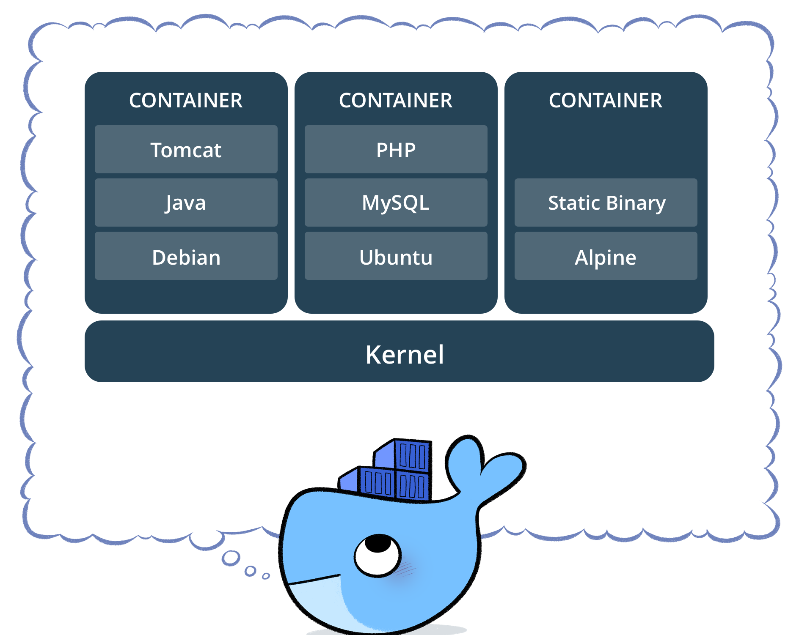
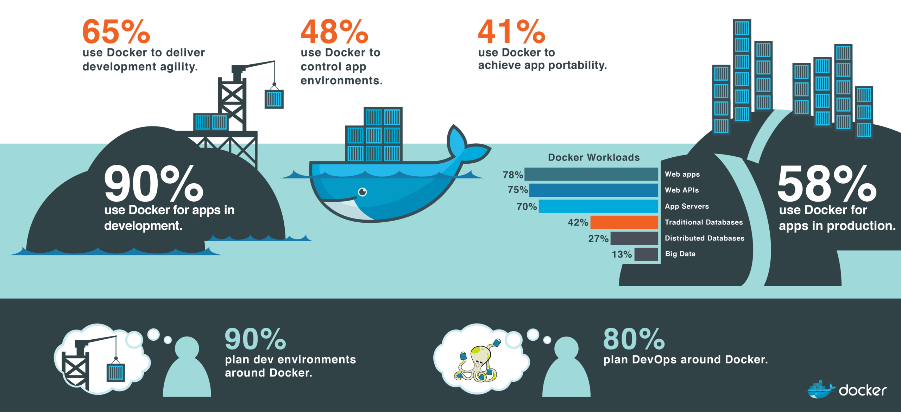

# Introduction to Docker :o:

Docker is the company driving the container movement and the only
container platform provider to address every application across the
hybrid cloud. Today's businesses are under pressure to digitally
transform but are constrained by existing applications and
infrastructure while rationalizing an increasingly diverse portfolio of
clouds, datacenters and application architectures. Docker enables true
independence between applications and infrastructure and developers and
IT ops to unlock their potential and creates a model for better
collaboration and innovation. An overview of docker is provided at

* <https://docs.docker.com/engine/docker-overview/>

{#fig:cocker-container}

Image Source
<https://www.docker.com/sites/default/files/Package%20software%40x2.png>

:o: +@fig:cocker-container

## Docker Survey

In 2016 Docker Inc. surveyed over 500 Docker developers and operations
experts in various phases of deploying container-based technologies. The
result is available in the *The Docker Survey 2016* as seen in +@fig:docker-survey.

* <https://www.docker.com/survey-2016>

{#fig:docker-survey}

{#fig:docker-flow}

{#fig:docker-arch}

:o: +@fig:docker-flow

:o: +@fig:docker-arch

:o: add image sources
