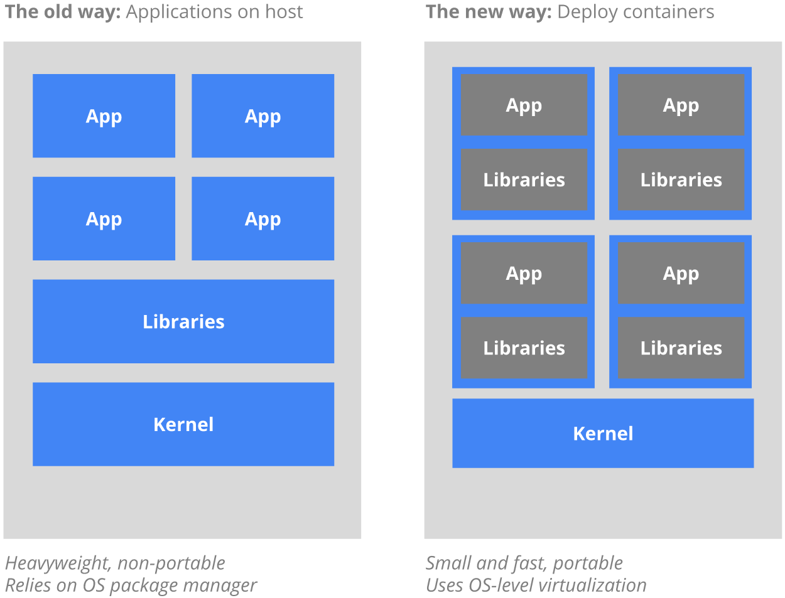
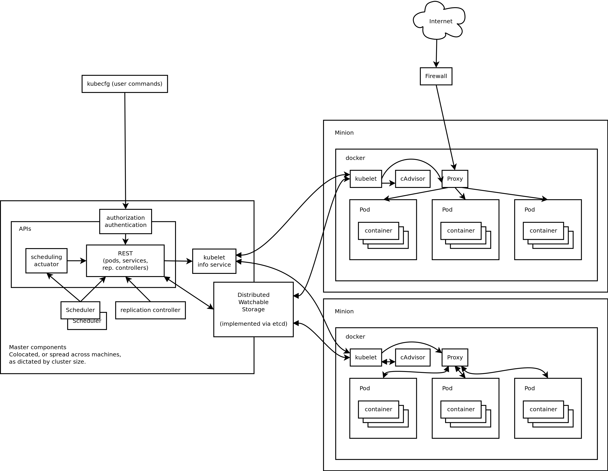

# Introduction to Kubernetes :o:

<!--- 

Disclaimer: If you reached this file via github, it is ok to make a pull request 
for this file to correct it. However, viewing this file is only done properly 
in the ePub. Thus we recommend that you go to 

https://github.com/cloudmesh-community/book/blob/master/README.md

and download the appropriate ePub
--->

:o: there are some windows commands here, we want linux, but if
windows useful explain how to run it from bash within windows


## Topics Covered and Learning Outcome

---

**:mortar_board: Learning Objectives**

* What is Kubernetes?
* What are containers?
* Cluster components in Kubernetes
* Basic Units in Kubernetes
* Run an example with Minikube
* Interactive online tutorial
* Have a solid understanding of Containers and Kubernetes
* Understand the Cluster components of Kubernetes
* Understand the terminology of Kubernetes
* Gain practical experience with kubernetes
* With minikube
* With an interactive online tutorial

---

## What is Kubernetes?

Kubernetes is an open-source platform designed to automate deploying,
scaling, and operating application containers.

* <https://kubernetes.io/docs/concepts/overview/what-is-kubernetes/>

With Kubernetes, you can:

* Deploy your applications quickly and predictably.
* Scale your applications on the fly.
* Roll out new features seamlessly.
* Limit hardware usage to required resources only.
* Run applications in public and private clouds.

Kubernetes is

* Portable: public, private, hybrid, multi-cloud
* Extensible: modular, pluggable, hookable, composable
* Self-healing: auto-placement, auto-restart, auto-replication,
    auto-scaling

## What are containers?



Figure: Containers

source: <https://d33wubrfki0l68.cloudfront.net/e7b766e0175f30ae37f7e0e349b87cfe2034a1ae/3e391/images/docs/why_containers.svg>

## Terminology

Pods:

:   A pod (as in a pod of whales or pea pod) is a group of one or more
    containers (such as Docker containers), with shared storage/network,
    and a specification for how to run the containers. A pod's contents
    are always co-located and co-scheduled, and run in a shared context.
    A pod models an application-specific *logical host*. It contains one
    or more application containers which are relatively tightly coupled.
    In a pre-container world, they would have executed on the same
    physical or virtual machine.

Services:

:   Service is an abstraction which defines a logical set of Pods and a
    policy by which to access them. Sometimes they are called a
    micro-service. The set of Pods targeted by a Service is (usually)
    determined by a Label Selector.

Deployments:

:   A Deployment controller provides declarative updates for Pods and
    ReplicaSets. You describe a desired state in a Deployment object,
    and the Deployment controller changes the actual state to the
    desired state at a controlled rate. You can define Deployments to
    create new ReplicaSets, or to remove existing Deployments and adopt
    all their resources with new Deployments.

## Kubernetes Architecture

{#fig:tas-arch}

## Minikube

1.  minikube installation
2.  minikube hello-minikube

### Install minikube

##### OSX

```console
$ curl -Lo minikube https://storage.googleapis.com/minikube/releases/v0.25.0/minikube-darwin-amd64 && chmod +x minikube && sudo mv minikube /usr/local/bin/
```

##### Windows 10

We assume that you have installed Oracle VirtualBox in your machine
which must be a version 5.x.x.

Initially, we need to download two executables.

[Download
Kubectl](http://storage.googleapis.com/kubernetes-release/release/v1.4.0/bin/windows/amd64/kubectl.exe)

[Download
Minikube](https://storage.googleapis.com/minikube/releases/v0.25.0/minikube-windows-amd64.exe)

After downloading these two executables place them in the cloudmesh
directory we earlier created. Rename the `minikube-windows-amd64.exe` to
`minikube.exe`. Make sure minikube.exe and kubectl.exe lie in the same
directory.

##### Linux

```console
$ curl -Lo minikube https://storage.googleapis.com/minikube/releases/v0.25.0/minikube-linux-amd64 && chmod +x minikube && sudo mv minikube /usr/local/bin/
```

Installing KVM2 is important for Ubuntu distributions

```console
$ sudo apt install libvirt-bin qemu-kvm
$ sudo usermod -a -G libvirtd $(whoami)
$ newgrp libvirtd
```

We are going to run minikube using KVM2 libraries instead of virtualbox
libraries for windows installation.

Then install the drivers for KVM2,

```console
$ curl -LO https://storage.googleapis.com/minikube/releases/latest/docker-machine-driver-kvm2 && chmod +x docker-machine-driver-kvm2 && sudo mv docker-machine-driver-kvm2 /usr/bin/
```

### Start a cluster using Minikube

##### OSX Minikube Start

```console
$ minikube start
```

##### Ubuntu Minikube Start

```console
$ minikube start --vm-driver=kvm2
```

##### Windows 10 Minikube Start

In this case you must run Windows PowerShell as administrator. For this
search for the application in search and right click and click Run as
administrator. If you are an administrator it will run automatically but
if you are not please make sure you provide the admin login information
in the pop up.

```console
$ cd  C:\Users\<username>\Documents\cloudmesh
$ .\minikube.exe start --vm-driver="virtualbox"
```

### Create a deployment

```console
$ kubectl run hello-minikube --image=k8s.gcr.io/echoserver:1.4 --port=8080
```

### Expose the service

```console
$ kubectl expose deployment hello-minikube --type=NodePort
```

### Check running status

This step is to make sure you have a pod up and running.

```console
$ kubectl get pod
```

### Call service api

```console
$ curl $(minikube service hello-minikube --url)
``

### Take a look from Dashboard

```console
$ minikube dashboard
```

If you want to get an interactive dashboard,

```console
$ minikube dashboard --url=true
http://192.168.99.101:30000
```

Browse to http://192.168.99.101:30000 in your web browser and it will
provide a GUI dashboard regarding minikube.

### Delete the service and deployment

```console
$ kubectl delete service hello-minikube
$ kubectl delete deployment hello-minikube
```

### Stop the cluster

For all platforms we can use the following command.

```console
$ minikube stop
```

## Interactive Tutorial Online

* Start cluster
  <https://kubernetes.io/docs/tutorials/kubernetes-basics/cluster-interactive/>
* Deploy app
  <https://kubernetes.io/docs/tutorials/kubernetes-basics/cluster-interactive>
* Explore
  <https://kubernetes.io/docs/tutorials/kubernetes-basics/explore-intro/>
* Expose
  <https://kubernetes.io/docs/tutorials/kubernetes-basics/expose-intro/>
* Scale
  <https://kubernetes.io/docs/tutorials/kubernetes-basics/scale-intro/>
* Update
  <https://kubernetes.io/docs/tutorials/kubernetes-basics/update-interactive/>
* MiniKube
  <https://kubernetes.io/docs/tutorials/stateless-application/hello-minikube/>
