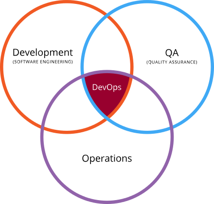
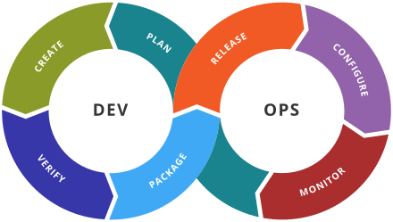

DevOps
======

When we work with cloud infrastructure and at the same time deploy
platforms and software we become in essence our own system
administrator. Today the intervoven responsibilities of the developer
not only to design an algorithm but be familiar with how this
algorithm can be effectively deployed on an infrastructure is a
challange that Big Data Scientists, Big Data Engineers and Cloud
researchers must master.

A field of study that will be helpful in achieving this is called
*DevOps*.

We quote form <https://en.wikipedia.org/wiki/DevOps>:

> DevOps is a set of practices intended to reduce the time between
> committing a change to a system and the change being placed into
> normal production, while ensuring high quality.[8]

> [8] Bass, Len; Weber, Ingo; Zhu, Liming. DevOps: A Software Architect's
  Perspective. ISBN 978-0134049847.

A helpful ven diagram for visualizing the important aspects that
DevOps tries to address is depicted in @fig:devops-ven

{#fig:devops-ven}

Source: <https://en.wikipedia.org/wiki/DevOps#/media/File:Devops.svg>

To visualize the process interactions in the toolchain cycle between development and operations we also often find the it depicted in @fig:devops-cycle

{#fig:devops-cycle}

The cycle includes in each portion

Dev:

* dev planing
* creating
* verifying
* packaging

Ops:

* releasing
* configuring
* monitoring
* ops planing (influencing dev planing)

One of the advantages we have while adopting a DevOps approach is to
also address reproducibility across the entire product chain. That is
if we apply these technologies correctly we should be able to adapt
our DevOps solutions in such a form that it not only works on one
cloud when we develop general tools, but also on multiple clouds. We
can enable this through different entry points into the toolchain
while for example using a common underlying infrastructure, platform,
or software environment to address each DevOps challange in that
particular layer.

## References

* DevOps tools <https://github.com/collections/devops-tools>
* Tox <https://tox.readthedocs.io/en/latest/>
* Travis:

	* <https://about.travis-ci.com/> <https://travis-ci.org/>
	* <https://docs.travis-ci.com/user/getting-started/>

