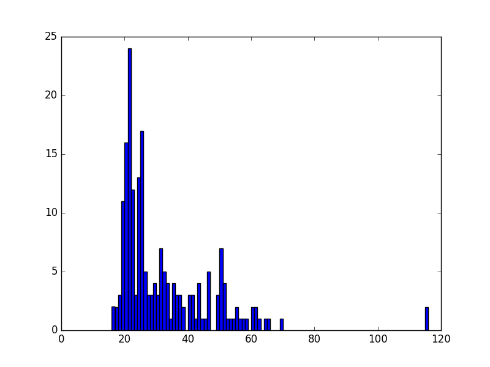

# Markdown

Markdown is a simple markup language, however there is no uniform precise
standard defined for it and implementations may have features not
supported by other implementations. Nevertheless, whne using the basic features, 
it provides a simple
and easy way to quickly develop clean structured documents. The emphasize here is on structure, as in contrast to 
WYSIWYG editors it is not only important that your document looks good, but that the structure 
of the document is reflected in its layout. Thus you need to use headings and not just make headings look 
like headings with a bold font.


## Markdown format

To convert the markdown to other formats with `pandoc`

    # Heading

    ## Sub-heading

    ### Sub Sub Heading heading
     
    Paragraphs are separated
    by a blank line. This is important. THere must be one after the heading also

    Text attributes include: *italic*, **bold**, `monospace`.

    Horizontal rule:

    ---

    Bullet list:

      * item 1
      * item 2
      * item 3

    Numbered list:

      1. first
      2. second
      3. third

    A [link](http://example.com).

    ```bash
    $ echo "a bash script"
    ```

    ```python
    print("a pythion script")
    ```

    Images must all be local and must not have an http refernce
    All images must be placed in a directory called images/ as shown in @fig:labelwithoutspaces.
    
    {#fig:labelwithoutspaces}
    
    Any figure used in the text must be refered to with a Figure cation and label as shown next
    

## Editors

There are several tools that make writing documents in markdown easy. If you do not just look at the output of these 
documents but follow the structure guides properly.

Examples for such ediotrs are:

Macdown

:   MacDown is an open source Markdown editor for macOS that is
    available at <https://macdown.uranusjr.com/>

Emacs

: The most universal editor that has ever been written. It allows you to edit markdown text.

PyCharm

: As we do a lot of python programming, we recommend that your learn Emacs and/or PyCharm. Both come with Markdown editing modes. 

Dilinger

:   A HTML5 based cloud enabled editor <https://dillinger.io/>. It
    allows to download the created Markdown.

Markdown plus

: :warning: We are not using the many extensions that are provided by markdown plus.
  We recommendthat you use emacs or pycharm. However, those that want to do advanced markdown
  outside the class may benefit from markdown plus.
  Markdown plus ahs lots of extensions. 
  It is located at <https://mdp.tylingsoft.com/>. The source code is
  on github <https://github.com/tylingsoft/markdown-plus>. A local install can be achieved as follows:

  ```bash
  $ git clone https://github.com/tylingsoft/markdown-plus.git
  $ cd markdown-plus
  $ brew install yarn
  $ yarn install
  $ yarn watch
  $ open dist/index.html
  ```

## Converters

In addition to editors you can often convert text to markdown. However you need to be careful that the 
documents you created your text from may not produce the clean markdown you need and you may need to 
cleanup the text by for example replacing some characters, inlcuding proper spaces and other things.

The most powerful converter is pandoc and we recommend that you use it. Pandoc is also able to convert markdown in other 
formats such as ePub, PDF, HTML.

A word of warning: Although pandoc can convert from MSWord, Word has some limitations in its character sets that require you to clean the markdown after conversion. 
Experience shows that it cost less time and is far easier to write the document directly in markdown with emacs or pyCharm.


### Conversion with pandoc

Pandoc is a tool to convert file formats between each other. According
tho the Web page Pandoc can convert "Markdown, reStructuredText,
textile, HTML, DocBook, LaTeX, MediaWiki markup, TWiki markup,
TikiWiki markup, Creole 1.0, Vimwiki markup, OPML, Emacs Org-Mode,
Emacs Muse, txt2tags, Microsoft Word docx, LibreOffice ODT, EPUB, or
Haddock markup".

The Web page is located at.

* <https://pandoc.org/>

To convert files simply use the following commandline option `-o` to
specify the output format

    pandoc filename.md -o filename.tex

In our example we converted the md file to latex.

As this document is created with pandoc we encourage you to review our
Makefile to see how we use some more advanced features


### Advanced Pandoc

pandoc can integrate extensions and filters. We have not made yet use
of them but like to explore them over time.

Packages of interest include:

* Include files <http://pandoc.org/filters.html#include-files>
* Integration of R <https://github.com/cdupont/r-pandoc>
* Figure numbers <https://github.com/tomduck/pandoc-fignos>
* Equation numbers <https://github.com/tomduck/pandoc-eqnos>
* Table numbers <https://github.com/tomduck/pandoc-tablenos>
* Cross refs with lots of numbering <https://github.com/lierdakil/pandoc-crossref>
* section numbering <https://github.com/chdemko/pandoc-numbering>
* CSV table <https://github.com/baig/pandoc-csv2table>
* inline CSV table <https://github.com/mb21/pandoc-placetable>

#### Mermaid

Mermaid is a graph generation tool that lets you create graphs and
diagrams with the help of a description language. It includes graphviz
and UML like diagrams, as well as gantt charts

A live editor is available at 

  * [Mermaid live editor](https://mermaidjs.github.io/mermaid-live-editor/)

A markdown plugin for pandoc is available

* Mermaid 
* <https://github.com/raghur/mermaid-filter>

Installation is done with

```bash
$ npm install --global mermaid-filter
```

A sequence diagram example is shown next

```
~~~mermaid
sequenceDiagram
Alice->>John: Hello John
    John-->>Alice: Hallo Allice
~~~
```

~~~mermaid
sequenceDiagram
    Alice->>John: Hello John
    John-->>Alice: Hallo Allice
~~~

A flowchart looks like

```
~~~mermaid
graph LR
    Start --> End
~~~
```

~~~mermaid
graph LR
    Start --> End
~~~

## Presentations in Markdown

Please find some links on hwo to use markdown to create slides

* <https://yhatt.github.io/marp/>
* <http://slidify.org/>
* <https://rmarkdown.rstudio.com/lesson-11.html>
* GitPitch <https://github.com/gitpitch/gitpitch/wiki/Slide-Markdown>


## References

*   <https://en.wikipedia.org/wiki/Markdown>
