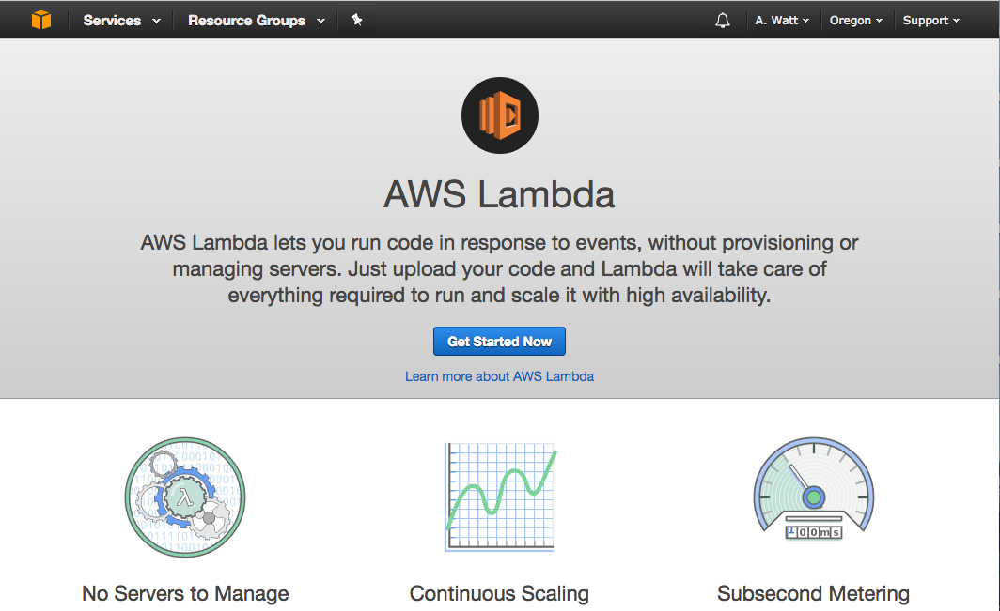
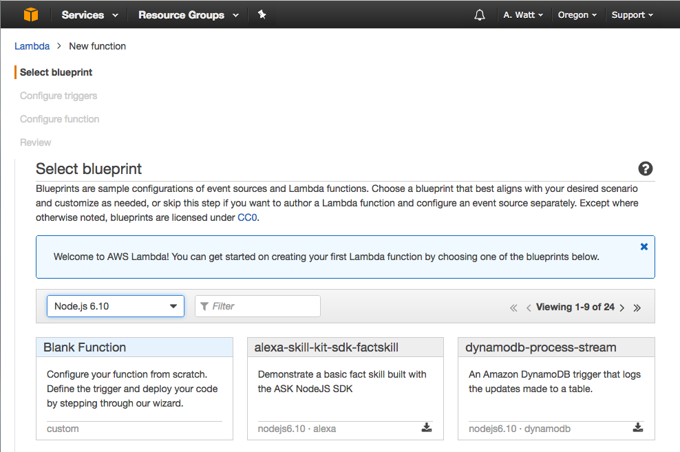
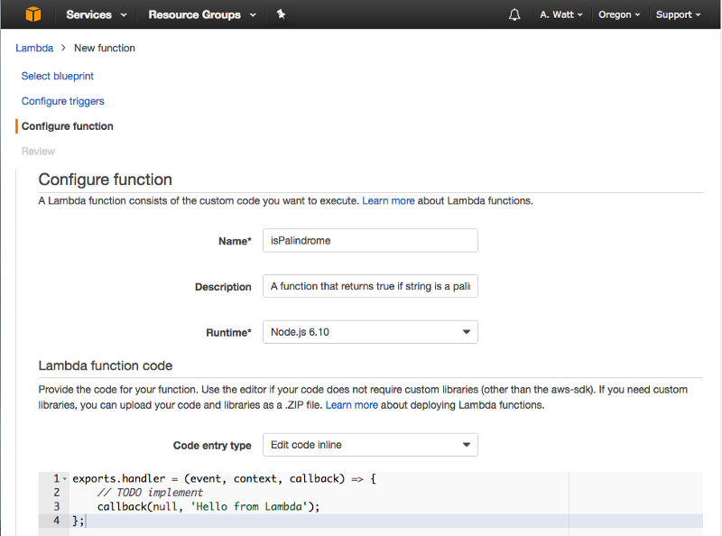
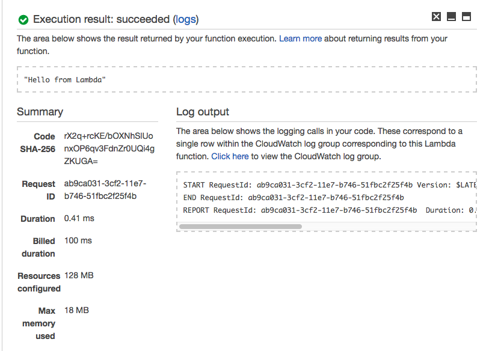
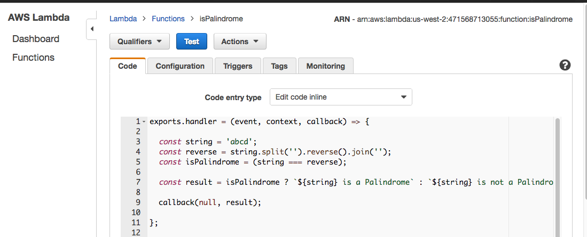
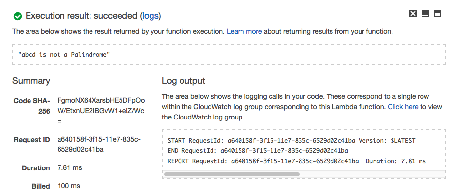

# AWS Lambda {#s-aws-lambda}

---

 **Learning Objectives**

* Learn about AWS lambda
* Try out AWS Lambda practically

---


AWS Lambda is considered as one of the earliest FaaS implementations
made available to end users. AWS Lambda provides a rich set of
features that can be leveraged by users to build programs and
applications on top of the FaaS framework. AWS Lambda supports many
event types that developers can use to orchestrate their FaaS
applications. And in line with the FaaS model AWS Lambda only charges
users for actual execution time of the functions. For example if you
host and deploy a function on AWS Lambda and only execute it for 1
minute every day you will only be charged for the 1 minute execution
time.

AWS does not share how the internals of AWS Lambda work in detail but
as with any general FaaS framework it should be leveraging various
container technologies underneath. You can get a better understanding
on how the internals of a FaaS framework is organized by looking at
the [OpenWhisk Section](openwhisk.md)

## AWS Lambda Features

AWS Lambda provides many features that allows the creation of an FaaS
application to be straight forward. An FaaS application normally
consist of a set of functions and a set of events that activate or
invoke those functions. AWS Lambda supports several programing
languages that allow developers to develop the function they require
in any of the programming languages that are supported. The following
list show the programming languages that are currently supported by
AWS Lambda for function creation.

* Node.js (JavaScript)
* Python
* Java (Java 8 compatible)
* C# (.NET Core)
* Go

Other than the functions the most important requirement for a good
FaaS framework is a rich set of function invocation methods which
allow users to tie together different events that happen in the echo
system with the FaaS application. In this regard AWS Lambda supports
many event sources, mainly from the AWS echo system. AWS documentation
provides a complete list of supported event sources at
[AWS Lambda event sources](https://docs.aws.amazon.com/lambda/latest/dg/invoking-lambda-function.html).
For example a developer can configure an function to be invoked when a
S3 bucket is updated, or configure an function to be invoked based on
inputs received by Amazon Alexa, etc.

 use also bibtex

## Understanding Function limitations

Before you start working on FaaS frameworks it is important to
understand the limitations and restrictions that are applied to
functions. The limits and restrictions discussed in the section are
applicable to most FaaS frameworks but the exact values may differ
based on the FaaS vendor. However the reason for most of the
limitations are to maintain performance requirements. We will discuss
several major limits next. For a complete list of limits in AWS
Lambda please refer to the limits documentation
[AWS Lambda Function Limits](https://docs.aws.amazon.com/lambda/latest/dg/limits.html)

 use also bibtex

### Execution Time

AWS Lambda limits the execution length of a function. Currently it is
set to 15 minutes but was set at 300s previously, so the function
limits have and may change with time. Other FaaS provides have
different values for execution time limits, but in general each FaaS
provider does define a execution time limit

### Function size

AWS Lambda also sets several memory and storage limits for
functions. Currently the maximum memory allocated to a function is
3008MB and the maximum allocated storage space is 512MB. However it is
good to keep in mind that monetary charge for function execution
increases with the amount of memory that is specified for the
function.

## Understanding the free Tier

If new users want to experiment with AWS lambda, AWS does provide a
free tier for AWS Lambda, which include 1 million function invocations
per month. You can find a more detailed description of the free tier
in the AWS docs
[AWS Lambda Pricing](https://aws.amazon.com/lambda/pricing/).

 use also bibtex

## Writing your fist Lambda function

With the GUI interface it is relatively easy to try out your first
Serverless function with AWS Lambda. Please follow the steps defined
at
[How to run your first AWS Lambda function in the cloud](../iaas/aws/aws-lambda.md#how-to-run-your-first-aws-lambda-function-in-the-cloud---example) (this link does not exsit any longer)

 use also bibtex


## AWS Lambda Usecases {#s-aws-lambda-applictaions}


AWS Lambda is an event-driven, serverless computing platform provided
by Amazon as a part of the Amazon Web Services. It is a computing
service that runs code in response to events, runs the code that has
been loaded into the system and automatically manages the computing
resources required by that code. According to the the Lambda product page

> “AWS Lambda lets you run code without provisioning or managing
> servers.” [Aws](https://aws.amazon.com/lambda/) ( refernce to bibtex)

For example, one of the use-cases would be that everytime AWS Lambda
could resize the picture, after it is uploaded onto AWS S3 system and
rendered on different devices like phone, ipad or desktop. The event
that triggers the Lambda function is the file being uploaded to S3.
Lambda then executes the function of resizing the image. The Seattle
Times uses the AWS Lambda to automatically resize the images.

One key point to note here is that Amazon charges only when the
functions are executed. So, The Seattle Times is charged for this
service only when the images are been resized. Lambda can be used for
Analytics. So lets say, there has been a purchase of a house on
zillow, this data can be saved into a NoSQL database and this entry
into the database is an event which can trigger Lambda function to
load the order information into Amazon Redshift. Then we can run
Analytics on top of this data. We can also build serverless
applications composed of functions that are triggered by events and
automatically deploy them using AWS CodePipeline and AWS CodeBuild.
For more information, see Deploying Lambda-based Applications.

There are development groups or companies mainly startups, where they want
to just focus on their application development without wanting to care about
their infrastructure and they also want that they pay for what they use.
Hence, AWS Lambda comes into play which satisfies all their needs.

Ironically, Lambda could be a threat to one of the Amazon's most
popular EC2. Developers can build apps that run entirely on Lambda
functions instead of spinning up EC2 VMs. Amazon may be out-innovating
itself with Lambda.


In AWS Lambda, we have triggers. Lambda Functions can be triggered in
different ways: an HTTP request, a new document upload to S3, a
scheduled Job, an AWS Kinesis data stream, or a notification from AWS
Simple Notification Service (SNS).

## AWS Lambda Example

Let us create our first Lambda function.

Step 1: The very first thing we need is an AWS account. (There is
already a section on this, please go through that to understand how to
create an AWS account -
[Creating AWS account](aws.md#creating-an-account)

Step 2: We will be writing a function that we call `isPalindrome`,
which will check if the string is palindrome or not.


```java
function isPalindrome(string) {
    const reverse = string.split('').reverse().join('');
    const isPalindrome = (string === reverse);
    const result = isPalindrome ? `${string} is a Palindrome` : `${string} is not a Palindrome`;
    return result;
}

document.write(isPalindrome('abcd'));
```


This example we store in a file as javascript named `isPalindrome.js`

Step 3: Let’s see how to create an AWS Lambda function - isPalindrome.
Firstly, go to AWS Console. (see @fig:aws-lambda-console).

{#fig:aws-lambda-console}

Step 4: Now we will select AWS Lambda from console and then click
on <span style="background-color:blue;color:white">&nbsp;Get Started Now&nbsp;</span>
(see @fig:aws-lambda-lambda)

{#fig:aws-lambda-lambda}

Step 5: For runtime, we will select Node.js 6.10 and then press “Blank Function.”
(see @fig:aws-lambda-blank).

{#fig:aws-lambda-blank}

Step 6: We will skip this step and press <span style="background-color:blue;color:white">&nbsp;Next&nbsp;</span>.
(see @fig:aws-lambda-next)

{#fig:aws-lambda-next}

Step 7: Let’s give the Name as isPalindrome and put in a description
of our new Lambda Function, or we can leave it blank. (see @fig:aws-lambda-description)


{#fig:aws-lambda-description}

Lambda function is just a function, named as *handler* here and the
function takes three parameter - event, context and a callback
function. The callback will run when the Lambda function is done and
will return a response or an error message. For the Blank Lambda
blueprint, response is hard-coded as the string `Hello from Lambda`.

Step 8: Please scroll down for choosing the Role “Create new Role from
template”, and for Role name we are going to use isPalindromeRole in
our case.  For Policy templates, we will choose “Simple Microservice”
permissions.  (see @fig:aws-lambda-policy)

{#fig:aws-lambda-policy}

Step 9: For Memory, 128 megabytes is more than enough for our simple
function. As for the 3 second timeout, this means that — should the
function not return within 3 seconds - AWS will shut it down and
return an error. Three seconds is also more than enough. Leave the
rest of the advanced settings unchanged (see @#fig:aws-lambda-settings).

](images/aws_lambda_5.png){#fig:aws-lambda-settings}

Step 10: Let’s click on the “Create function” button now to create
our first Lambda function. (see @fig:aws-lambda-create)

{#fig:aws-lambda-create}

Step 11: Now that we have created our first Lambda function, let's test
it by clicking <span style="background-color:blue;color:white">&nbsp;Test&nbsp;</span>
(see @fig:aws-lambda-test)

{#fig:aws-lambda-test}


The output will be the hard-coded response of `Hello from Lambda.`
from the created Lambda function. (see @fig:aws-lambda-hello)

{#fig:aws-lambda-hello}

Step 12: Now let us add our `isPalindrome.js` function code here to
Lambda function but instead of return result use `callback(null,
result)`. Then add a hard-coded string value of abcd on line 3 and
press `Test`. (see @fig:aws-lambda-press)

{#fig:aws-lambda-press}

The output will be `abcd is not a Palindrome` (see @fig:aws-lambda-output)


{#fig:aws-lambda-output}

Similarly, let us try with string `abcdcba` and in this case output
should return `abcdcba is a Palindrome`. Thus, our Lambda function is
behaving as expected.
