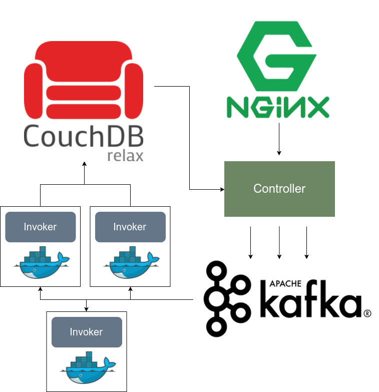

# Apache OpenWhisk :o: :hand: fa18-516-26 {#s-openwhisk}

Apache OpenWhisk is a Function as a Service (FaaS), aka Serverless computing, platform used to execute code in response of an events via triggers by managing the infrastructure, servers and scaling. The advantage of OpenWhisk over traditional long-running VM or container approach is that there is lack of resiliency-related overhead in OpenWhisk. OpenWhisk is inherently scalable since the actions are executed on demand. OpenWhisk also helps the developers to focus only on coding by taking care of infrastructure-related tasks like monitoring and patching.

The developers provide the code written in the desired programming language for the desired action and this code will be executed in response to the events. The *triggering* can be invoked using HTTP requests or external feeds. The events invoking the triggers ranges from database modification to new variables in IoT sensors. Actions that response to these events could also range from a Python code snippet to a binary code in a container and it is as well possible to chain the actions. Note that these actions are deployed and executed instantaneously and can be invoked not only by triggers but also using the OpenWhisk API or CLI.

## OpenWhisk Workflow

OpenWhisk uses Nginx, Kafka, Docker and CouchDB as internal components. To understand the role of each of these components, let's review an action invocation trace in the system. Remember the main outcome of OpenWhisk (or Serverless architecture in general) is to execute the user's code inside the system and return the result. The workflow of the OpenWhisk is illustrated in the following figure:

{#fig:openwhisk-workflow}

We will review the role of each components in the OpenWhisk workflow.  
### The Action and Nginx
As mentioned prior, the action is the response of the OpenWhisk to triggers. Consider the following JavaScript function: 
``` Javascript 
function main() {
    return { hello: 'world' };
}
```
This is the Hello World example of the OpenWhisk action where the action returns a JSON object with the key `hello` which has a value of `world`.  After saving this function in a `.js` file, e.g. `action.js` then the action could be created using the following command: 
```bash
$ wsk action create HelloAction action.js
```
Then, the `HelloAction` can be invoked using: 
```bash
$ wsk action invoke HelloAction --result
```
The `wsk` command is what is known as OpenWhisk CLI, which we will show how to install in the next sections.  Note that OpenWhisk's API is RESTful and fully HTTP based. In other words, the above-mentioned `wsk action` command  is basically a HTTP request equivalent to the following: 
``` 
POST /api/v1/namespaces/$userNamespace/actions/HelloAction
Host: $openwhiskEndpoint
```
The `userNamespace` variable defines the namespace in which the `HelloAction` is put into. Accordingly, nginx is the entering point of the OpenWhisk system and it plays an important role as a HTTP server as well as a reverse proxy server, mainly used for SSL termination and HTTP request  forwarding. 
### Controller
We learned that nginx does not do any processing on the HTTP request except decrypting it (SSL Termination). The main processing of the request starts in the Controller. The controller plays the role of the interface for user both for actions and Create, Read, Update, and Delete (CRUD) requests. 

Based on the 
### CouchDB
to be completed
### Load Balancer
to be completed
### Kafka
to be completed
### Invoker
to be completed
### CouchDB again
to be completed

## Setting up the OpenWhisk CLI

