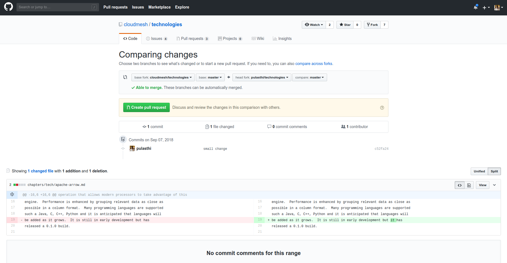

# Git Pull Request

## Introduction

Git pull requests allow developers to submit work or changes they have 
done to a repository, The developers can then check the changes that 
have been proposed in the pull request, discuss and make changes if
needed. After the content off the pull request has been agreed upon
it can be merged to the repository to add the information or changes in
the pull request into the repository. 

## How to create a pull request

In this document we will see how we can create a pull request for the 
Cloudmesh technologies repo that is located at 

* <https://github.com/cloudmesh/technologies>

However if you do pull request on other directories, you just have to replace the url with that of the repository you like to use. A common one four our classes is also 

* <https://github.com/cloudmesh-community/book>

Which contains this book.

You can either create a pull request through a branch or through a fork.
In this document we will be looking at how we can create a pull request
through a fork.

## Fork the original repository

First you need to create a fork of the original repository. A fork is 
your own copy of the repository to which you can make changes to. To fork
the Cloudmesh technologies goto [Cloudmesh technologies repo](https://github.com/cloudmesh/technologies)
and click on the Fork button on the top right corner. Now you can notice
that instead of `cloudmesh/technologies` the name of the repo says 
`YOURGITUSERNAME/technologies`, where `YOURGITUSERANAME` is indeed your github user name. That is because you are now in your own 
copy of the `cloudmesh/technologies` repository. n our case the user name will be `pulashti`. 

## Clone your copy

Now that you have your fork created, we can go ahead and clone it into
our machine. Instructions on how to clone a repository can be found in the
Github documentation - [Cloning a repository](https://help.github.com/articles/cloning-a-repository/).
Make sure that you clone your version of the technologies repo.

## Adding an upstream 

Before we can start working on our copy of the git repo it is good to add
an upstream (a link to the original repo) so that we can get all the 
latest changes in the original repository into our copy. Use the following 
commands to add an upstream to `cloudmesh/technologies`. First go into the
folder which contains your git repo that you cloned and execute the
following command.

```bash
$ git remote add upstream https://github.com/cloudmesh/technologies.git'
```

To make sure you have added it correctly execute the following command

```bash
$ git remote -v
```

You should see something similar to the following as the output

```bash
origin	https://github.com/pulasthi/technologies.git (fetch)
origin	https://github.com/pulasthi/technologies.git (push)
upstream	https://github.com/cloudmesh/technologies.git (fetch)
upstream	https://github.com/cloudmesh/technologies.git (push)

```

## Making changes

Now you can make changes to your repo as with any normal git repository.
However to make sure you have the latest copy from the original execute
the following command before you start making changes. This will pull the 
latest changes from the original `cloudmesh/technologies` into your local
copy

```bash
$ git pull upstream master
```

Now make the needed changes commit and push, the changes will be pushed
to your copy of the repo i Github, not the `cloudmesh/technologies` repo.

## Creating a pull request

Once we have changes pushed, you can go into your repository in Github to
create a pull request. As seen in +@#fig:button-pullrequest, you have an button named
`Pull request`

{#fig:button-pullrequest}


Once you click on that button you will be taken to a page to create the
pull request, which will look similar to +@fig:pullrequest.

{#fig:pullrequest}

Once you click on the `Create pull request` button you will be given an
option to add a title and a comment for the pull request. Once you complete
the details and submit the pull request will appear in the original
`cloudmesh/technologies` repo. 

**Note: Make sure you see the `Able to merge` sign before you submit the
pull request, otherwise your pull will not be able to directly merged to
the original repo. If you do not see this that means you have not properly
done the `git pull upstream master` command before you made the changes**
