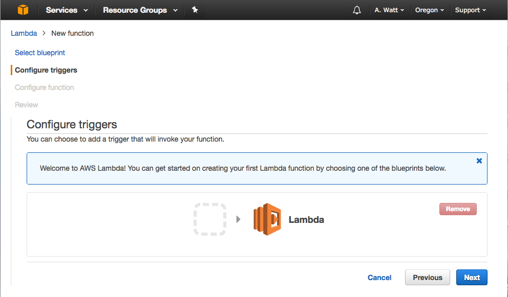
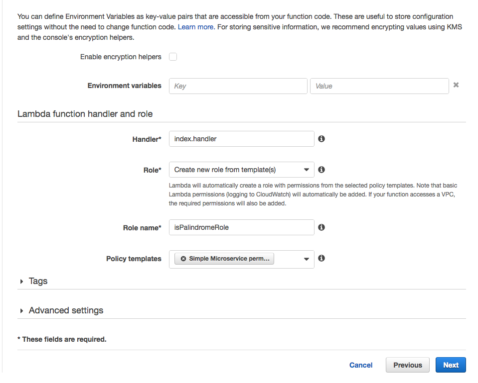
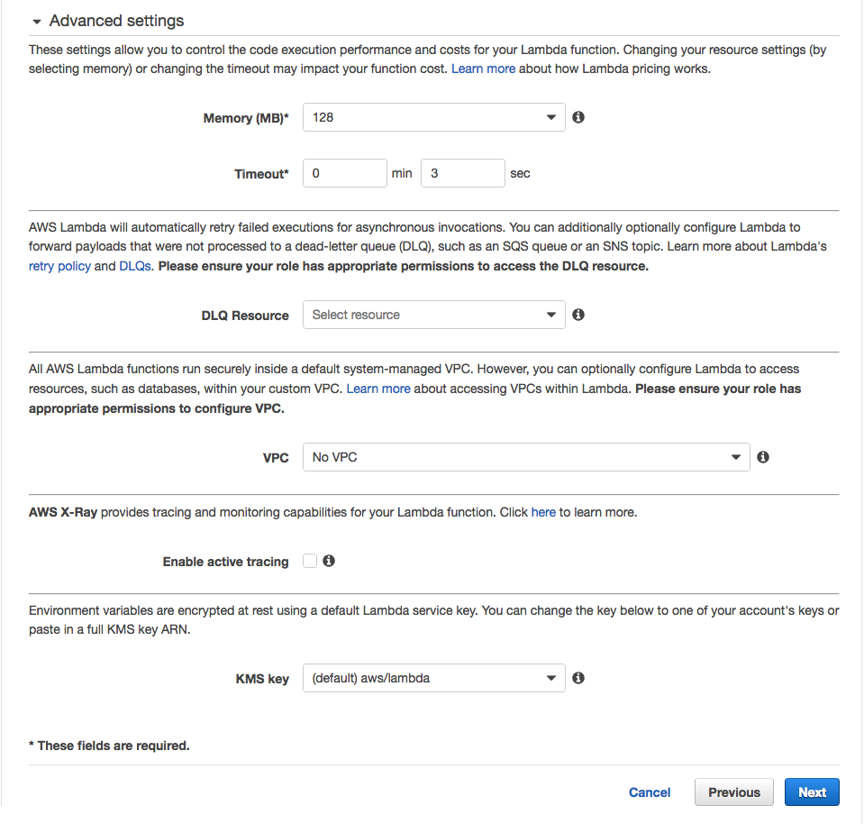
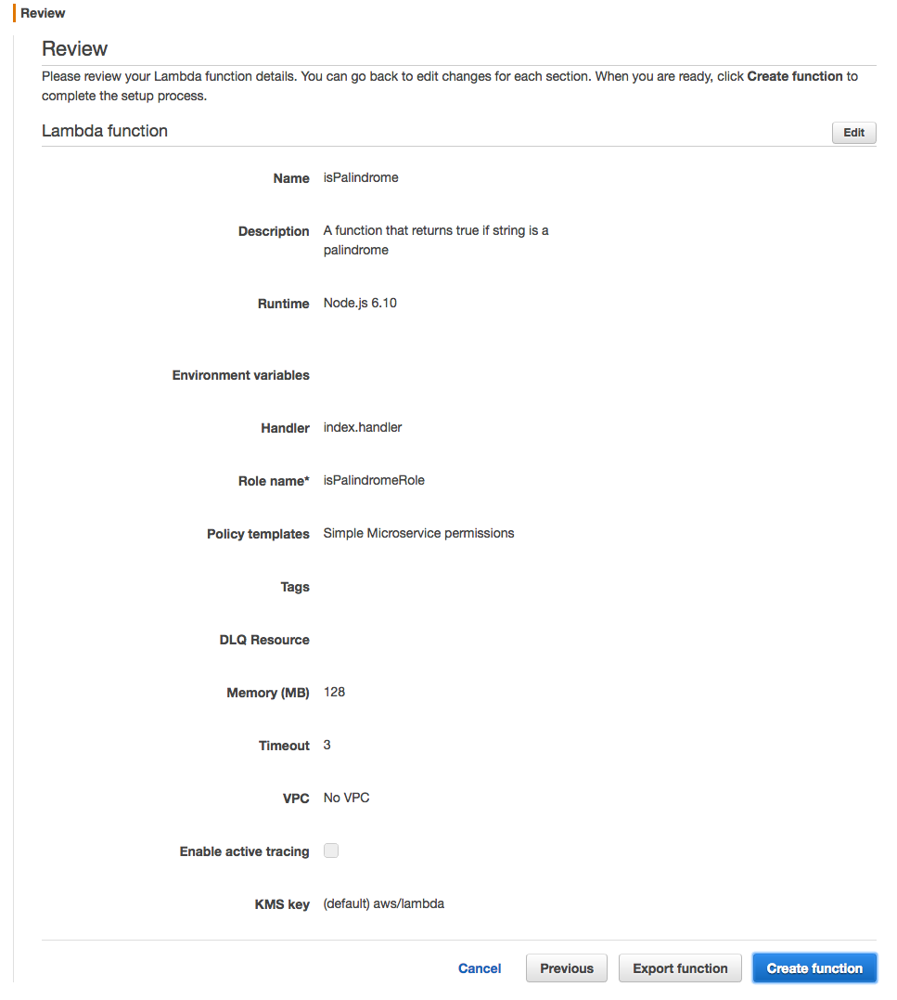
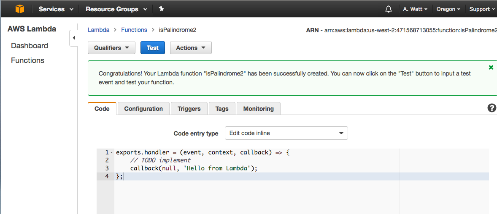

# AWS Lambda :o: {#s-aws-lambda}

---

**:mortar_board: Learning Objectives**

* Leran about AWS lambda
* Try out AWS Lambda practucally

---

AWS Lambda is an event-driven, serverless computing platform provided
by Amazon as a part of the Amazon Web Services. It is a computing
service that runs code in response to events, runs the code that has
been loaded into the system and automatically manages the computing
resources required by that code. According to the the Lambda product page

> “AWS Lambda lets you run code without provisioning or managing
> servers.” [:warning: ciite missing](cite missing) 

For example, one of the use-cases would be that everytime AWS Lambda
could resize the picture, after it is uploaded onto AWS S3 system and
rendered on different devices like phone, ipad or desktop. The event
that triggers the Lambda function is the file being uploaded to S3.
Lambda then executes the function of resizing the image. The Seattle
Times uses the AWS Lambda to automatically resize the images.

One key point to note here is that Amazon charges only when the
functions are executed. So, The Seattle Times is charged for this
service only when the images are been resized. Lambda can be used for
Analytics. So lets say, there has been a purchase of a house on
zillow, this data can be saved into a NoSQL database and this entry
into the database is an event which can trigger Lambda function to
load the order information into Amazon Redshift. Then we can run
Analytics on top of this data. We can also build serverless
applications composed of functions that are triggered by events and
automatically deploy them using AWS CodePipeline and AWS CodeBuild.
For more information, see Deploying Lambda-based Applications.

In one of the interviews with Matt Wood, Chief product strategist at
Amazon Web Services, says 

> "There’s a particular category of usage
> where the developer wants to focus primarily on adding functionality
> to their application, they don’t want to worry about scaling up and
> down (infrastructure), and they want costs that run in line with usage
> of their application, not the utilization of their infrastructure.
> Lambda provides a really good answer for developers looking for that
> sort of focus." :warning: citation missing, could this not be 
> formulated without this quote?

Ironically, Lambda could be a threat to one of the Amazon's most
popular EC2. Developers can build apps that run entirely on Lambda
functions instead of spinning up EC2 VMs. Amazon may be out-innovating
itself with Lambda.

### Serverless Computing

In Serverless Computing, servers are still there, its just that we
dont need to manage them.

Another advantage of going serverless is that you no longer need to
keep a server running all the time. The *server* suddenly appears when
you need it, then disappears when you’re done with it. Now you can
think in terms of functions instead of servers, and all your business
logic can now live within these functions.

In AWS Lambda, we have triggers. Lambda Functions can be triggered in
different ways: an HTTP request, a new document upload to S3, a
scheduled Job, an AWS Kinesis data stream, or a notification from AWS
Simple Notification Service (SNS).

### How to run your first AWS Lambda function in the cloud - Example

Let us create our first Lambda function.

Step 1: Firts, We need an AWS account. This is discussed in Section :warning:.

Step 2: We will be writing a function that we call `isPalindrome`, which will check
if the string is palindrome or not.

:o: can syntax be improved so we can see the text

```
const isPalindrome = (string) => {
  const reverse = string.split('').reverse().join('');
  	const isPalindrome = (string === reverse);
      const result = isPalindrome ? `${string} is a Palindrome` :
       `${string} is not a Palindrome`;
              return result;
  };
```
  
This example we store in a file as javascript named `isPalindrome.js`

Step 3: Next we create an AWS Lambda function  `isPalindrome`. Go to AWS
Console (see +@fig:aws-lambda-console).

 
{#fig:aws-lambda-console}
 
 
Step 4: Now go to AWS Lambda from console and hit `Get Started Now` (see +@fig:aws-lambda-lambda)
 
{#fig:aws-lambda-lambda}

Step 5: For runtime select Node.js 6.10 and then press “Blank Function.” (see +@fig:aws-lambda-blank)
 
{#fig:aws-lambda-blank}

Step 6: Skip this step and press “Next.” (see +@fig:aws-lambda-next)

{#fig:aws-lambda-next}
 
Step 7: Say Name as `isPalindrome` and put in a description of your new
Lambda Function, or leave it blank. (see +@fig:aws-lambda-description)

{#fig:aws-lambda-desccription}

Lambda function is just a function, named as “handler” here and the
function takes three parameter - event, context and a callback
function. The callback will run when the Lambda function is done and
will return a response or an error message. For the Blank Lambda
blueprint response is hard-coded as the string ‘Hello from Lambda’.

Step 8: Scroll down, for Role choose “Create new Role from template”, and for Role name use isPalindromeRole or any name.
For Policy templates, choose “Simple Microservice” permissions. (see +@fig:aws-lambda-policy)
 
{#fig:aws-lambda-policy}

Step 9: For Memory, 128 megabytes is more than enough for our simple
function. As for the 3 second timeout, this means that — should the
function not return within 3 seconds — AWS will shut it down and
return an error. Three seconds is also more than enough. Leave the
rest of the advanced settings unchanged. (see +@fig:aws-lambda-settings)

{#fig:aws-lambda-settings}

Step 10: Create function now (see +@fig:aws-lambda-create)

{#fig:aws-lambda-create}

Step 11: First Lambda function is created. To test it, press “Test” (see +@fig:aws-lambda-test)
 
{#fig:aws-lambda-test}

Output will be the hard-coded response of “Hello from Lambda.” from the created Lambda function. (see +@fig:aws-lambda-hello)
 
{#fig:aws-lambda-hello}

Step 12: Now let’s add our isPalindrome.js function code here to
Lambda function but instead of return result use callback(null,
result). Then add a hard-coded string value of abcd on line 3 and
press “Test.” (see +@fig:aws-lambda-press)

{#fig:aws-lambda-press}

Output returns “abcd is not a Palindrome” (see +@fig:aws-lambda-output)

{#fig:aws-lambda-output}

Similarly, let’s try with string “abcdcba” and in this case output
should return “abcdcba is a Palindrome” So our Lambda function is
behaving as expected.

