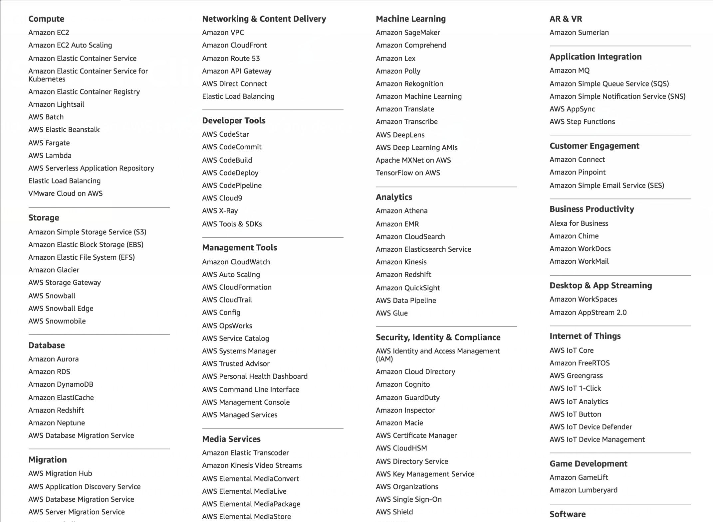

# Amazon Web Services :o:

## AWS Products

Amazon Web Services offers a large number of products that are
centered around their cloud services. These services have grown
considerably over the years from the core offering related to virtual
machine (EC2) and datastorage (S3). An overview of them is provided by
Amazon in the following document:

* <https://d0.awsstatic.com/whitepapers/aws-overview.pdf>

We list the product in screenshots from their Product Web page panel
in Figure AWS Products.

Figure: AWS Products

Service offerings are grouped by categories:

* Compute
* Storage
* Database
* Migration
* Networking and Content Delivery
* Developer Tools
* Management Tools
* Media Services
* Machine Learning
* Analytics
* Security and Identity Compliance
* Mobile Services
* AR and VR
* Application Integration
* Customer Engagement
* Business Productivity
* Desktop and App Streaming
* Internet of Things
* Game Development
* Software
* Aws Core Management

Within each category you have several products. When choosing products
form AWS it is best to start with the overview paper and identify
products that can be of benefit to you. For our purpose we focus on
the traditional Compute and Storage offerings.

## Locations

## Compute

AWS offers a number of compute related services. 

## Serverless Computing with AWS Lambda

Serverless computing or FaaS is a new cloud computing paradigm that has
gained popularity recently. AWS Lambda was one of the first serverless
computing services that was made available to the public,  Serverless
computing allows users to run small functions in the cloud without 
having to worry about resource requirements. More information regarding
AWS Lambda can be found in the following document

<https://aws.amazon.com/lambda/>

## Storage

AWS provides many storage services that users can leverage for developing
applications and solutions. The list below showcases AWS storage 
services

### Database

AWS also provides many data base solutions. AWS has both SQL based
databases and NoSQL based databases. The list below shows the database
services that AWS offers. And other database related services

*Image reference - https://aws.amazon.com/products/databases/*

## App Integration

## Access from the Command Line

AWS also provides an command line interface that can be used to manage
all the AWS services through simple commands. below are two example 
commands.

	aws s3 <Command> [<Arg> ...]
	aws ec2 <Command> [<Arg> ...]

You can find more information regarding the AWS CLI in the following 
documents.

* AWS Command Line: <https://aws.amazon.com/cli/>
* AWS Command Line reference: <https://docs.aws.amazon.com/cli/latest/reference/>

* EC2: <https://docs.aws.amazon.com/cli/latest/reference/ec2/index.html>
* S3: <https://docs.aws.amazon.com/cli/latest/reference/s3/index.html>

## Access from Python

### Boto

Boto is a Python software development kit specifically targeting
Amazon Web Services (AWS). It allows access to services such as S3 and
EC2. It is using object oriented programming paradigms ta access the
lower level services. The advantage is that it is written just for
Amazon and thus we assume it will be developed with high quality due
to its specialization. However this is also its limitation as in
contrast to libcloud it does not support other cloud providers. Hence
it bares the risk of vendor lockin. Boto is maintained in github.

Documentation about boto can be found at 

* https://boto3.readthedocs.io/en/latest/
* <https://github.com/boto/boto3>

### libcloud

"Libcloud is a Python library for interacting with many of the popular
cloud service providers using a unified API. It was created to make it
easy for developers to build products that work between any of the
services that it supports. A more detailed description on Libcloud and
how you can use it to connect with AWS is provided in the [LibCloud section](../libcloud.md)

For more information about the features and supported providers, please
refer to the [documentation](https://libcloud.readthedocs.org/en/latest/)