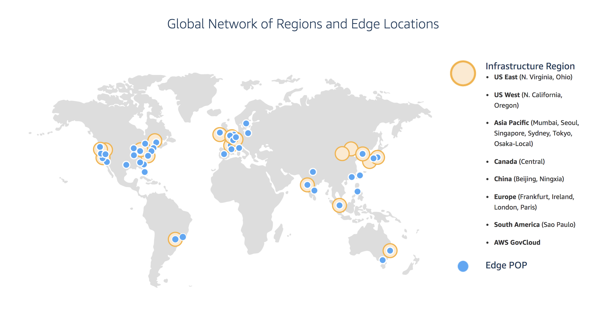
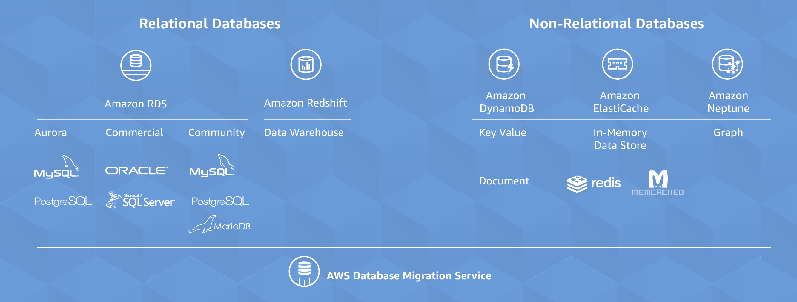
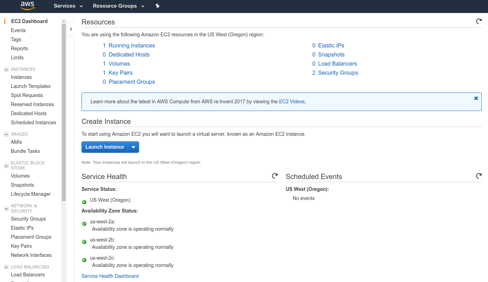

# Amazon Web Services :o:

## AWS Products

Amazon Web Services offers a large number of products that are
centered around their cloud services. These services have grown
considerably over the years from the core offering related to virtual
machine (EC2) and datastorage (S3). An overview of them is provided by
Amazon in the following document:

* <https://d0.awsstatic.com/whitepapers/aws-overview.pdf>

We list the product in screenshots from their Product Web page panel
in Figure AWS Products.

Figure: AWS Products

Service offerings are grouped by categories:

* Compute
* Storage
* Database
* Migration
* Networking and Content Delivery
* Developer Tools
* Management Tools
* Media Services
* Machine Learning
* Analytics
* Security and Identity Compliance
* Mobile Services
* AR and VR
* Application Integration
* Customer Engagement
* Business Productivity
* Desktop and App Streaming
* Internet of Things
* Game Development
* Software
* Aws Core Management

Within each category you have several products. When choosing products
form AWS it is best to start with the overview paper and identify
products that can be of benefit to you. For our purpose we focus on
the traditional Compute and Storage offerings. We list the products
that are available In Sep. 2018 next.

Not all the products are related to IaaS.

### Compute

* [Amazon EC2](https://aws.amazon.com/ec2/?nc2=h_mo)
* [Amazon EC2 Auto
Scaling](https://aws.amazon.com/ec2/autoscaling/?nc2=h_mo)
* [Amazon Elastic Container Service](https://aws.amazon.com/ecs/?nc2=h_mo)
* [Amazon Elastic Container Service for
Kubernetes](https://aws.amazon.com/eks/?nc2=h_mo)
* [Amazon Elastic Container
Registry](https://aws.amazon.com/ecr/?nc2=h_mo)
* [Amazon Lightsail](/lightsail/?nc2=h_mo)
* [AWS Batch](https://aws.amazon.com/batch/?nc2=h_mo)
* [AWS Elastic
Beanstalk](https://aws.amazon.com/elasticbeanstalk/?nc2=h_mo)
* [AWS Fargate](https://aws.amazon.com/fargate/?nc2=h_mo)
* [AWS Lambda](https://aws.amazon.com/lambda/?nc2=h_mo)
* [AWS Serverless Application
Repository](https://aws.amazon.com/serverless/serverlessrepo/?nc2=h_mo)
* [Elastic Load
Balancing](https://aws.amazon.com/elasticloadbalancing/?nc2=h_mo)
* [VMware Cloud on AWS](https://aws.amazon.com/vmware/?nc2=h_mo)
* [AWS
Marketplace](https://aws.amazon.com/marketplace/ref=mkt_ste_l2_ec2_Category?nc1=h_l2_c&nc2=h_mo)

### Storage

* [Amazon Simple Storage Service
(S3)](https://aws.amazon.com/s3/?nc2=h_mo)
* [Amazon Elastic Block Store (EBS)](https://aws.amazon.com/ebs/?nc2=h_mo)
* [Amazon Elastic File System (EFS)](https://aws.amazon.com/efs/?nc2=h_mo)
* [Amazon Glacier](https://aws.amazon.com/glacier/?nc2=h_mo)
* [AWS Storage Gateway](https://aws.amazon.com/storagegateway/?nc2=h_mo)
* [AWS Snowball](https://aws.amazon.com/snowball/?nc2=h_mo)
* [AWS Snowball Edge](https://aws.amazon.com/snowball-edge/?nc2=h_mo)
* [AWS Snowmobile](https://aws.amazon.com/snowmobile/?nc2=h_mo)
* [AWS
Marketplace](https://aws.amazon.com/marketplace/b/2649337011/ref=mkt_ste_l2_S3CDN?page=1&category=2649337011&nc2=h_mo)

### Databases

* [Amazon Aurora](https://aws.amazon.com/rds/aurora/?nc2=h_mo)
* [Amazon RDS](https://aws.amazon.com/rds/?nc2=h_mo)
* [Amazon DynamoDB](https://aws.amazon.com/dynamodb/?nc2=h_mo)
* [Amazon ElastiCache](https://aws.amazon.com/elasticache/?nc2=h_mo)
* [Amazon Redshift](https://aws.amazon.com/redshift/?nc2=h_l3_db)
* [Amazon Neptune](https://aws.amazon.com/neptune/?nc2=h_mo)
* [AWS Database Migration Service](https://aws.amazon.com/dms/?nc2=h_mo)
* [AWS
Marketplace](https://aws.amazon.com/marketplace/search/results/ref=mkt_ste_l2_database_category?page=1&category=2649364011&nc2=h_mo)

### Migration

* [AWS Migration Hub](https://aws.amazon.com/migration-hub/?nc2=h_mo)
* [AWS Application Discovery
Service](https://aws.amazon.com/application-discovery/?nc2=h_mo)
* [AWS Database Migration Service](https://aws.amazon.com/dms/?nc2=h_mo)
* [AWS Server Migration
Service](https://aws.amazon.com/server-migration-service/?nc2=h_mo)
* [AWS Snowball](https://aws.amazon.com/snowball/?nc2=h_mo)
* [AWS Snowball Edge](https://aws.amazon.com/snowball-edge/?nc2=h_mo)
* [AWS Snowmobile](https://aws.amazon.com/snowmobile/?nc2=h_mo)
* [AWS
Marketplace](https://aws.amazon.com/marketplace/b/2649366011/ref=mkt_ste_l2_nw_Category?nc2=h_mo)

### Networking & Content Delivery

* [Amazon VPC](https://aws.amazon.com/vpc/?nc2=h_mo)
* [Amazon VPC PrivateLink](https://aws.amazon.com/privatelink/?nc2=h_mo)
* [Amazon CloudFront](https://aws.amazon.com/cloudfront/?nc2=h_mo)
* [Amazon Route 53](https://aws.amazon.com/route53/?nc2=h_mo)
* [Amazon API Gateway](https://aws.amazon.com/api-gateway/?nc2=h_mo)
* [AWS Direct Connect](https://aws.amazon.com/directconnect/?nc2=h_mo)
* [Elastic Load
Balancing](https://aws.amazon.com/elasticloadbalancing/?nc2=h_mo)
* [AWS
Marketplace](https://aws.amazon.com/marketplace/b/2649366011/ref=mkt_ste_l2_nw_Category?nc2=h_mo)

### Developer Tools

* [AWS CodeStar](https://aws.amazon.com/codestar/?nc2=h_mo)
* [AWS CodeCommit](https://aws.amazon.com/codecommit/?nc2=h_mo)
* [AWS CodeBuild](https://aws.amazon.com/codebuild/?nc2=h_mo)
* [AWS CodeDeploy](https://aws.amazon.com/codedeploy/?nc2=h_mo)
* [AWS CodePipeline](https://aws.amazon.com/codepipeline/?nc2=h_mo)
* [AWS Cloud9](https://aws.amazon.com/cloud9/?nc2=h_mo)
* [AWS X-Ray](https://aws.amazon.com/xray/?nc2=h_mo)
* [AWS
Marketplace](https://aws.amazon.com/marketplace/b/2649274011/ref=mkt_ste_l2_Deployment_cat?nc2=h_mo)
* [AWS Command Line Interface](https://aws.amazon.com/cli/?nc2=h_mo)
* [AWS Tools &
SDKs](https://aws.amazon.com/getting-started/tools-sdks/?nc2=h_mo)

### Management Tools

* [Amazon CloudWatch](https://aws.amazon.com/cloudwatch/?nc2=h_mo)
* [AWS Auto Scaling](https://aws.amazon.com/autoscaling/?nc2=h_mo)
* [AWS CloudFormation](https://aws.amazon.com/cloudformation/?nc2=h_mo)
* [AWS CloudTrail](https://aws.amazon.com/cloudtrail/?nc2=h_mo)
* [AWS Config](https://aws.amazon.com/config/?nc2=h_mo)
* [AWS OpsWorks](https://aws.amazon.com/opsworks/?nc2=h_mo)
* [AWS Service Catalog](https://aws.amazon.com/servicecatalog/?nc2=h_mo)
* [AWS Systems Manager](https://aws.amazon.com/systems-manager/?nc2=h_mo)
* [AWS Trusted
Advisor](https://aws.amazon.com/premiumsupport/trustedadvisor/?nc2=h_mo)
* [AWS Personal Health
Dashboard](https://aws.amazon.com/premiumsupport/phd/?nc2=h_mo)
* [AWS Command Line Interface](https://aws.amazon.com/cli/?nc2=h_mo)
* [AWS Management Console](https://aws.amazon.com/console/?nc2=h_mo)
* [AWS Managed
Services](https://aws.amazon.com/managed-services/?nc2=h_mo)
* [AWS
Marketplace](https://aws.amazon.com/marketplace/b/2649274011/ref=mkt_ste_l2_Deployment_cat?nc2=h_mo)

### Media Services

* [Amazon Elastic
Transcoder](https://aws.amazon.com/elastictranscoder/?nc2=h_mo)
* [Amazon Kinesis Video
Streams](https://aws.amazon.com/kinesis/video-streams/?nc2=h_mo)
* [AWS Elemental
MediaConvert](https://aws.amazon.com/mediaconvert/?nc2=h_mo)
* [AWS Elemental MediaLive](https://aws.amazon.com/medialive/?nc2=h_l3_dm)
* [AWS Elemental
MediaPackage](https://aws.amazon.com/mediapackage/?nc2=h_mo)
* [AWS Elemental MediaStore](https://aws.amazon.com/mediastore/?nc2=h_mo)
* [AWS Elemental
MediaTailor](https://aws.amazon.com/mediatailor/?nc2=h_mo)

### Security, Identity & Compliance

* [AWS Identity and Access Management
(IAM)](https://aws.amazon.com/iam/?nc2=h_mo)
* [Amazon Cloud
Directory](https://aws.amazon.com/cloud-directory/?nc2=h_l3_dm)
* [Amazon Cognito](https://aws.amazon.com/cognito/?nc2=h_mo)
* [Amazon GuardDuty](https://aws.amazon.com/guardduty/?nc2=h_mo)
* [Amazon Inspector](https://aws.amazon.com/inspector/?nc2=h_mo)
* [Amazon Macie](https://aws.amazon.com/macie/?nc2=h_mo)
* [AWS Certificate
Manager](https://aws.amazon.com/certificate-manager/?nc2=h_mo)
* [AWS CloudHSM](https://aws.amazon.com/cloudhsm/?nc2=h_mo)
* [AWS Directory
Service](https://aws.amazon.com/directoryservice/?nc2=h_l3_dm)
* [AWS Firewall
Manager](https://aws.amazon.com/firewall-manager/?nc2=h_mo)
* [AWS Key Management Service](https://aws.amazon.com/kms/?nc2=h_mo)
* [AWS Organizations](https://aws.amazon.com/organizations/?nc2=h_mo)
* [AWS Secrets Manager](https://aws.amazon.com/secrets-manager/?nc2=h_mo)
* [AWS Single Sign-On](https://aws.amazon.com/single-sign-on/?nc2=h_mo)
* [AWS Shield](https://aws.amazon.com/shield/?nc2=h_mo)
* [AWS WAF](https://aws.amazon.com/waf/?nc2=h_mo)
* [AWS Artifact](https://aws.amazon.com/artifact/?nc2=h_mo)
* [AWS
Marketplace](https://aws.amazon.com/marketplace/b/2649274011/ref=mkt_ste_l2_Deployment_cat?nc2=h_mo)

### Machine Learning

* [Amazon SageMaker](https://aws.amazon.com/sagemaker/?nc2=h_mo)
* [Amazon Comprehend](https://aws.amazon.com/comprehend/?nc2=h_mo)
* [Amazon Lex](https://aws.amazon.com/lex/?nc2=h_mo)
* [Amazon Polly](https://aws.amazon.com/polly/?nc2=h_mo)
* [Amazon Rekognition](https://aws.amazon.com/rekognition/?nc2=h_mo)
* [Amazon Machine Learning](https://aws.amazon.com/aml/?nc2=h_mo)
* [Amazon Translate](https://aws.amazon.com/translate/?nc2=h_mo)
* [Amazon Transcribe](https://aws.amazon.com/transcribe/?nc2=h_mo)
* [AWS DeepLens](https://aws.amazon.com/deeplens/?nc2=h_mo)
* [Apache MXNet on AWS](https://aws.amazon.com/mxnet/?nc2=h_mo)
* [TensorFlow on AWS](https://aws.amazon.com/tensorflow/?nc2=h_mo)
* [AWS Deep Learning
AMIs](https://aws.amazon.com/machine-learning/amis/?nc2=h_mo)

### Analytics

* [Amazon Athena](https://aws.amazon.com/athena/?nc2=h_l3_al)
* [Amazon EMR](https://aws.amazon.com/emr/?nc2=h_l3_al)
* [Amazon CloudSearch](https://aws.amazon.com/cloudsearch/?nc2=h_mo)
* [Amazon Elasticsearch
Service](https://aws.amazon.com/elasticsearch-service/?nc2=h_mo)
* [Amazon Kinesis](https://aws.amazon.com/kinesis/?nc2=h_mo)
* [Amazon Redshift](https://aws.amazon.com/redshift/?nc2=h_mo)
* [Amazon QuickSight](https://aws.amazon.com/quicksight/)
* [AWS Data Pipeline](https://aws.amazon.com/datapipeline/?nc2=h_mo)
* [AWS Glue](https://aws.amazon.com/glue/?nc2=h_mo)
* [AWS
Marketplace](https://aws.amazon.com/marketplace/search/results/ref=mkt_ste_l2_analytics_category?page=1&searchTerms=analytics&nc2=h_mo)

### Mobile

* [AWS Mobile Hub](https://aws.amazon.com/mobile/?nc2=h_mo)
* [Amazon API Gateway](https://aws.amazon.com/api-gateway/?nc2=h_mo)
* [Amazon Pinpoint](https://aws.amazon.com/pinpoint/?nc2=h_mo)
* [AWS AppSync](https://aws.amazon.com/appsync/?nc2=h_mo)
* [AWS Device Farm](https://aws.amazon.com/device-farm/?nc2=h_mo)
* [AWS Mobile SDK](https://aws.amazon.com/mobile/resources/?nc2=h_mo)

### AR & VR

* [Amazon Sumerian](https://aws.amazon.com/sumerian/?nc2=h_mo)

### Application Integration

* [Amazon MQ](https://aws.amazon.com/amazon-mq/?nc2=h_mo)
* [Amazon Simple Queue Service
(SQS)](https://aws.amazon.com/sqs/?nc2=h_mo)
* [Amazon Simple Notification Service
(SNS)](https://aws.amazon.com/sns/?nc2=h_l3_as)
* [AWS AppSync](https://aws.amazon.com/appsync/?nc2=h_mo)
* [AWS Step Functions](https://aws.amazon.com/step-functions/?nc2=h_mo)

### Customer Engagement

* [Amazon Connect](https://aws.amazon.com/connect/?nc2=h_mo)
* [Amazon Pinpoint](https://aws.amazon.com/pinpoint/?nc2=h_mo)
* [Amazon Simple Email Service
(SES)](https://aws.amazon.com/ses/?nc2=h_mo)
* [AWS
Marketplace](https://aws.amazon.com/marketplace/search/ref=mkt_ste_l2_app_svcs?page=2&searchTerms=Application+services&nc2=h_mo)

### Business Productivity

* [Alexa for Business](https://aws.amazon.com/alexaforbusiness/?nc2=h_mo)
* [Amazon WorkDocs](https://aws.amazon.com/workdocs/?nc2=h_mo)
* [Amazon WorkMail](https://aws.amazon.com/workmail/?nc2=h_mo)
* [Amazon Chime](https://aws.amazon.com/chime/)

### Desktop & App Streaming

* [Amazon WorkSpaces](https://aws.amazon.com/workspaces/?nc2=h_mo)
* [Amazon AppStream 2.0](https://aws.amazon.com/appstream2/?nc2=h_mo)

### Internet of Things

* [AWS IoT Core](https://aws.amazon.com/iot-core/?nc2=h_mo)
* [Amazon FreeRTOS](https://aws.amazon.com/freertos/?nc2=h_mo)
* [AWS Greengrass](https://aws.amazon.com/greengrass/?nc2=h_mo)
* [AWS IoT 1-Click](https://aws.amazon.com/iot-1-click/?nc2=h_mo)
* [AWS IoT Analytics](https://aws.amazon.com/iot-analytics/?nc2=h_mo)
* [AWS IoT Button](https://aws.amazon.com/iotbutton/?nc2=h_mo)
* [AWS IoT Device
Defender](https://aws.amazon.com/iot-device-defender/?nc2=h_mo)
* [AWS IoT Device
Management](https://aws.amazon.com/iot-device-management/?nc2=h_mo)

### Game Development

* [Amazon GameLift](https://aws.amazon.com/gamelift/?nc2=h_mo)
* [Amazon Lumberyard](https://aws.amazon.com/lumberyard/?nc2=h_mo)

### AWS Marketplace Software

* [Infrastructure Software
(1300+)](https://aws.amazon.com/marketplace/search/results/ref=mkt_ste_l2_mp_infra_sw_all/?page=1&category=2649276011&nc2=h_mo)
* [Business Software
(845+)](https://aws.amazon.com/marketplace/search/results/ref=mkt_ste_l2_mp_biz_sw_all/?page=1&category=2649275011&nc2=h_mo)
* [Developer Tools
(220+)](https://aws.amazon.com/marketplace/search/results/ref=mkt_ste_l2_mp_dev_tools_all/?page=1&category=2649274011&nc2=h_mo)

### AWS Cost Management

* [AWS Cost
Explorer](https://aws.amazon.com/aws-cost-management/aws-cost-explorer/?nc2=h_mo)
* [AWS
Budgets](https://aws.amazon.com/aws-cost-management/aws-budgets/?nc2=h_mo)
* [Reserved Instance
Reporting](https://aws.amazon.com/aws-cost-management/reserved-instance-reporting/?nc2=h_mo)
* [AWS Cost and Usage
Report](https://aws.amazon.com/aws-cost-management/aws-cost-and-usage-reporting/?nc2=h_mo)

## Locations

## Compute

AWS offers a number of compute related services. 

## Serverless Computing with AWS Lambda

Serverless computing or FaaS is a new cloud computing paradigm that has
gained popularity recently. AWS Lambda was one of the first serverless
computing services that was made available to the public,  Serverless
computing allows users to run small functions in the cloud without 
having to worry about resource requirements. More information regarding
AWS Lambda can be found in the following document

<https://aws.amazon.com/lambda/>

## Storage

AWS provides many storage services that users can leverage for developing
applications and solutions. The list below showcases AWS storage 
services

### Database

AWS also provides many data base solutions. AWS has both SQL based
databases and NoSQL based databases. The list below shows the database
services that AWS offers. And other database related services

*Image reference - https://aws.amazon.com/products/databases/*

## App Integration

## Access from the Command Line

AWS also provides an command line interface that can be used to manage
all the AWS services through simple commands. below are two example 
commands.

	aws s3 <Command> [<Arg> ...]
	aws ec2 <Command> [<Arg> ...]

You can find more information regarding the AWS CLI in the following 
documents.

* AWS Command Line: <https://aws.amazon.com/cli/>
* AWS Command Line reference: <https://docs.aws.amazon.com/cli/latest/reference/>

* EC2: <https://docs.aws.amazon.com/cli/latest/reference/ec2/index.html>
* S3: <https://docs.aws.amazon.com/cli/latest/reference/s3/index.html>

Amazon Web Services (AWS) is a cloud platform that provides a large
number os services for individuals and enterprises. You can get an
overview of the AWS offering at
[Amazon Web Services Overview](aws.md). This section will guide
through the processes of creating an AWS account and explain the free
tier details so that you can leverage the tools and products available
in AWS for your work and research.

## Creating an account

In order to create a AWS account you will need the following

* A valid email address
* A credit/debit card
* A valid phone number

First you need to visit the AWS
[signup page](https://aws.amazon.com/free/) and click "Create Free
Account". You will then be asked to provide some basic details
including your email address as shown in the image below

Next you will be asked to provide further details such as your name,
address and phone number. After the additional details have been
provided. AWS will ask for credit/debit card details as shown below.
They require this information to verify your identity and make sure
they have a method to charge you if needed. However no charges will be
applied to your credit/debit card unless you use the AWS services and
exceed the free tier limits, which will be discussed in the next
section.

After the credit/debit card has been verified AWS will use your phone
number to verify your identity. Once you are logged into your account
you will be able to sign into the console, from the link on the top
right corner in your account. Once you are in the AWS console the
services tab in the left top corner will allow you to access all the
services that are available to you through AWS as shown in the image
below.

## Understanding the free tier

AWS provides a set of services free of charge. These free services are
to allow new users test and experiment with various AWS services
without worrying about any cost. Free services are provided as a
product that is free until a certain amount of usage, that is if you
exceed those limits you will be charged for the additional usage.
However the free quotas are typically more than sufficient for testing
and learning purposes. For example under the free tier you are able to
use 750 hours of EC2 resources per month for the first 12 months after
account creation. However it is important to make note of important
details that are included in the limits. For example for the 750 hours
of free EC2 usage, you can only use "EC2 Micro" instances, using any
other instance type for your EC2 machine will not fall under the free
tier agreement and you will be charged for them. To view all the AWS
free tier details visit [AWS Free Tier](https://aws.amazon.com/free/)

Basically there are two categories in the free tier, 

* 12 months free
* Always free

12 months free offer are only good for the first 12 months after you
create your AWS account. The always free offer are valid even after
the first 12 months.

## Important Notes

When using AWS services make sure you understand how and when you will
be charged for. For example if you are using an EC2 to run some
application, usage of the instance will be calculated from the time
you started the instance to the time you stop or terminate the
instance. So even if you do not use the application itself, if you are
have the instance in an active mode that will be added to the usage
hours and you will be billed if you exceed the 750 hour limit. In EC2
even if you stop the instance you might be charged for data that is
stored in the instance so terminating it would be the most safest
option if you do not have any important data stored in the instance.
You can look up other such tricky scenarios at
[Avoiding Unexpected Charges](https://docs.aws.amazon.com/awsaccountbilling/latest/aboutv2/checklistforunwantedcharges.html)
to make sure you will not get an unexpected bill

## Introduction to the AWS console

As we discussed above we can access all the service and product
offerings that are provided by AWS from the AWS console. In the
following section we will look into how we can start and stop a
virtual machine using AWS EC2 service. Please keep in mind that this
will reduce time from your free tier limit of 750 hours/month, So be
careful when starting EC2 instances and make sure to terminate them
after you are done.

### Starting a VM

To go to the EC2 services you can click on the services link on the
top left corner in the console and then click on EC2 which is listed
under "Compute". Then you will see a blue button labeled "Launch
instance". Click on the button and the console will take you to the
page shown below. Notice that the check box for "Free tier only" is
clicked to make sure the instance type we choose is eligible for the
free tier hours. The instance type you select defines the properties
of the virtual machine you are staring such as RAM, Storage,
processing power. However since we are using instance that are free
tier eligible we will only be able to use "EC2 Micro instances". You
can also select a OS that you want to be started as the virtual
machine. We will select "Ubuntu Server 16.04 LTS" as our Operating
system. press the blue select button to do so.

Once you select the OS type you will be asked to select the instance
type. You can notice that only the "t2.micro" is marked as free tier
eligible as shown in the image below. Now that you have selected all
the basic details press the "Review and Launch" button located in the
button right corner. This will give you a summary of your current
selections.

#### Setting up key pair

Before we can launch the VM we need to perform one more step. We need
to setup a SSH key pair for the new VM. Creating this will allow us to
access our VM through SSH. Once you click on the launch button, you
will get the following dialog box. If you already have a worked with
SSH keys and if you already have a key pair you can use it, otherwise
you can create a new key pair as we will do. To create a new key pair
select the "Create a new key pair" in the first drop down box and
enter a name of your choosing as the name. Next you need to download
and save the private key, Keep the private key in a safe place and do
not delete it since you will need it when you are accessing the VM
(This tutorial will not cover accessing the VM through SSH but you
need to keep the private key so you can use the same key value pair
later). Once you have downloaded the private key, the "Launch
Instance" button will activate. Press this button to start the VM.

After starting the instance go back to the EC2 dashboard ( Services ->
EC2). Now the dashboard will show the number of running instance as
shown in the image below. If you do not see is initially, refresh the
page after a little while, starting the VM may take a little time so
the dashboard will not be updated until the VM starts.

Now to get a more detailed view click on the "Running Instances" link.
This will give you the following view. Is shows the current instance
that you are running

### Stopping a VM

In AWS EC2 you can either stop a VM or terminate it. If you terminate
it you will loose all the data that was stored in the VM as well,
simply stopping will save the data for future use if you restart the
instance again. In order to stop the VM you can select the VM machines
you want to stop from the GUI and go to "Actions -> Instance status"
and click on stop. This will stop your VM machine.

After a little while the dashboard will show the instance as stopped.
If you want to go further and terminate the instance you can again go
to "Actions -> Instance status" and select terminate, which will
terminate the VM.

## Access from Python

### Boto

Boto is a Python software development kit specifically targeting
Amazon Web Services (AWS). It allows access to services such as S3 and
EC2. It is using object oriented programming paradigms ta access the
lower level services. The advantage is that it is written just for
Amazon and thus we assume it will be developed with high quality due
to its specialization. However this is also its limitation as in
contrast to libcloud it does not support other cloud providers. Hence
it bares the risk of vendor lockin. Boto is maintained in github.

Documentation about boto can be found at 

* https://boto3.readthedocs.io/en/latest/
* <https://github.com/boto/boto3>

### libcloud

"Libcloud is a Python library for interacting with many of the popular
cloud service providers using a unified API. It was created to make it
easy for developers to build products that work between any of the
services that it supports." A more detailed description on Libcloud and
how you can use it to connect with AWS is provided in the Section 
[Python libcloud](#python-libcloud).

### Exercise

E.AWS.0:

> Identify all products related to IaaS service offerings and mark
> them with :star: after the bullet. Do copy the aws.md file into your
> own repository, do not yet create a pull request. Confirm in a team
> your findings and agree with each other.

