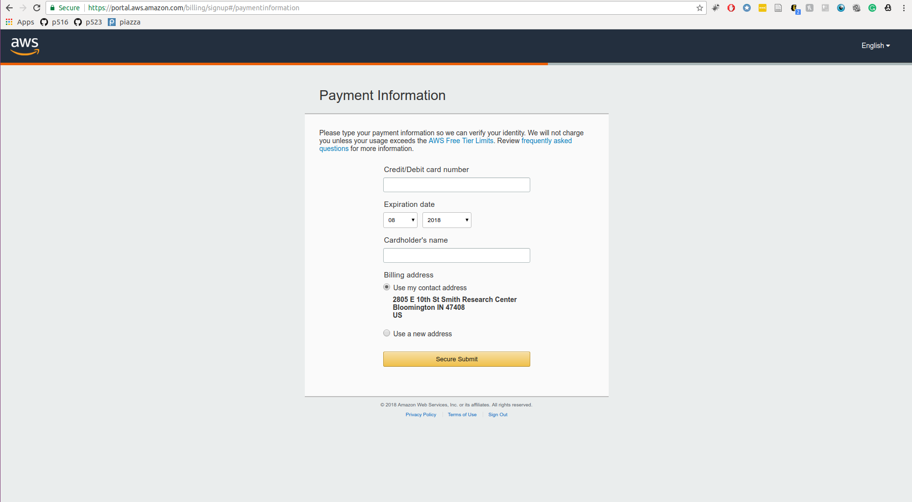
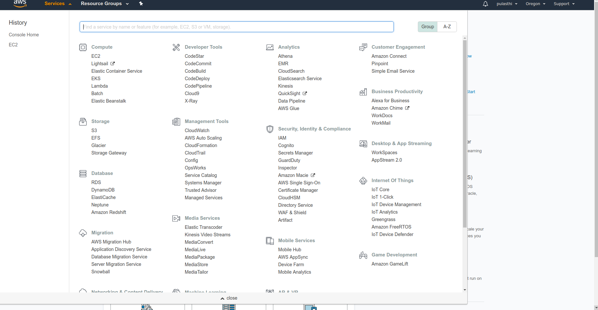

# Amazon Web Services

## Introduction
Amazon Web Services (AWS) is a cloud platform that provides a large number os services for individuals and enterprises. You can get an overview of the 
AWS offering at [Amazon Web Services Overview](aws.md). This section will guide through the processes of creating an AWS account and explain the free tier 
details so that you can leverage the tools and products available in AWS for your work and research.

## Creating an account

In order to create a AWS account you will need the following

* A valid email address
* A credit/debit card
* A valid phone number

First you need to visit the AWS [signup page](https://aws.amazon.com/free/) and click "Create Free Account". You will then be asked to provide some basic details
including your email address as shown in the image below

Next you will be asked to provide further details such as your name, address and phone number. After the additional details have been provided. AWS will ask for 
credit/debit card details as shown below. They require this information to verify your identity and make sure they have a method to charge you if needed. However no charges will be applied 
to your credit/debit card unless you use the AWS services and exceed the free tier limits, which will be discussed in the next section.

After the credit/debit card has been verified AWS will use your phone number to verify your identity. Once you are logged into your account you will be able to sign into the console, from the link on the top
right corner in your account. Once you are in the AWS console the services tab in the left top corner will allow you to access all the services that are avilable to you through AWS as shown in the image below.

## Understanding the free tier

AWS provides a set of services free of charge. These free services are to allow new users test and experiment with various AWS services without worrying about any cost. 
Free services are provided as a product that is free until a certain amount of usage, that is if you exceed those limits you will be charged for the additional usage. However the
free quotas are typically more than sufficient for testing and learning purposes. For example under the free tier you are able to use 750 hours of EC2 resources per month for the first 12 months
after account creation. However it is important to make note of important details that are inculded in the limits. For example for the 750 hours of free EC2 usage, you can only use "EC2 Micro" instances, 
using any other instance type for your EC2 machine will not fall under the free tier agreement and you will be charged for them. To view all the AWS free tier details visit [AWS Free Tier](https://aws.amazon.com/free/)

Basically there are two categories in the free tier, 

* 12 months free
* Always free

12 months free offer are only good for the first 12 months after you create your AWS account. The always free offer are vaild even after the first 12 months.

## Important Notes

When using AWS services make sure you understand how and when you will be charged for. For example if you are using an EC2 to run some application, usage of the instance
will be calculated from the time you started the instance to the time you stop or terminate the instance. So even if you do not use the applicaiton itself, if you are have the instance in 
an active mode that will be added to the usage hours and you will be billed if you exceed the 750 hour limit. In EC2 even if you stop the instance you might be charged for data that is stored
in the instance so terminating it would be the most safest option if you do not have any important data stored in the instance. You can look up other such tricky scenarios at [Avoiding Unexpected Charges](https://docs.aws.amazon.com/awsaccountbilling/latest/aboutv2/checklistforunwantedcharges.html)
to make sure you will not get an unexpected bill
