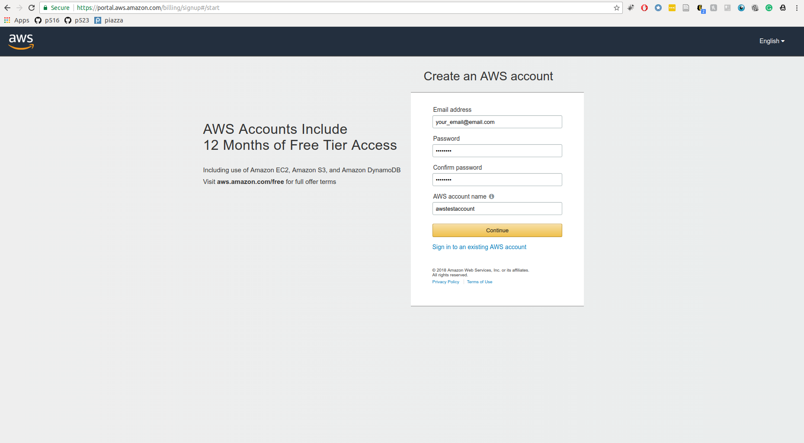
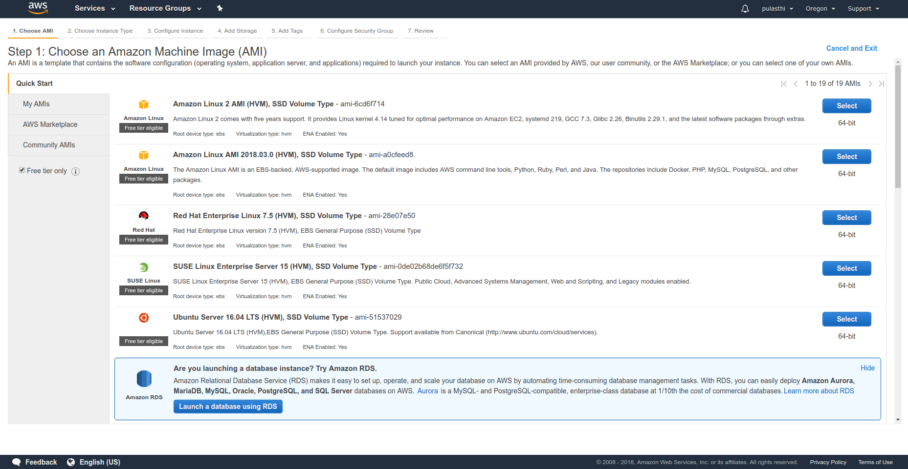

## Amazon Web Services

### Introduction
Amazon Web Services (AWS) is a cloud platform that provides a large number os services for individuals and enterprises. You can get an overview of the 
AWS offering at [Amazon Web Services Overview](aws.md). This section will guide through the processes of creating an AWS account and explain the free tier 
details so that you can leverage the tools and products available in AWS for your work and research.

### Creating an account

In order to create a AWS account you will need the following

* A valid email address
* A credit/debit card
* A valid phone number

First you need to visit the AWS [signup page](https://aws.amazon.com/free/) and click "Create Free Account". You will then be asked to provide some basic details
including your email address as shown in the image below

Next you will be asked to provide further details such as your name, address and phone number. After the additional details have been provided. AWS will ask for 
credit/debit card details as shown below. They require this information to verify your identity and make sure they have a method to charge you if needed. However no charges will be applied 
to your credit/debit card unless you use the AWS services and exceed the free tier limits, which will be discussed in the next section.

After the credit/debit card has been verified AWS will use your phone number to verify your identity. Once you are logged into your account you will be able to sign into the console, from the link on the top
right corner in your account. Once you are in the AWS console the services tab in the left top corner will allow you to access all the services that are avilable to you through AWS as shown in the image below.

### Understanding the free tier

AWS provides a set of services free of charge. These free services are to allow new users test and experiment with various AWS services without worrying about any cost. 
Free services are provided as a product that is free until a certain amount of usage, that is if you exceed those limits you will be charged for the additional usage. However the
free quotas are typically more than sufficient for testing and learning purposes. For example under the free tier you are able to use 750 hours of EC2 resources per month for the first 12 months
after account creation. However it is important to make note of important details that are inculded in the limits. For example for the 750 hours of free EC2 usage, you can only use "EC2 Micro" instances, 
using any other instance type for your EC2 machine will not fall under the free tier agreement and you will be charged for them. To view all the AWS free tier details visit [AWS Free Tier](https://aws.amazon.com/free/)

Basically there are two categories in the free tier, 

* 12 months free
* Always free

12 months free offer are only good for the first 12 months after you create your AWS account. The always free offer are vaild even after the first 12 months.

### Important Notes

When using AWS services make sure you understand how and when you will be charged for. For example if you are using an EC2 to run some application, usage of the instance
will be calculated from the time you started the instance to the time you stop or terminate the instance. So even if you do not use the application itself, if you are have the instance in 
an active mode that will be added to the usage hours and you will be billed if you exceed the 750 hour limit. In EC2 even if you stop the instance you might be charged for data that is stored
in the instance so terminating it would be the most safest option if you do not have any important data stored in the instance. You can look up other such tricky scenarios at [Avoiding Unexpected Charges](https://docs.aws.amazon.com/awsaccountbilling/latest/aboutv2/checklistforunwantedcharges.html)
to make sure you will not get an unexpected bill

### Introduction to the AWS console

As we discussed above we can access all the service and product offerings that are provided by AWS from the AWS console. In the following section we will look into how we can 
start and stop a virtual machine using AWS EC2 service. Please keep in mind that this will reduce time from your free tier limit of 750 hours/month, So be careful when starting EC2 instances and
make sure to terminate them after you are done.

### Starting a VM

To go to the EC2 services you can click on the services link on the top left corner in the console and then click on EC2 which is listed under "Compute". Then you will see a blue button labeled "Launch instance".
Click on the button and the cosole will take you to the page shown below. Notice that the check box for "Free tier only" is clicked to make sure the instance type we choose is eligible for the free tier hours.
The instance type you select defines the properties of the virtual machine you are staring such as RAM, Storage, processing power. However since we are using instance that are free tier eligible
we will only be able to use "EC2 Micro instances". You can also select a OS that you want to be started as the virtual machine. We will select "Ubuntu Server 16.04 LTS" as our Operating system. press the blue select
button to do so.

Once you select the OS type you will be asked to select the instance type. You can notice that only the "t2.micro" is marked as free tier eligible as shown in the image below. Now that you have selected
all the basic details press the "Review and Launch" button located in the botton right corner. This will give you a summary of your current selections.

#### Setting up key pair

Before we can launch the VM we need to perform one more step. We need to setup a SSH key pair for the new VM. Creating this will allow us to access our VM through SSH. Once you click on the launch button, you will get
the following dialog box. If you already have a worked with SSH keys and if you already have a key pair you can use it, otherwise you can create a new key pair as we will do. To create a new key pair select the "Create a new key pair"
in the first drop down box and enter a name of your choosing as the name. Next you need to download and save the private key, Keep the private key in a safe place and do not delete it since you will need it when you are
accessing the VM (This tutorial will not cover accessing the VM through SSH but you need to keep the private key so you can use the same key value pair later). Once you have downloaded the private key, the "Launch Instance" button will activate.
Press this button to start the VM.

After starting the instance go back to the EC2 dashboard ( Services -> EC2). Now the dashboard will show the number of running instance as shown in the image below. If you do not see is initially, refresh the page after
a little while, starting the VM may take a little time so the dashboard will not be updated untill the VM starts.

Now to get a more detailed view click on the "Running Instances" link. This will give you the following view. Is shows the current instance that you are running

### Stopping a VM

In AWS EC2 you can either stop a VM or ternimate it. If you terminate it you will loose all the data that was stored in the VM as well, simply stopping will save the data for future use if you restart the instance again.
In order to stop the VM you can select the VM machines you want to stop from the GUI and go to "Actions -> Instance status" and click on stop. This will stop your VM machine.

After a little while the dashboard will show the instance as stopped. If you want to go further and terminate the instance you can again go to "Actions -> Instance status" and select terminate, which will terminate the VM. 

