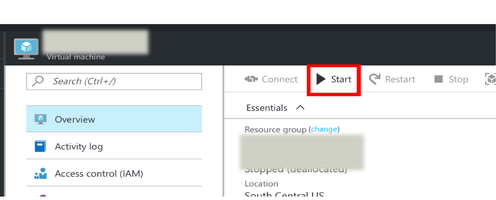

# Microsoft Azure

Microsoft Azure is a cloud computing service created by Microsoft. It
includes computing services and products for building, testing,
deploying, and managing applications and services through a global
network of Microsoft-managed data centers.  It provides software as a
service (SaaS), platform as a service (PaaS) and infrastructure as a
service (IaaS) and supports many different programming languages,
tools and frameworks, including both Microsoft-specific and
third-party software and systems.

## Registration

In order for you to register in Azure and start your free account, you
will need to go to

* [https://azure.microsoft.com/en-us/free/](https://azure.microsoft.com/en-us/free/)

You will see an image such as

On that image you click the `Start free` button to obtain a free one
year account. You will have to either create a new Microsoft account
or use the one from Indiana University which will be your IU id
followed by the @iu.edu domain. You will be redirected to the single
sign on from IU to proceed. If you use another e-mail you can
certainly do that and you free account sis not associated with the IU
account. This could be your Skype account or some other e-mail.  After
registration you will be provided with 12 months of free usage of a
few selected services and $200 credits for 30 days.

The services that you have access to include:

* Linux Virtual Machines (750 Hours)
* Windows Virtual Machines (750 Hours)
* Managed Disks (64 GB X 2)
* Blob Storage (5 GB)
* File Storage (5 GB)
* SQL Database (250 GB)
* Azure Cosmos DB (5 GB)
* Bandwidth (Data Transfer 15 GB)
* In case Azure changes the product list, please refer to the official
  page for a full list of free products:
  https://azure.microsoft.com/en-us/free/

## Introduction to the Azure Portal

Azure can be accessed via a portal. An introductory video from
Microsoft provides you with some elementary information:

[:clapper: Introduction to Azure Portal](https://channel9.msdn.com/Blogs/Azure/Get-Started-with-Azure-Portal/player)

## Creating a VM

Choose `Create a resource` in the upper left-hand corner of the Azure
portal. Select a VM name, and the disk type as SSD, then provide a
username. The password must be at least 12 characters long and meet
the defined complexity requirements.

## Starting a VM

Now we like to introduce you how to start a VM. Please note that VMS
do cost and reduce your free hours on Azure. Hence you need to make
sure you carefully review the charging rates and chose VM sizes and
types that minimize your charges.

A VM can be started through the Portal as follows:

* On the overview tqb, a VM can be started by clicking the `Start`
  button.

## Stopping the VM

It is the most important to stop your VMS once they are not in used,
or you get continuously charged. The portal allows you to see the list
of VM that you run as follows

To shut a VM down, please do the following:

* On the overview tab, a VM can be started by clicking the `Stop` button.

## Exercises

E.Azure.1:

> What is the difference between terminating, shutting down, and
> suspension?

E.Azure.2:

> Do I get charged when the VM is suspended, terminated, shutdown?

E.Azure.3:

> How do I resume a VM if it is suspended?

