# Amazon Elastic Beanstalk :o:

:o: Undefined cross-reference: fig:aws-beanstalk-manageenv
:o: Undefined cross-reference: fig:aws-beanstalk-config-database
---

**:mortar_board: Learning Objectives**

* Learn about AWS Elastic Beanstalk
* Benefits
* Pricing
* How to provision a Elastic Beanstalk Environment for Quick Start
* Explore Elastic Beanstalk Features

---

Amazon Elastic Beanstalk is an PaaS offering from AWS that aims to
offer be a one stop solution for fast deployment of scalable
web-applications.

Elastic Beanstalk has been developeed with an idea of allowing
developers to focus on code developement instead of the environment
set up. All the developers need to provide is a working code,
beanstalk takes care of providing the platform to run it.

A Variety of Platforms are supported

* Java
* Python
* Node JS
* .NET
* PHP
* Ruby
* Go
* Docker

Features of Elastic Beanstock include

:o: change to bullet list with headings italic

### High Performance

Elastic Beanstalk allows freedom to provision servers from a variety
of EC2 configurations based on business to suit the compute
requirements.

### Scalability

Easy configurable auto scaling settings are available to handle peak
loads based on metrics monitoring.

### High Availability

Elastic Beanstalk provides easy health check based load balancing
options to ensure high avialability of the web application.

### Complete source control

The user has freedom to select the AWS resources and has full control
over the infrastructure powering the application using the Elastic
Beanstalk management capabilities.

### Fully Managed

With Elastic Beanstalk, AWS manages actvities like hardware
provisioning, set up and configuration, software patching, database
backups and performance monitoring.

## Amazon Elastic Beanstalk Pricing

Amazon Elastic Beanstalk has no additional charges of its own. You pay
for the resources and services provisioned by the beanstalk
environment.

These are typically:

* EC2 instances
* S3 Storage
* Elastic Load Balancer
* Database

## How to provision a Amazon Elastic Beanstalk Environment for Quick Start

:o: remove this section 

:o: there is no space before :

:o: Assumption : is not a full sentence use `select` instead of double quotes so they ar everbatim

:o: (see ...) is an incomplete sentence and does not have a period. Review grammar rulkes on setting periods e.g. it needs to be inside the sendtence and the period needs to be behind .

:o: you shoudl have looked at the modifications i made to your other text

:o: All figures must be refered to 

This section will help with steps to be followed to create a Highly
Availble, Load Balanced sample application on Elastic Beanstalk in a
few quick Steps.

Assumption : User must have an AWS account.

### Step 1 : Login to the AWS console.

Console URL : [AWS Console URL](https://aws.amazon.com/console/).  On
successfull login, select Elastic Beanstalk from the Compute section
or alternatively, you can type Beanstalk in the search bar to look up
(see @fig:aws-beanstalk-console).

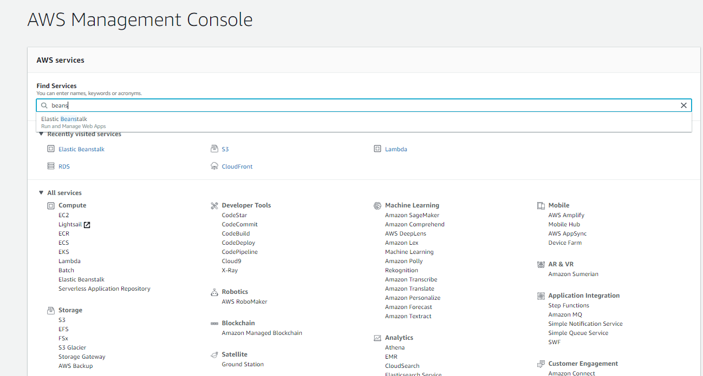{#fig:aws-beanstalk-console}

### Step 2 : Click on Create New Application

On the Beanstlak home page, one can either click on the 
`Create New Application` button at the top right corner or 
click on the `Get Started` button in the screen center (see @fig:aws-beanstalk-home).

{#fig:aws-beanstalk-home}

### Step 3 : Select Base Configuration

Provide a suitable name for your application (see
@fig:aws-beanstalk-baseconfig). In the Base Configuration section,
select the type of platform you wish provision for you code to be
executed. There are several option available like Java, Python, Ruby,
Go, .NET, PHP, Node JS, Docker and Tomcat (see
@fig:aws-beanstalk-baseoption). For this example we will go with
Tomcat.

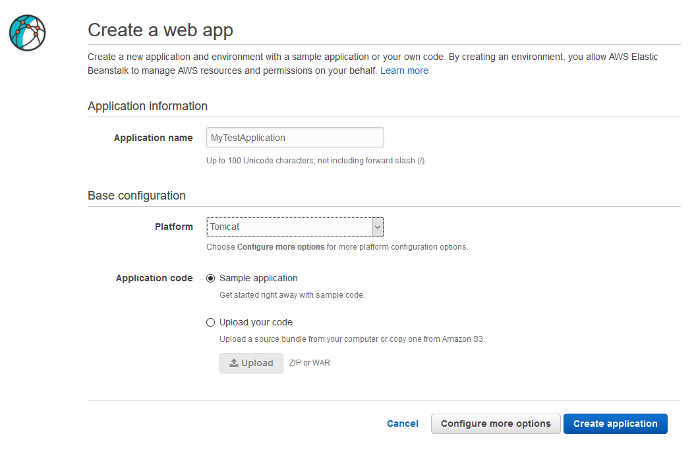{#fig:aws-beanstalk-baseconfig}

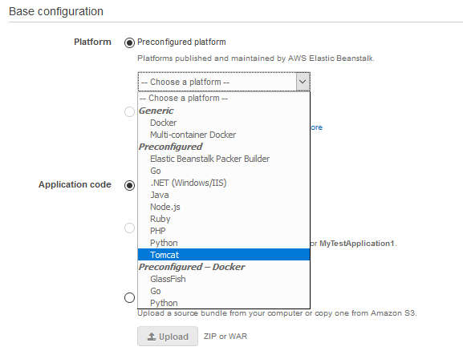{#fig:aws-beanstalk-baseoption}

### Step 4 : Click on Configure More Options

Do not click on Create Application button in the previous step in case
you wish to create your application in a particular VPC. This is will
be a requirement for most organizations since they would like the
application to be created in their own VPCs on cloud so that they can
restrict the access to the application and also allow the application
to connect with other resources on their cloud like databases.  If you
go ahead and click on Create Application button, the application will
be created \ in default AWS VPC.  Once an application is created, the
VPC on it cannot be updated.

To be able to launch the application in the VPC of your choice, click
on `Configure More Options` button.

### Step 5 : Select High Availability as Config Preset

Once you click on `Configure More Options` button, AWS will take you
to Advance Configuration page.  Select High Availaibility option as
configuration present. This will allow you provision a load balancer
for your application.  If this option is not selected, the application
is launched as low cost and no load balancer can be mapped to it
(see @fig:aws-beanstalk-configpreset-1).

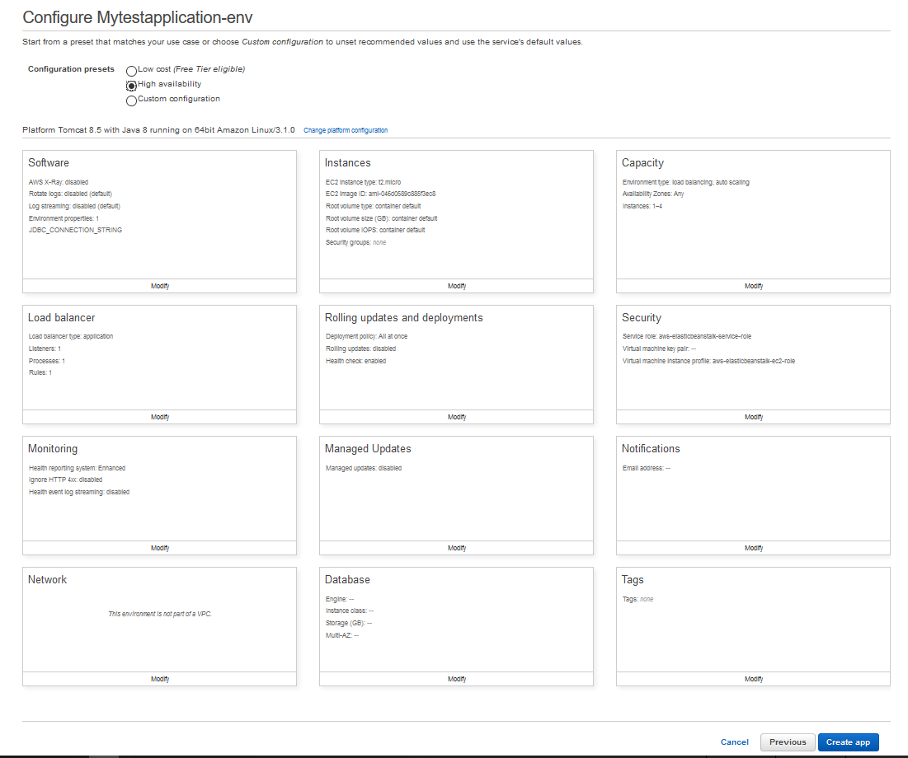{#fig:aws-beanstalk-configpreset-1}

### Step 6 : Map VPC

Click on the Network section on the Advance Configuration page (see
@fig:aws-beanstalk-configpreset-1). This will open the another page
which will allow to select the VPC under which we want the application
to be launched. This step cannot be reversed so pay special attention
to the VPC that is selected here. For this example, we will continue
with the default VPC (see @fig:aws-beanstalk-network).

{#fig:aws-beanstalk-network}

Other options on that can be configured in this section are explained next.

#### Load Balancer settings

Select visibility as public in case you want your application to be
accessible from other VPCs or over internet.

This section also allows you to select the subnet to be used for the
load balancer across availability zones.

These settings can be modified after the application launch as well.

#### Instance settings

You can assign public IP address to your EC2 instances from this
section.  Howver this action is discourage and the application should
be accesible only the load balancers.

This section also allows you to select the subnet to be used for the
application servers across availability zones.

These settings can be modified after the application launch as well.

{#fig:aws-beanstalk-configpreset-2}

Once done, click on Save button. This action will save the settings
and will take you back to the Advance Configuration page (see
@fig:aws-beanstalk-configpreset-2).

### Step 7 : Launch Application

These settings done so far are sufficeint to create a High
Availability Load Balanced application. Click on `Create App`
button (see @fig:aws-beanstalk-configpreset-2).

This will initiate the process of application creation. Once the
process completes, the application health will be displayed with a
green check and the application URL (which points to the publlic load
balancer) will be displayed in the top section  (see
@fig:aws-beanstalk-appready).

{#fig:aws-beanstalk-appready}

### Step 8 : Verify application URL

Click on the URL gerenerated in the previous step. This will open the
homepage of the sample application (see @fig:aws-beanstalk-homepage).

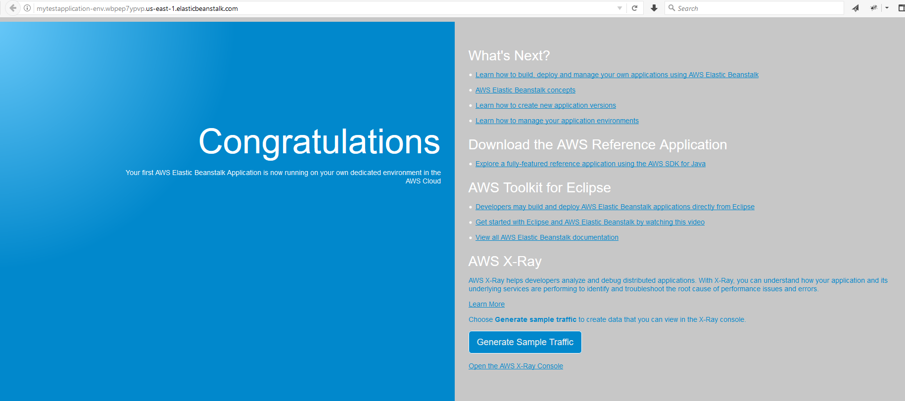{#fig:aws-beanstalk-homepage}

## Explore Amazon Elastic Beanstlalk Features

### Beanstalk Deployment

Beanstalk deployment is quick an easy. Lets deploy a sample springboot
war to this environment.  Go to the application dashboard. Click on
Upload and Deploy button.  This will open a pop up that will allow to
upload package and apply a version label.  Once can also select to
deploy to all instances at once or batch wise. Click on deploy once
ready (see @fig:aws-beanstalk-upload).

{#fig:aws-beanstalk-upload}

Upon completion of the deployment, beanstalk will display success
message in the recent events sections (see
@fig:aws-beanstalk-deployed).

{#fig:aws-beanstalk-deployed}

The updated application can be validated by clicking the beanstalk URL
(see @fig:aws-beanstalk-url).

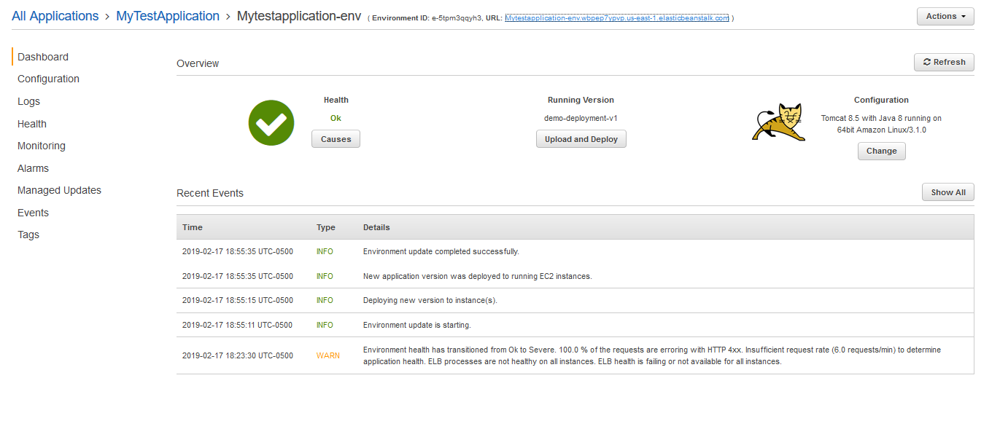{#fig:aws-beanstalk-url}

#### Tracking Deployments

All deployments can be tracked by clicking the `Application Versions page` on the 
upload pop up (see @fig:aws-beanstalk-upload).

Once you click the link, a new page is opened which allows to :
* View and download all past packages deployed.
* Deploy a previous package again
* Manage the life cycle policy for backing up past deployments (see
@fig:aws-beanstalk-deployments).

{#fig:aws-beanstalk-deployments}

### Beanstalk Env management

The Action button on the application dashboard allows to perform the
next set of actions on the application environment:

* Restart App servers
* Save the configuration for re-use
* Load a new configuration
* Clone the environment
* Rebuild the environment
* Teminate the environment

(see @fig:aws-beanstalk-manageenv)

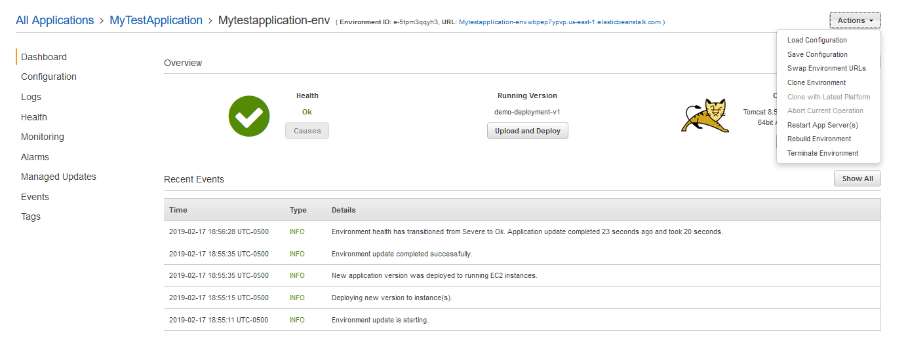
{#fig:aws-beanstalk-manageenv}

### Beanstalk Logs

The application logs can be accessed from the Logs link in the
application dashboard (see @fig:aws-beanstalk-logs).

{#fig:aws-beanstalk-logs}

### Beanstalk Instance Health

The Health link in the application dashboard takes to the heath
monitoring screen and allows to view the health of all the EC2 server
instances associated with the beanstalk application.

Additionally, this screen gives option to reboot or termite the
selected EC2 instances (see @fig:aws-beanstalk-health).

{#fig:aws-beanstalk-health}

### Beanstalk Environment Monitoring and Alarms

The Monitoring link in the application dashboard takes to the
environment monitoring screen which displays different types of graphs
/ metrics under different sections.  The duration and intervals for
monitoring can be edited to adjust the granularity (see
@fig:aws-beanstalk-monitor).

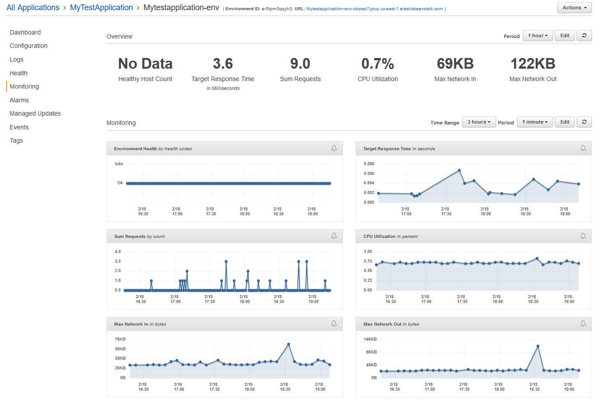{#fig:aws-beanstalk-monitor}

Each metric section also has a bell icon on the top right
corner. Using this icon one can set alarms based on specific
thresholds. Alarms can be integrated SNS topics for notification or
DynamoDB (see @fig:aws-beanstalk-alarm).

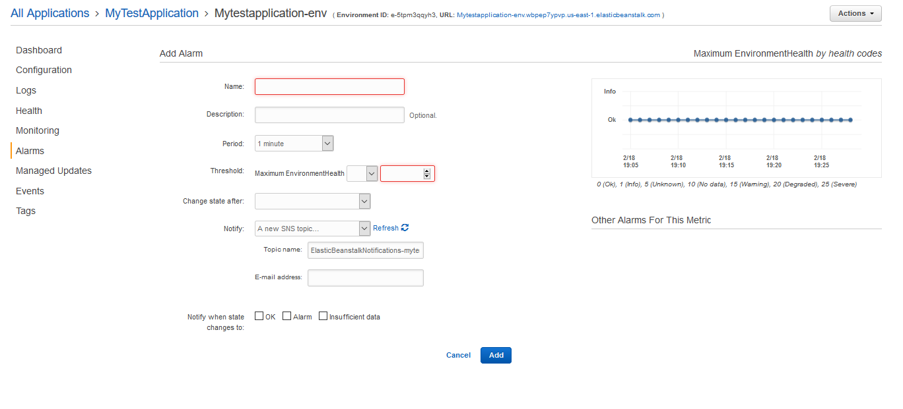{#fig:aws-beanstalk-alarm}

### Beanstalk Patching Logs

The Managed Updates link in the application dashboard allows to view
the history of the patching activities performed on the environment by
AWS (see @fig:aws-beanstalk-patchlog).

{#fig:aws-beanstalk-patchlog}

### Beanstalk Event Logs

The Events link in the application dashboard allows to view the
history of events occurred on the environment. These are typically
from the configuring changes made, instances transitioning from one
health status to another, or deployments made on the environment (see
@fig:aws-beanstalk-eventlog).

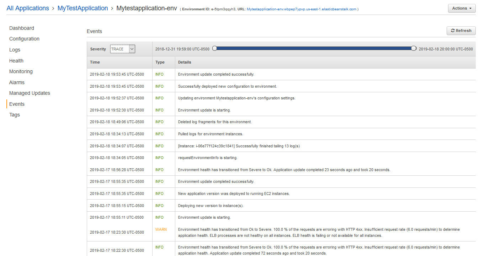{#fig:aws-beanstalk-eventlog}

### Beanstalk Tags

The Tags link in the application dashboard allows to view all the tags
applied to the environment. Tags are key value pairs that help to
identify the beanstalk resources for managment or pricing activities
(see @fig:aws-beanstalk-tags).

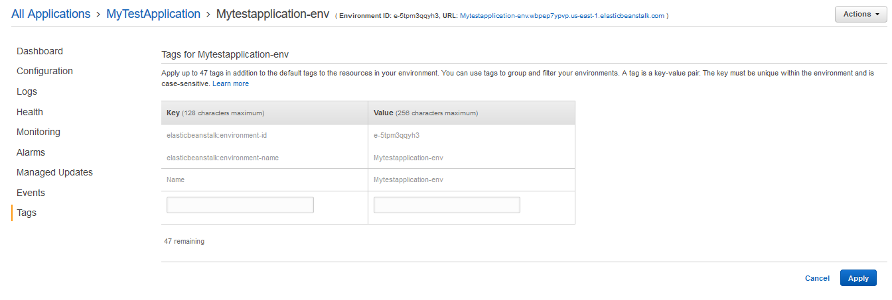{#fig:aws-beanstalk-tags}

### Beanstalk Configuration Management

The Configurations link the application dashboard allows to modify
various configurations for the beanstalk application. These are
grouped into different sections which are explained under the
following pages (see @fig:aws-beanstalk-config).

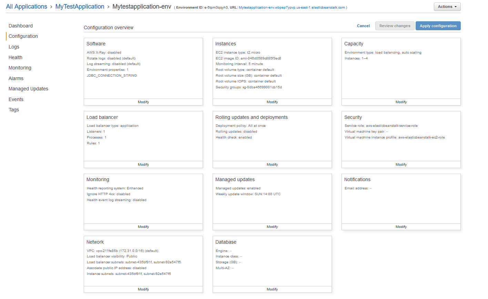{#fig:aws-beanstalk-config}

#### Software

##### Container Options

This section provides options to configure the container settings to host the 
application.
* Proxy Server - Apache, Nginx
* Gzip Compression
* Initial JVM Heap Size
* Max JVM Heap Size
* Max Perm Size

##### X Ray 

AWS X Ray is a service that can be enabled to trace an application
request end to end through to the underlying components. This is
extremely useful in helping debug systems following distributed
architecture.  This service however is not free and will incur
additional charges.

##### S3 Log Storage 

This section allows to optionially rotate logs to Amazon S3. Again, S3
storage will incur addtional charges.

##### Environment properties

The properties defined here are passed to the application as
environment properties.  These are especially useful in maintaining
variables like the Database connection string which would vary between
the development, staging and production environment.

Maintaining these properties here allows migration of same code
package between environments without any code changes (see
@fig:aws-beanstalk-config-software).

{#fig:aws-beanstalk-config-software}

#### Intances

##### Instance Type

This section allows to update the EC2 server instance type to be used
to host the application. EC2 instance come in various categories (t2,
t3, m4, m5, c1, c2 etc.) and size (micro, small, medium, large etc) and
can be selected based on the application needs and usage pattern.

##### Amazon CloudWatch monitoring

The cloudwatch monitoring period can be selected between 1 and 5 mins
from this section. Smaller monitoring interval incur additional
charges.

##### Root volume (boot device)

This section allows to choose the volume type (Magnetic, General
Purpose SSD, Provisioned IOPS SSD), size and IOPS for the instances

##### Security Groups

This section allows to secuirty groups to the EC2 instances to
restirct traffic ingress (see @fig:aws-beanstalk-config-intances).

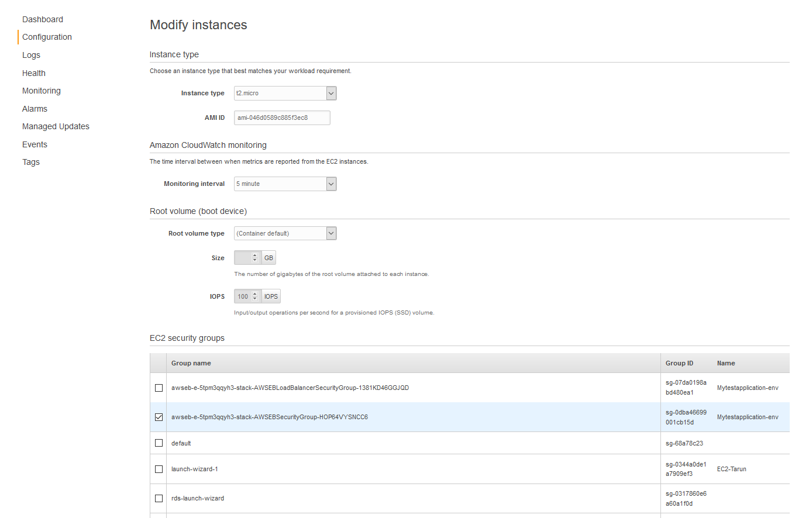{#fig:aws-beanstalk-config-intances}

#### Capacity

##### Auto Scaling Group

Auto Scaling Groups allow to define an auto scaling policy where in
the beanstalk environment would toggle between min and max number of
instances defined based on scaling triggers like

* Network Out
* CPU Utilization
* Network In
* Disk IO
* Latency
* Healthy Host Count
* Unhealthy Host Count
* Response Time

Alternatively, auto scaling can be timed if we know the time period of
peak load (see @fig:aws-beanstalk-config-capacity).

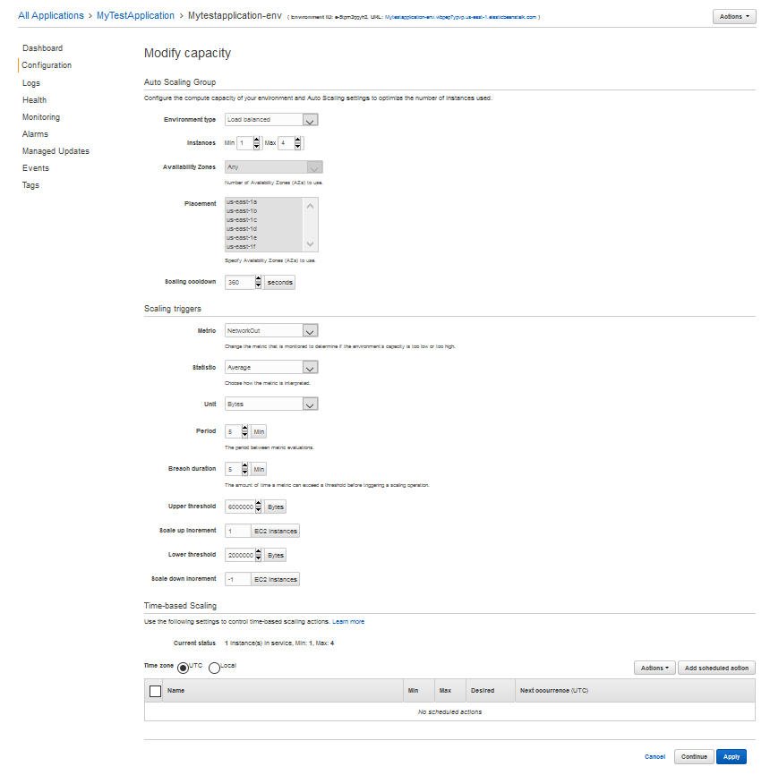{#fig:aws-beanstalk-config-capacity}

#### Load Balancer

This section allows to modify the following load balance
configruations:

* Add remove http / https listeners
* Serve http / https services on one or more ports
* Health check paths

Opening application on https will require you to upload signed
certificates (see @fig:aws-beanstalk-config-loadbalancer).

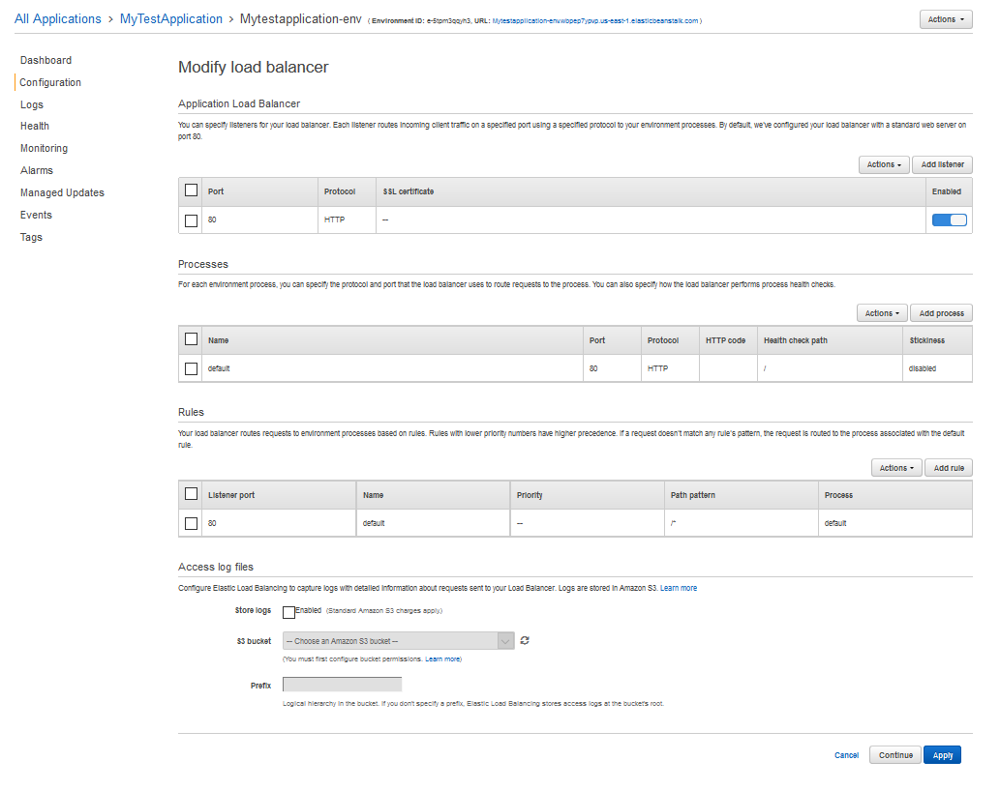{#fig:aws-beanstalk-config-loadbalancer}

#### Rolling updates and deployments

##### Application Deployments

This section allows to specify the if the deployments will be done on
all instances at once or one by one.

##### Configuration Updates

This section allows to specify the if the configuration changes on VMs
will be done on all instances at once or one by one.  (see
@fig:aws-beanstalk-config-updates-1).

{#fig:aws-beanstalk-config-updates-1}

#### Security

This section allows to map the the following list of attributes

* Service Role - AWS role that beanstalk will assume. This role
  specifies the permissions to beanstalk to provision resources like
  EC2.
* Instance Role - AWS role that the EC2 instances will assume. This
  role specifies the permissions to EC2 instances to access other AWS
  services.
* EC2 key pair - This selected key pair can be used to SSH into the
  EC2 instances if needed (see @fig:aws-beanstalk-config-security).

{#fig:aws-beanstalk-config-security}

#### Monitoring

##### Health Reporting
This section allows to select between basic and enhanced monitoring options.
While enhanced monitoring incurs addtional charges, it allows to select custom metrics
to be reported to Cloud Watch.

##### Health monitoring rule customization

This section currently allows to ignore http 4XX errors for monitoring
health checks (see @fig:aws-beanstalk-config-monitoring).

{#fig:aws-beanstalk-config-monitoring}

#### Managed Updates

This section allows to manage the automatic updates to the platform
and specify the time period / slot for updates (see
@fig:aws-beanstalk-config-updates-2).

{#fig:aws-beanstalk-config-updates-2}

#### Notifications

Using this section, we can specify email address to receive
notifications about important events (see
@fig:aws-beanstalk-config-notifications).

{#fig:aws-beanstalk-config-notifications}

#### Network

Using this section, we can update the subnets associated with the load
balancer and EC2 instances

Note : VPC on the application can be mapped only at the time of
creation of the beanstalk application and cannot be modified later
(see @fig:aws-beanstalk-config-network).

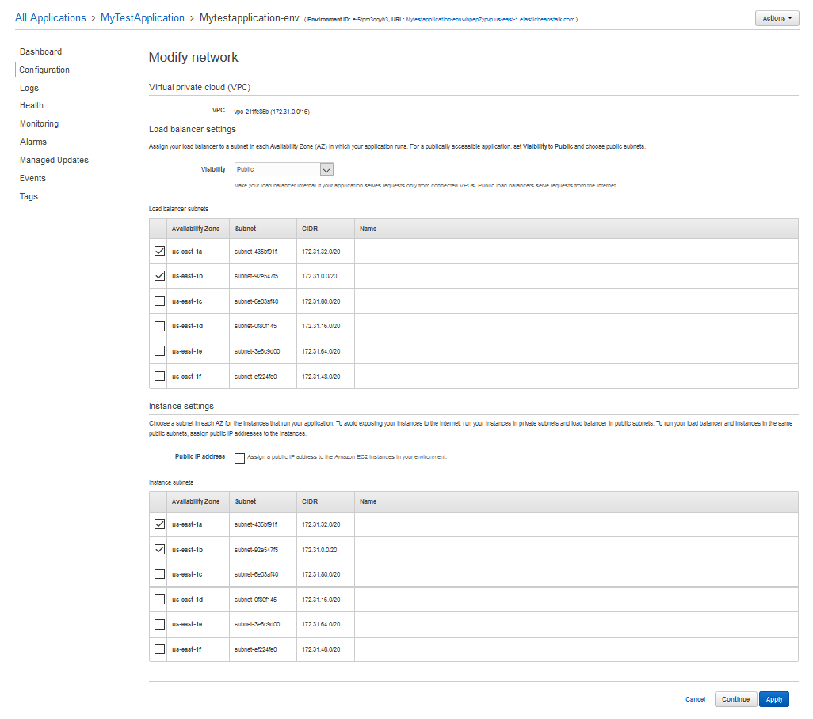{#fig:aws-beanstalk-config-network}

#### Database

This section allows to create and manage an RDS database as part of
the beanstalk configuration (see @fig:aws-beanstalk-config-database).

{#fig:aws-beanstalk-config-database}

## References

* <https://aws.amazon.com/elasticbeanstalk/>

:o: create also bibtex
