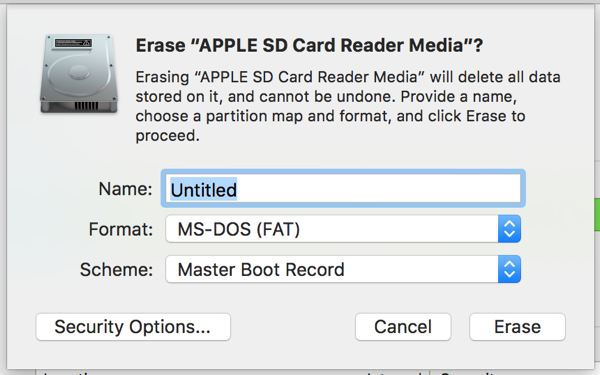
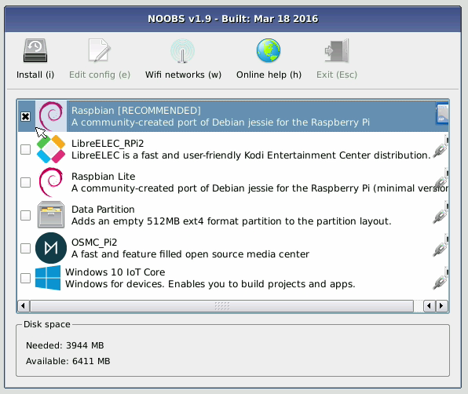
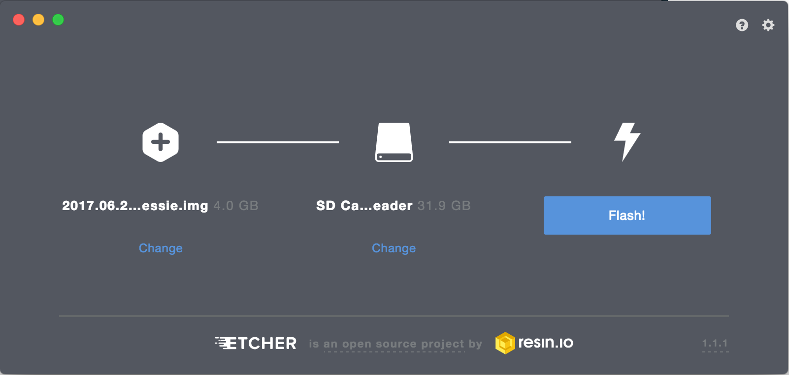

Raspberry PI 3
==============

Installation
------------

### Erasing the SD Card

Before you can install an OS on your sd card, you must erase it and put
it in the proper format.

1.  Insert your sd card into your micro-sd adapter and open Disk Utility
    with a spotlight search.

2.  In the Disk Utility, right click the name of the sd card and select
    erase.

3.  Name the sd card and format it as MS-DOS (FAT). Then click erase.

    {width="50%"}

4.  If it does not erase the first time, try again. It sometimes takes
    multiple tries to work.

### Installation of NOOBS

NOOBS is an OS that includes Raspbian. The official description of
Raspbian can be found
[here](https://www.raspberrypi.org/downloads/raspbian/). It comes
pre-packaged with many useful programming tools, and is easy to use.

1.  Download Noobs [here](https://www.raspberrypi.org/downloads/noobs/).
    This will take around 30 minutes.

2.  Go to your Finder and in Downloads, search for NOOBS.

3.  Open the NOOBS folder and drag its contents into the sd card in the
    devices section. There should be 20 files and folders in the NOOBS
    folder. The download should take about 3 minutes.

4.  Once installed, eject the sd card and put it in your raspberry pi.

5.  Power up your raspberry and you will see a menu like this

{width="50%"}

1.  Select Raspbian and click `Install (i)`

### Installation of Dexter

The version of Dexter that you want to flash onto your sd card is called
Raspbian for Robots. This is a Raspbian based os that is compatible with
the GrovePi board. It also comes with pre-installed Dexter Industries
software.

1.  First, download the most recent Dexter_Industries_jessie.zip file
    from
    [here](https://sourceforge.net/projects/dexterindustriesraspbianflavor/).

2.  Once the file has downloaded, uncompress it and insert your sd card
    into the micro-sd adapter.

3.  Open etcher and flash the uncompressed jessie image onto the sd
    card.

{width="50%"}

1.  Eject your sd card and insert it into your raspberry pi.

Configure
---------

### Prepare OS

Update
------

The following are essential updates:

    sudo apt-get update
    sudo apt-get upgrade
    sudo apt-get install emacs
    dpkg -l > ~/Desktop/packages.list
    pip freeze > ~/Desktop/pip-freeze-initial.list

The following are necessary for the scientific libraries, but they
require lots of space. Our sd cards do not have enough space for them.

    sudo apt-get install build-essential python-dev python-distlib python-setuptools python-pip python-wheel libzmq-dev libgdal-dev
    sudo apt-get install xsel xclip libxml2-dev libxslt-dev python-lxml python-h5py python-numexpr python-dateutil python-six python-tz python-bs4 python-html5lib python-openpyxl python-tables python-xlrd python-xlwt cython python-sqlalchemy python-xlsxwriter python-jinja2 python-boto python-gflags python-googleapi python-httplib2 python-zmq libspatialindex-dev
    sudo pip install bottleneck rtree

add to .bashrc

    cd
    git clone git://github.com/yyuu/pyenv.git .pyenv
    echo 'export PYENV_ROOT="$HOME/.pyenv"' >> ~/.bashrc
    echo 'export PATH="$PYENV_ROOT/bin:$PATH"' >> ~/.bashrc
    echo 'eval "$(pyenv init -)"' >> ~/.bashrc
    source ~/.bashrc

    export PATH="/home/pi/.pyenv/bin:$PATH"
    eval "$(pyenv init -)"
    eval "$(pyenv virtualenv-init -)"

    curl -L https://raw.githubusercontent.com/pyenv/pyenv-installer/master/bin/pyenv-installer | bash

source

### Update to Python 3.6.1

change python version
---------------------

-   \[https://linuxconfig.org/how-to-change-from-default-to-alternative-python-version-on-debian-linux\]
    (https://linuxconfig.org/how-to-change-from-default-to-alternative-python-version-on-debian-linux)

Upgrade setuptools for pip install with

        $ pip3 install --upgrade setuptools
        

Test your python version with

        $ python --version
        

Check your python version alternatives

        $ update-alternatives --list python
        

If python2.7 is not in your alternatives, add it with

        $ sudo update-alternatives --install /usr/bin/python python /usr/bin/python2.7 1
        

If python3.4 is not in your alternatives, add it with

        $ sudo update-alternatives --install /usr/bin/python python /usr/bin/python3.4 2
        

Now make python3.4 to your default with

        update-alternatives --config python

Select python3.4

install 3.6.1
-------------

To install python 3.6.1, follow steps 1 and 2. This is unnecessary for
our purposes.

-   [better get
    3.6.1](https://gist.github.com/dschep/24aa61672a2092246eaca2824400d37f)

install cloudmesh-pi
--------------------

pip install cloudmesh-pi

pip install cloudmesh-pi with

        $ git clone https://github.com/cloudmesh/cloudmesh-pi.git
        $ cd cloudmesh-pi
        $ sudo pip3 install .

see how we do this in macOS/linux can this be done on raspberry? if not
document update from source with altinstall

### Install scientific Libraries

check if they are already installed we do not have enough space to
install all of these.

    sudo apt-get install python-numpy python-matplotlib python-scipy python-sklearn python-pandas

numpy\
matplotlib\
scipy\
scikitlearn

### cloudmesh-pi 

cloudmesh-pi is a repository for our GrovePi module classes. These
classes require Dexter software, so you need to either have Raspbian for
Robots or download the software separately.

If you have Raspbian for Robots, run the following in your terminal:

    cd
    mkdir github
    cd github
    git clone https://github.com/cloudmesh/cloudmesh-pi.git
    cd cloudmesh-pi
    sudo pip install .

### Install VNC

describe how to install and configure VNC

Sensors
-------

### Grove Sensors 

we already have draft

### Non Grove Sensors  

Elegoo as example

Notes To integrates
-------------------

### Connecting

Hostnames:

-   raspberrypi.local

-   raspberrypi.

change

recovery.cmdline

forgot what these were:

    runinstaller quiet ramdisk_size=32768 root=/dev/ram0 init=/init vt.cur_default=1 elevator=deadline
    silentinstall runinstaller quiet ramdisk_size=32768 root=/dev/ram0 init=/init vt.cur_default=1 elevator=deadline

Connect the cable

You will see the activity LEDs flash while the OS installs. Depending on
your SD-Card this can take up to 40-60 minutes.

VLC on macOS
----------

-   <http://www.videolan.org/vlc/index.en_GB.html>

-   <http://get.videolan.org/vlc/2.2.6/macosx/vlc-2.2.6.dmg>

-   <http://www.mybigideas.co.uk/RPi/RPiCamera/>

-    

    Camera on Pi
    ------------

    sudo apt-get install vlc

-   <https://www.raspberrypi.org/learning/getting-started-with-picamera/worksheet/>

-   <https://www.hackster.io/bestd25/pi-car-016e66>

Streaming video
---------------

-   <https://blog.miguelgrinberg.com/post/stream-video-from-the-raspberry-pi-camera-to-web-browsers-even-on-ios-and-android>

Linux Commandline
-----------------

-   <http://www.computerworld.com/article/2598082/linux/linux-linux-command-line-cheat-sheet.html>

Enable SPI
----------

go to the configuration interfaces and enable

RTIMUlib2
---------

git clone https://github.com/RTIMULib/RTIMULib2.git cd RTIMULib

Add the following two lines to /etc/modules

    i2c-bcm2708
    i2c-dev

reboot

    ls /dev/i2c-*
    sudo apt-get install i2c-tools

    sudo i2cdetect -y 1
             0  1  2  3  4  5  6  7  8  9  a  b  c  d  e  f
    00:          -- -- -- -- -- -- -- -- -- -- -- -- -- 
    10: -- -- -- -- -- -- -- -- -- -- -- -- -- -- -- -- 
    20: -- -- -- -- -- -- -- -- -- -- -- -- -- -- -- -- 
    30: -- -- -- -- -- -- -- -- -- -- -- -- -- -- -- -- 
    40: -- -- -- -- -- -- -- -- -- -- -- -- -- -- -- -- 
    50: -- -- -- -- -- -- -- -- -- -- -- -- -- -- -- -- 
    60: -- -- -- -- -- -- -- -- 68 -- -- -- -- -- -- -- 
    70: -- -- -- -- -- -- -- --

create a file /etc/udev/rules.d/90-i2c.rules and add the line:

    KERNEL=="i2c-[0-7]",MODE="0666"

note: does not work

instead we do

    sudo chmod 666 /dev/i2c-1 

Set the I2C bus speed to 400KHz by adding to /boot/config.txt:

    dtparam=i2c1_baudrate=400000

reboot. In terminal change directories to

    cd /home/pi/github/RTIMULib2/RTIMULib/IMUDrivers

and open

    emacs RTIMUDefs.h

In RTIMUDefs.h change

    #define MPU9250_ID 0x71

To

    #define MPU9250_ID 0x73

    cd /home/pi/github/RTIMULib2/RTIMULib

In terminal

    mkdir build
    cd build
    cmake ..
    make -j4
    sudo make install
    sudo ldconfig

Compile RTIMULib Apps
---------------------

    cd /home/pi/github/RTIMULib2/Linux/RTIMULibCal
    make clean; make -j4
    sudo make install
    cd /home/pi/github/RTIMULib2/Linux/RTIMULibDrive
    make clean; make -j4
    sudo make install
    cd /home/pi/github/RTIMULib2/Linux/RTIMULibDrive10
    make clean; make -j4
    sudo make install
    cd /home/pi/github/RTIMULib2/Linux/RTIMULibDrive11
    make clean; make -j4
    sudo make install

    cd /home/pi/github/RTIMULib2/Linux/RTIMULibDemo    
    qmake clean
    make clean
    qmake
    make -j4
    sudo make install
    cd /home/pi/github/RTIMULib2/Linux/RTIMULibDemoGL
    qmake clean
    make clean
    qmake
    make -j4
    sudo make install

Camera
------

-   [Camera
    Tutorial](https://www.raspberrypi.org/learning/getting-started-with-picamera/worksheet/)

.

    sudo apt-get install libjpeg-dev libtiff5-dev libjasper-dev libpng12-dev
    sudo apt-get install libavcodec-dev libavformat-dev libswscale-dev libv4l-dev

    sudo apt-get install libxvidcore-dev libx264-dev

    sudo pip install virtualenv virtualenvwrapper
    sudo rm -rf ~/.cache/pip

copy into \~/.profile:

     echo -e "\n# virtualenv and virtualenvwrapper" >> ~/.profile
     echo "export WORKON_HOME=$HOME/.virtualenvs" >> ~/.profile
     echo "source /usr/local/bin/virtualenvwrapper.sh" >> ~/.profile

source \~/.profile

    mkvirtualenv cv -p python3

workon cv

command line has (cv) in front

    pip install numpy

    wget -O opencv.zip https://github.com/Itseez/opencv/archive/3.1.0.zip
    wget -O opencv_contrib.zip https://github.com/Itseez/opencv_contrib/archive/3.1.0.zip
    unzip opencv.zip
    unzip opencv_contrib.zip

Lessons and Projects
--------------------

-   [Gui](https://www.raspberrypi.org/learning/getting-started-with-guis/worksheet/)\

-   [Solder](https://www.raspberrypi.org/learning/getting-started-with-guis/)\

-   [PI Camera Line
    Follower](https://www.raspberrypi.org/blog/an-image-processing-robot-for-robocup-junior/)\

-   [Pi car
    flask](https://circuitdigest.com/microcontroller-projects/web-controlled-raspberry-pi-surveillance-robot)

OTHER TO BE INTEGRATED
----------------------

### PI emulator on Windows

We have not yet tried it, but we like to hear back from you on
experiences with

-   https://sourceforge.net/projects/rpiqemuwindows/

### Scratch

-   [scratch](https://github.com/DexterInd/GrovePi/tree/master/Software/Scratch)

Web Server
----------

-   [Web Server
    Flask](https://www.raspberrypi.org/learning/python-web-server-with-flask/worksheet/)
