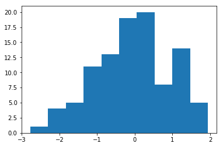
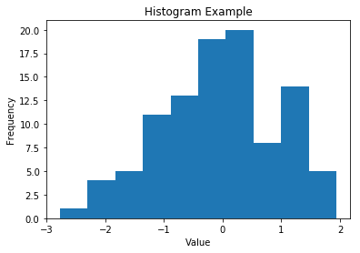
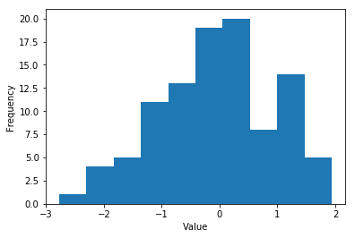
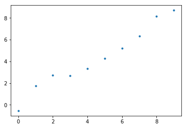
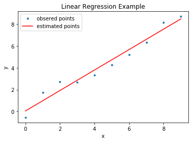

# Scipy {#s-scipy}

SciPy is a library built around numpy and has a number of off-the-shelf
algorithms and operations implemented. These include algorithms from
calculus (such as integration), statistics, linear algebra,
image-processing, signal processing, machine learning.

To achieve this, SciPy bundels a number of useful open-source software
for mathematics, science, and engineering. It includes the following
packages:

NumPy,

:   for managing N-dimensional arrays

SciPy library,

:   to access fundamental scientific computing capabilities

Matplotlib,

:   to conduct 2D plotting

IPython,

:   for an Interactive console (see jupyter)

Sympy,

:   for symbolic mathematics

pandas,

:   for providing data structures and analysis

Introduction
------------

First we add the usual scientific computing modules with the typical
abbreviations, including sp for scipy. We could invoke scipy's
statistical package as sp.stats, but for the sake of laziness we
abbreviate that too.

    import numpy as np # import numpy
    import scipy as sp # import scipy
    from scipy import stats # refer directly to stats rather than sp.stats
    import matplotlib as mpl # for visualization
    from matplotlib import pyplot as plt # refer directly to pyplot
                                         # rather than mpl.pyplot

Now we create some random data to play with. We generate 100 samples
from a Gaussian distribution centered at zero.

    s = sp.randn(100)

How many elements are in the set?

    print ('There are',len(s),'elements in the set')

What is the mean (average) of the set?

    print ('The mean of the set is',s.mean())

What is the minimum of the set?

    print ('The minimum of the set is',s.min())

What is the maximum of the set?

    print ('The maximum of the set is',s.max())

We can use the scipy functions too. What's the median?

    print ('The median of the set is',sp.median(s))

What about the standard deviation and variance?

    print ('The standard deviation is',sp.std(s),
           'and the variance is',sp.var(s))

Isn't the variance the square of the standard deviation?

```python
    print ('The square of the standard deviation is',sp.std(s)**2)
```

How close are the measures? The differences are close as the following
calculation shows

```python
    print ('The difference is',abs(sp.std(s)**2 - sp.var(s)))

    print ('And in decimal form, the difference is %0.16f' %
           (abs(sp.std(s)**2 - sp.var(s))))
```

How does this look as a histogram? See @fig:scipy-output_23_0, @fig:scipy-output_25_0, @fig:scipy-output_27_0

    plt.hist(s) # yes, one line of code for a histogram
    plt.show()

{#fig:scipy-output_23_0}

Let's add some titles.

    plt.clf() # clear out the previous plot

    plt.hist(s)
    plt.title("Histogram Example")
    plt.xlabel("Value")
    plt.ylabel("Frequency")

    plt.show()

{#fig:scipy-output_25_0}

Typically we do not include titles when we prepare images for inclusion
in LaTeX. There we use the caption to describe what the figure is about.

    plt.clf() # clear out the previous plot

    plt.hist(s)
    plt.xlabel("Value")
    plt.ylabel("Frequency")

    plt.show()

{#fig:scipy-output_27_0}

Let's try out some linear regression, or curve fitting. See @#fig:scipy-output_30_0

    import random

    def F(x):
        return 2*x - 2

    def add_noise(x):
        return x + random.uniform(-1,1)

    X = range(0,10,1)

    Y = []
    for i in range(len(X)):
        Y.append(add_noise(X[i]))

    plt.clf() # clear out the old figure
    plt.plot(X,Y,'.')
    plt.show()

{#fig:scipy-output_30_0}

Now let's try linear regression to fit the curve.

    m, b, r, p, est_std_err = stats.linregress(X,Y)

What is the slope and y-intercept of the fitted curve?

    print ('The slope is',m,'and the y-intercept is', b)

    def Fprime(x): # the fitted curve
        return m*x + b

Now let's see how well the curve fits the data. We'll call the fitted
curve F'.

    X = range(0,10,1)

    Yprime = []
    for i in range(len(X)):
        Yprime.append(Fprime(X[i]))

    plt.clf() # clear out the old figure

    # the observed points, blue dots
    plt.plot(X, Y, '.', label='observed points')

    # the interpolated curve, connected red line
    plt.plot(X, Yprime, 'r-', label='estimated points')  

    plt.title("Linear Regression Example") # title
    plt.xlabel("x") # horizontal axis title
    plt.ylabel("y") # vertical axis title
    # legend labels to plot
    plt.legend(['obsered points', 'estimated points'])

    # comment out so that you can save the figure
    #plt.show()

To save images into a PDF file for inclusion into LaTeX documents you
can save the images as follows. Other formats such as png are also
possible, but the quality is naturally not sufficient for inclusion in
papers and documents. For that you certainly want to use PDF. The save
of the figure has to occur before you use the `show()` command. See @fig:scipy-output_40_0

    plt.savefig("regression.pdf", bbox_inches='tight')

    plt.savefig('regression.png')

    plt.show()

{#fig:scipy-output_40_0}

References
----------

For more information about SciPy we recommend that you visit the
following link

<https://www.scipy.org/getting-started.html#learning-to-work-with-scipy>

Additional material and inspiration for this section are from

- [:o:]  "Getting Started guide" <https://www.scipy.org/getting-started.html>
- [:o:]    Prasanth. "Simple statistics with SciPy." Comfort at 1 AU. February
   28, 2011.
   <https://oneau.wordpress.com/2011/02/28/simple-statistics-with-scipy/>.
-  [:o:]   SciPy Cookbook. Lasted updated: 2015.
   <http://scipy-cookbook.readthedocs.io/>.

:o: create bibtex entries
